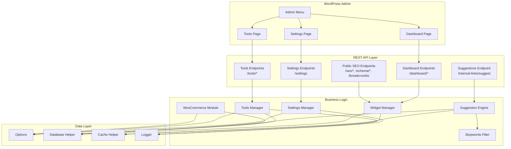
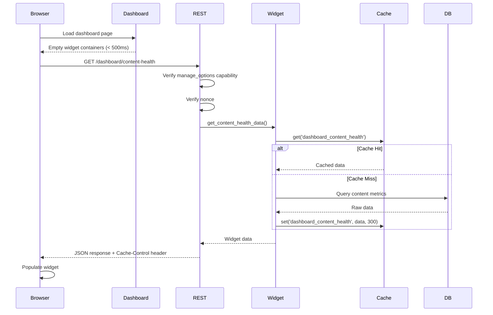
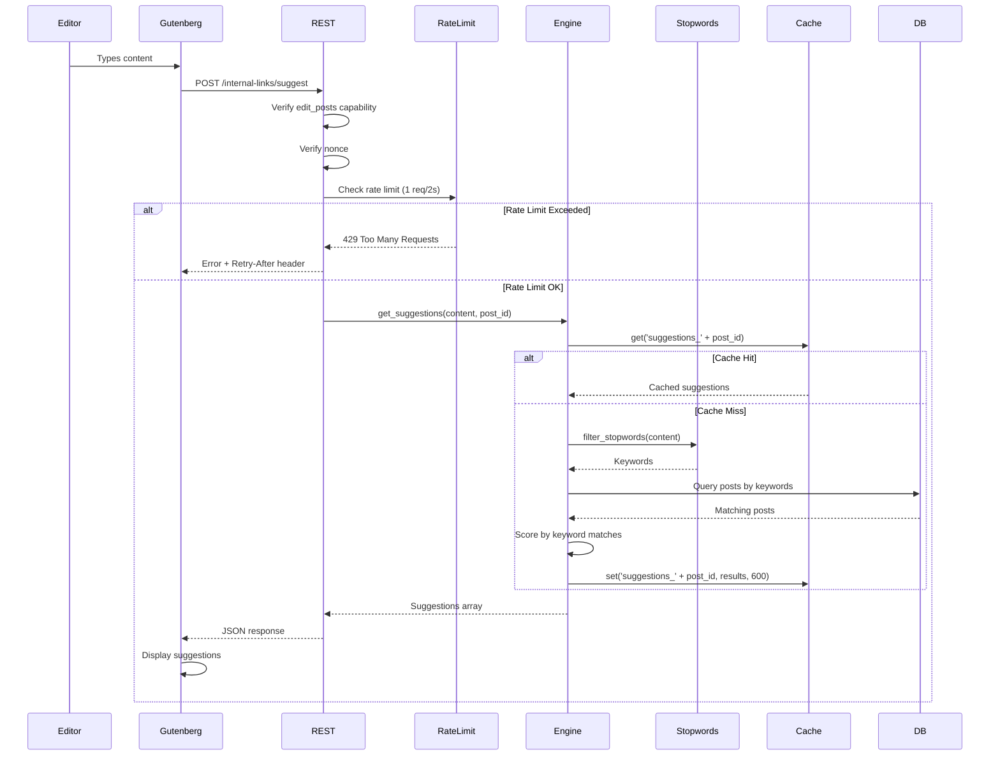
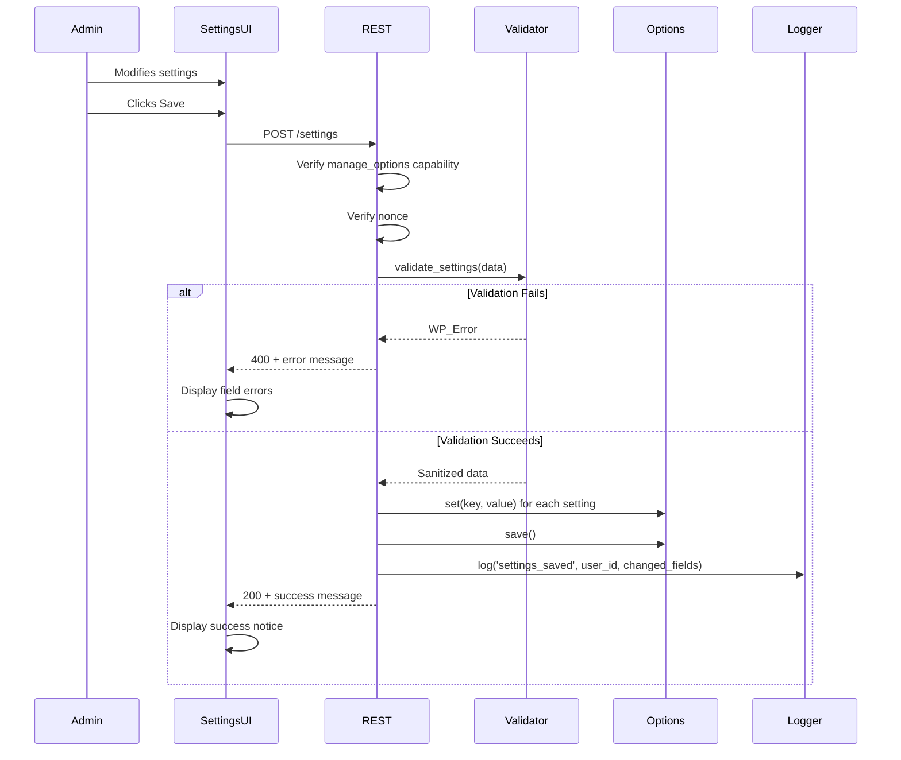

# Design Document: Admin Dashboard Completion

## Overview

This design document specifies the architecture and implementation details for completing the MeowSEO WordPress plugin admin interface. The feature encompasses six major components:

1. **Admin Dashboard** - Main administrative interface with async-loaded widgets displaying SEO metrics
2. **Settings System** - Comprehensive tabbed settings interface for plugin configuration  
3. **Tools Page** - Import/export, database maintenance, and bulk SEO operations
4. **Internal Linking Suggestion Engine** - Content-aware link recommendation system with stopword filtering
5. **Public REST API** - Headless-ready endpoints for SEO data access with caching
6. **WooCommerce Integration** - E-commerce SEO enhancements for product pages with schema and sitemaps

The design follows WordPress best practices, leverages the existing module architecture, and prioritizes performance through async loading, caching, and rate limiting.

### Design Goals

- **Performance**: Dashboard loads in <500ms with zero synchronous database queries; widget data cached for 5 minutes
- **Security**: All endpoints protected by capability checks, nonce verification, and input sanitization
- **Extensibility**: Module-based architecture allows easy addition of new widgets and settings tabs
- **Accessibility**: WCAG 2.1 AA compliant interface with full keyboard navigation and ARIA labels
- **Developer Experience**: Clean REST API for headless WordPress deployments with proper cache headers
- **Internationalization**: Support for Indonesian stopwords in suggestion engine

### Key Technical Decisions

1. **Async Widget Loading**: Dashboard renders empty containers immediately, then populates via REST API to achieve <500ms initial load
2. **Transient Caching**: Widget data cached for 5 minutes to reduce database load on high-traffic sites
3. **Rate Limiting**: Suggestion endpoint limited to 1 request per 2 seconds per user to prevent abuse
4. **Stopword Filtering**: Dual English/Indonesian stopword lists for effective keyword extraction
5. **WooCommerce Conditional Loading**: Module only loads when WooCommerce is active and enabled in settings
6. **ETag Support**: Public SEO endpoints support If-None-Match for efficient caching

## Architecture

### High-Level Component Diagram



### Module Integration

The admin interface integrates with the existing module system:

- **Admin Class** (`includes/class-admin.php`) - Extended to register all admin pages (Dashboard, Settings, Tools, Redirects, 404 Monitor, Search Console) and enqueue assets
- **REST_API Class** (`includes/class-rest-api.php`) - Extended with dashboard widget endpoints, tools endpoints, suggestion endpoint, and public SEO endpoints
- **Module_Manager** - Provides access to loaded modules for widget data aggregation and settings display
- **Options** - Centralized settings storage and retrieval with encryption for sensitive data
- **Cache Helper** - Widget data caching with 5-minute TTL using WordPress transients
- **Logger** - Admin action logging for audit trail (settings changes, imports, maintenance operations)
- **DB Helper** - Database query abstraction for widget data and suggestion queries

### Request Flow Diagrams

#### Dashboard Widget Loading



#### Internal Link Suggestion Flow



#### Settings Save Flow



## Components and Interfaces

### 1. Admin Menu Registration

**File**: `includes/class-admin.php`

**Responsibilities**:
- Register top-level "MeowSEO" menu with cat icon (dashicons-cat)
- Register submenu pages: Dashboard, Settings, Redirects, 404 Monitor, Search Console, Tools
- Verify manage_options capability for all pages
- Enqueue admin assets (JavaScript, CSS) on appropriate pages

**Key Methods**:
```php
public function register_admin_menu(): void
public function register_submenu_pages(): void
public function render_dashboard_page(): void
public function render_settings_page(): void
public function render_tools_page(): void
public function enqueue_admin_assets( string $hook_suffix ): void
```

**Integration Points**:
- Hooks into `admin_menu` action
- Hooks into `admin_enqueue_scripts` action
- Passes nonce and REST URL to JavaScript via `wp_localize_script`

### 2. Dashboard Widgets

**File**: `includes/admin/class-dashboard-widgets.php` (new)

**Responsibilities**:
- Render empty widget containers on page load
- Provide widget data via REST endpoints
- Cache widget data for 5 minutes using transients
- Handle widget errors gracefully

**Widget Types**:
1. **Content Health** - Posts missing SEO data (title, description, focus keyword)
2. **Sitemap Status** - Sitemap generation status and last update time
3. **Top 404s** - Most frequent 404 errors from last 30 days
4. **GSC Summary** - Total clicks, impressions, CTR, average position
5. **Discover Performance** - Discover impressions and clicks (if available)
6. **Index Queue Status** - Pending indexing requests count

**Key Methods**:
```php
public function render_widgets(): void
public function get_content_health_data(): array
public function get_sitemap_status_data(): array
public function get_top_404s_data(): array
public function get_gsc_summary_data(): array
public function get_discover_performance_data(): array
public function get_index_queue_data(): array
```

**Caching Strategy**:
- Transient key format: `meowseo_dashboard_{widget_name}`
- TTL: 300 seconds (5 minutes)
- Cache invalidation: On relevant data changes (post save, 404 log, GSC sync)

### 3. Settings Manager

**File**: `includes/admin/class-settings-manager.php` (new)

**Responsibilities**:
- Render tabbed settings interface
- Validate and sanitize all settings input
- Save settings to Options class
- Log settings changes for audit trail

**Settings Tabs**:
1. **General** - Homepage SEO, title patterns, separator
2. **Social Profiles** - Facebook, Twitter, Instagram, LinkedIn, YouTube URLs
3. **Modules** - Enable/disable plugin modules
4. **Advanced** - Noindex settings, canonical settings, RSS feed settings, delete on uninstall
5. **Breadcrumbs** - Enable/disable, separator, home label, prefix, position

**Key Methods**:
```php
public function render_settings_tabs(): void
public function render_general_tab(): void
public function render_social_profiles_tab(): void
public function render_modules_tab(): void
public function render_advanced_tab(): void
public function render_breadcrumbs_tab(): void
public function validate_settings( array $settings ): array|WP_Error
public function sanitize_social_url( string $url ): string
```

**Validation Rules**:
- Social URLs: Must be valid URLs with esc_url_raw
- Title patterns: Allow pattern variables (%title%, %sitename%, %sep%, %page%, %category%, %date%)
- Module toggles: Boolean values only
- Separator: Must be one of: |, -, –, —, ·, •

### 4. Tools Manager

**File**: `includes/admin/class-tools-manager.php` (new)

**Responsibilities**:
- Render tools page with sections for Import/Export, Database Maintenance, SEO Data
- Handle file uploads for import
- Generate export files (JSON for settings, CSV for redirects)
- Execute database maintenance operations
- Perform bulk SEO operations in batches

**Key Methods**:
```php
public function render_tools_page(): void
public function export_settings(): string // Returns JSON
public function export_redirects(): string // Returns CSV
public function import_settings( array $file ): bool|WP_Error
public function import_redirects( array $file ): bool|WP_Error
public function clear_old_logs(): int // Returns count deleted
public function repair_tables(): bool
public function flush_caches(): bool
public function bulk_generate_descriptions( int $batch_size = 50 ): array
public function scan_missing_seo_data(): array
```

**Batch Processing**:
- Bulk operations process 50 posts per request
- Use AJAX for progress updates
- Display progress bar during execution
- Log all operations with affected post counts

### 5. Suggestion Engine

**File**: `includes/admin/class-suggestion-engine.php` (new)

**Responsibilities**:
- Extract keywords from content by removing stopwords
- Query database for relevant posts using extracted keywords
- Score results by keyword matches in title and content
- Cache suggestions for 10 minutes per post
- Implement rate limiting (1 request per 2 seconds per user)

**Key Methods**:
```php
public function get_suggestions( string $content, int $post_id ): array
private function extract_keywords( string $content ): array
private function filter_stopwords( array $words ): array
private function query_relevant_posts( array $keywords, int $exclude_post_id ): array
private function score_post( WP_Post $post, array $keywords ): int
private function check_rate_limit( int $user_id ): bool
```

**Stopwords**:
- Load from `includes/data/stopwords-id.php` (Indonesian) and `includes/data/stopwords-en.php` (English)
- Filter case-insensitively
- Common Indonesian stopwords: yang, dan, di, ke, dari, untuk, pada, adalah, dengan, ini, itu, atau, juga, akan, telah, dapat, ada, tidak, dalam, oleh, sebagai, antara, karena, saat, setelah, sebelum, jika, maka, tetapi, namun, bahwa, saya, kami, kita, mereka, dia, ia, anda, kamu, nya, mu, ku

**Scoring Algorithm**:
- Title match: +50 points per keyword
- Content match: +10 points per keyword occurrence (max 50 points per keyword)
- Meta description match: +30 points per keyword
- Sort by total score descending
- Return top 10 results

**Rate Limiting**:
- Store last request timestamp in transient: `meowseo_suggest_ratelimit_{user_id}`
- TTL: 2 seconds
- Return 429 status with Retry-After: 2 header if limit exceeded

### 6. Public SEO REST Endpoints

**File**: `includes/class-rest-api.php` (extend existing)

**Responsibilities**:
- Provide public REST endpoints for SEO data
- Support headless WordPress deployments
- Implement proper caching headers (Cache-Control, ETag)
- Support If-None-Match for 304 responses

**Endpoints**:
1. `GET /seo/post/{id}` - All SEO data for a post
2. `GET /seo?url={url}` - SEO data by URL
3. `GET /schema/post/{id}` - Only schema @graph array
4. `GET /breadcrumbs?url={url}` - Breadcrumb trail
5. `GET /redirects/check?url={url}` - Check for redirects

**Response Format** (for /seo/post/{id}):
```json
{
  "post_id": 123,
  "title": "SEO optimized title",
  "description": "Meta description",
  "robots": "index, follow",
  "canonical": "https://example.com/post-slug/",
  "openGraph": {
    "title": "OG title",
    "description": "OG description",
    "image": "https://example.com/image.jpg",
    "type": "article",
    "url": "https://example.com/post-slug/"
  },
  "twitterCard": {
    "card": "summary_large_image",
    "title": "Twitter title",
    "description": "Twitter description",
    "image": "https://example.com/image.jpg"
  },
  "schemaJsonLd": {
    "@context": "https://schema.org",
    "@graph": [...]
  }
}
```

**Caching Headers**:
- `Cache-Control: public, max-age=300` for GET requests
- `ETag: "{content_hash}"` for GET requests
- `Vary: Accept` for content negotiation
- `Cache-Control: no-store` for POST/PUT/DELETE requests

**ETag Implementation**:
- Generate ETag from MD5 hash of response content
- Check If-None-Match header in request
- Return 304 Not Modified if ETag matches

### 7. WooCommerce Module

**File**: `includes/modules/woocommerce/class-woocommerce.php` (new)

**Responsibilities**:
- Load only when WooCommerce is active and module is enabled
- Generate Product schema for product pages
- Add products to XML sitemaps
- Handle product category SEO
- Generate breadcrumbs with product categories

**Key Methods**:
```php
public function boot(): void
public function get_id(): string // Returns 'woocommerce'
public function generate_product_schema( int $product_id ): array
public function add_products_to_sitemap( array $sitemap ): array
public function get_product_meta( int $product_id ): array
public function generate_product_breadcrumbs( int $product_id ): array
private function should_exclude_out_of_stock(): bool
```

**Product Schema Fields**:
- @type: Product
- name: Product title
- description: Product description
- image: Product image URL
- sku: Product SKU
- brand: Product brand (from custom field or default)
- offers: Price, currency, availability
- aggregateRating: Rating value and review count (if reviews exist)
- review: Individual reviews (if available)

**Sitemap Integration**:
- Add product post type to sitemap
- Priority: 0.8
- Changefreq: weekly
- Lastmod: Product modified date
- Exclude out-of-stock products if setting enabled

**Breadcrumb Format**:
- Home > Shop > Category > Subcategory > Product
- Use primary category if product has multiple categories
- Include Shop page in trail

## Data Models

### Dashboard Widget Data

**Content Health Widget**:
```php
array(
  'total_posts' => int,
  'missing_title' => int,
  'missing_description' => int,
  'missing_focus_keyword' => int,
  'percentage_complete' => float
)
```

**Sitemap Status Widget**:
```php
array(
  'enabled' => bool,
  'last_generated' => string, // ISO 8601 datetime
  'total_urls' => int,
  'post_types' => array( 'post' => 150, 'page' => 25 ),
  'cache_status' => 'fresh' | 'stale'
)
```

**Top 404s Widget**:
```php
array(
  array(
    'url' => string,
    'count' => int,
    'last_seen' => string, // ISO 8601 datetime
    'has_redirect' => bool
  ),
  // ... up to 10 entries
)
```

**GSC Summary Widget**:
```php
array(
  'clicks' => int,
  'impressions' => int,
  'ctr' => float,
  'position' => float,
  'date_range' => array(
    'start' => string, // ISO 8601 date
    'end' => string
  ),
  'last_synced' => string // ISO 8601 datetime
)
```

**Discover Performance Widget**:
```php
array(
  'impressions' => int,
  'clicks' => int,
  'ctr' => float,
  'available' => bool, // False if no Discover data
  'date_range' => array(
    'start' => string,
    'end' => string
  )
)
```

**Index Queue Status Widget**:
```php
array(
  'pending' => int,
  'processing' => int,
  'completed' => int,
  'failed' => int,
  'last_processed' => string // ISO 8601 datetime
)
```

### Settings Data Model

**General Settings**:
```php
array(
  'homepage_title' => string,
  'homepage_description' => string,
  'separator' => string, // One of: |, -, –, —, ·, •
  'title_pattern_post' => string, // e.g., "%title% %sep% %sitename%"
  'title_pattern_page' => string,
  'title_pattern_category' => string,
  'title_pattern_tag' => string,
  'title_pattern_archive' => string,
  'title_pattern_search' => string
)
```

**Social Profiles Settings**:
```php
array(
  'facebook_url' => string,
  'twitter_username' => string, // Without @ symbol
  'instagram_url' => string,
  'linkedin_url' => string,
  'youtube_url' => string
)
```

**Modules Settings**:
```php
array(
  'enabled_modules' => array(
    'meta',
    'schema',
    'sitemap',
    'redirects',
    'monitor_404',
    'internal_links',
    'gsc',
    'social',
    'woocommerce' // Only if WooCommerce is active
  )
)
```

**Advanced Settings**:
```php
array(
  'noindex_post_types' => array( 'attachment' ),
  'noindex_taxonomies' => array(),
  'noindex_archives' => array( 'author', 'date' ),
  'canonical_force_trailing_slash' => bool,
  'canonical_force_https' => bool,
  'rss_before_content' => string,
  'rss_after_content' => string,
  'delete_on_uninstall' => bool
)
```

**Breadcrumbs Settings**:
```php
array(
  'breadcrumbs_enabled' => bool,
  'breadcrumbs_separator' => string, // e.g., " > ", " / ", " » "
  'breadcrumbs_home_label' => string, // e.g., "Home"
  'breadcrumbs_prefix' => string, // e.g., "You are here:"
  'breadcrumbs_position' => 'before_content' | 'after_content' | 'manual',
  'breadcrumbs_show_on_post_types' => array( 'post', 'page' ),
  'breadcrumbs_show_on_taxonomies' => array( 'category', 'post_tag' )
)
```

### Internal Link Suggestion Data Model

**Suggestion Request**:
```php
array(
  'content' => string, // Post content
  'post_id' => int // Current post ID to exclude
)
```

**Suggestion Response**:
```php
array(
  array(
    'post_id' => int,
    'title' => string,
    'url' => string,
    'score' => int // Relevance score 0-100
  ),
  // ... up to 10 suggestions
)
```

### WooCommerce Product Schema

```json
{
  "@context": "https://schema.org",
  "@type": "Product",
  "name": "Product Name",
  "description": "Product description",
  "image": "https://example.com/product-image.jpg",
  "sku": "PROD-123",
  "brand": {
    "@type": "Brand",
    "name": "Brand Name"
  },
  "offers": {
    "@type": "Offer",
    "price": "99.99",
    "priceCurrency": "USD",
    "availability": "https://schema.org/InStock",
    "url": "https://example.com/product-slug/"
  },
  "aggregateRating": {
    "@type": "AggregateRating",
    "ratingValue": "4.5",
    "reviewCount": "24"
  }
}
```

### Database Schema

**No new tables required**. This feature uses existing tables:
- `wp_options` - Settings storage via Options class
- `wp_postmeta` - SEO meta data per post
- `{prefix}_meowseo_404_logs` - 404 error tracking (existing)
- `{prefix}_meowseo_redirects` - Redirect rules (existing)
- `{prefix}_meowseo_gsc_data` - GSC metrics (existing)

**Transient Keys** (for caching):
- `meowseo_dashboard_content_health` - Content health widget data (TTL: 300s)
- `meowseo_dashboard_sitemap_status` - Sitemap status widget data (TTL: 300s)
- `meowseo_dashboard_top_404s` - Top 404s widget data (TTL: 300s)
- `meowseo_dashboard_gsc_summary` - GSC summary widget data (TTL: 300s)
- `meowseo_dashboard_discover_performance` - Discover performance widget data (TTL: 300s)
- `meowseo_dashboard_index_queue` - Index queue status widget data (TTL: 300s)
- `meowseo_suggestions_{post_id}` - Link suggestions per post (TTL: 600s)
- `meowseo_suggest_ratelimit_{user_id}` - Rate limit tracking per user (TTL: 2s)

## Error Handling

### Error Response Format

All REST endpoints return consistent error responses:

```json
{
  "success": false,
  "message": "Human-readable error message",
  "code": "error_code",
  "data": {
    "status": 400
  }
}
```

### Error Codes

**Authentication/Authorization Errors**:
- `rest_forbidden` (403) - User lacks required capability
- `rest_invalid_nonce` (403) - Nonce verification failed
- `rest_not_logged_in` (401) - User not authenticated

**Validation Errors**:
- `invalid_settings` (400) - Settings validation failed
- `invalid_file_format` (400) - Import file format invalid
- `invalid_parameter` (400) - REST parameter validation failed

**Rate Limiting Errors**:
- `rate_limit_exceeded` (429) - Too many requests (includes Retry-After header)

**Resource Errors**:
- `post_not_found` (404) - Post ID does not exist
- `module_not_found` (404) - Module not loaded or doesn't exist

**Server Errors**:
- `database_error` (500) - Database query failed
- `file_system_error` (500) - File operation failed

### Error Handling Strategy

1. **User-Facing Errors**: Display clear, actionable messages without technical details
2. **Logging**: Log all errors with context (user_id, timestamp, action, error details) using Logger class
3. **Graceful Degradation**: Widget errors don't prevent other widgets from loading
4. **Validation**: Validate all input before processing; return field-specific errors
5. **Security**: Never expose sensitive data (credentials, file paths, stack traces) in error messages

### Example Error Handling

**Settings Validation Error**:
```php
if ( ! filter_var( $facebook_url, FILTER_VALIDATE_URL ) ) {
    return new WP_Error(
        'invalid_url',
        __( 'Facebook URL is not valid. Please enter a complete URL starting with https://', 'meowseo' ),
        array( 'status' => 400, 'field' => 'facebook_url' )
    );
}
```

**Database Error**:
```php
$result = $wpdb->insert( $table, $data );
if ( false === $result ) {
    Logger::error( 'Database insert failed', array(
        'table' => $table,
        'error' => $wpdb->last_error,
        'user_id' => get_current_user_id()
    ) );
    return new WP_Error(
        'database_error',
        __( 'An error occurred while saving data. Please try again.', 'meowseo' ),
        array( 'status' => 500 )
    );
}
```

**Rate Limit Error**:
```php
if ( ! $this->check_rate_limit( $user_id ) ) {
    return new WP_REST_Response(
        array(
            'success' => false,
            'message' => __( 'Too many requests. Please wait before trying again.', 'meowseo' ),
            'code' => 'rate_limit_exceeded'
        ),
        429,
        array( 'Retry-After' => 2 )
    );
}
```

## Testing Strategy

This feature involves WordPress admin UI, REST API endpoints, database operations, and external integrations. Property-based testing is **not applicable** for most of this feature, as it primarily consists of:
- Infrastructure and configuration (admin pages, settings)
- CRUD operations (database reads/writes)
- UI rendering (dashboard widgets, settings forms)
- External service integration (WooCommerce, WPGraphQL)

### Testing Approach

**1. Unit Tests** (PHPUnit)
- Settings validation logic
- Input sanitization functions
- Stopword filtering
- Keyword extraction from content
- Scoring algorithm for link suggestions
- Error response formatting
- Cache key generation

**2. Integration Tests** (PHPUnit with WordPress test framework)
- REST endpoint authentication and authorization
- Settings save/load cycle
- Widget data retrieval with caching
- Import/export functionality
- Database maintenance operations
- WooCommerce module activation/deactivation
- Rate limiting enforcement

**3. End-to-End Tests** (Manual or automated browser testing)
- Dashboard page load performance (<500ms)
- Widget async loading and error handling
- Settings form validation and submission
- Tools page file upload and download
- Accessibility compliance (keyboard navigation, screen readers)

**4. Performance Tests**
- Dashboard load time with 10,000+ posts
- Suggestion engine response time with 5,000-word content
- Widget data caching effectiveness
- Rate limiting accuracy

**5. Security Tests**
- Capability checks on all admin pages
- Nonce verification on all form submissions
- Input sanitization on all user input
- SQL injection prevention (prepared statements)
- XSS prevention (output escaping)

### Test Coverage Goals

- **Unit Tests**: 80%+ coverage for business logic classes
- **Integration Tests**: All REST endpoints, all settings operations
- **Accessibility**: WCAG 2.1 AA compliance verified with axe-core
- **Performance**: Dashboard <500ms, suggestions <1s, all benchmarks met

### Example Test Cases

**Unit Test - Stopword Filtering**:
```php
public function test_filter_stopwords_removes_indonesian_stopwords() {
    $engine = new Suggestion_Engine();
    $words = array( 'yang', 'tutorial', 'dan', 'wordpress', 'untuk', 'pemula' );
    $filtered = $engine->filter_stopwords( $words );
    
    $this->assertContains( 'tutorial', $filtered );
    $this->assertContains( 'wordpress', $filtered );
    $this->assertContains( 'pemula', $filtered );
    $this->assertNotContains( 'yang', $filtered );
    $this->assertNotContains( 'dan', $filtered );
    $this->assertNotContains( 'untuk', $filtered );
}
```

**Integration Test - Dashboard Widget Caching**:
```php
public function test_content_health_widget_uses_cache() {
    $widgets = new Dashboard_Widgets( $this->options, $this->module_manager );
    
    // First call - cache miss
    $data1 = $widgets->get_content_health_data();
    $this->assertIsArray( $data1 );
    
    // Second call - cache hit (should not query database)
    $query_count_before = $wpdb->num_queries;
    $data2 = $widgets->get_content_health_data();
    $query_count_after = $wpdb->num_queries;
    
    $this->assertEquals( $data1, $data2 );
    $this->assertEquals( $query_count_before, $query_count_after, 'Should use cached data' );
}
```

**Integration Test - Rate Limiting**:
```php
public function test_suggestion_endpoint_enforces_rate_limit() {
    wp_set_current_user( $this->editor_id );
    
    $request = new WP_REST_Request( 'POST', '/meowseo/v1/internal-links/suggest' );
    $request->set_header( 'X-WP-Nonce', wp_create_nonce( 'wp_rest' ) );
    $request->set_param( 'content', 'Test content' );
    $request->set_param( 'post_id', 1 );
    
    // First request - should succeed
    $response1 = rest_do_request( $request );
    $this->assertEquals( 200, $response1->get_status() );
    
    // Second request immediately - should be rate limited
    $response2 = rest_do_request( $request );
    $this->assertEquals( 429, $response2->get_status() );
    $this->assertEquals( '2', $response2->get_headers()['Retry-After'] );
}
```

**Accessibility Test - Keyboard Navigation**:
```javascript
// Using axe-core in browser test
test('Dashboard widgets are keyboard accessible', async () => {
  await page.goto('http://localhost/wp-admin/admin.php?page=meowseo-dashboard');
  
  // Tab through all interactive elements
  await page.keyboard.press('Tab');
  let focusedElement = await page.evaluate(() => document.activeElement.tagName);
  expect(['BUTTON', 'A', 'INPUT']).toContain(focusedElement);
  
  // Run axe accessibility audit
  const results = await new AxePuppeteer(page).analyze();
  expect(results.violations).toHaveLength(0);
});
```

### Continuous Integration

- Run unit tests on every commit
- Run integration tests on pull requests
- Run performance benchmarks weekly
- Run accessibility audits before releases
- Maintain test coverage reports in CI dashboard

---

This design document provides a comprehensive blueprint for implementing the admin dashboard completion feature. The architecture prioritizes performance, security, and extensibility while maintaining WordPress best practices and accessibility standards.
