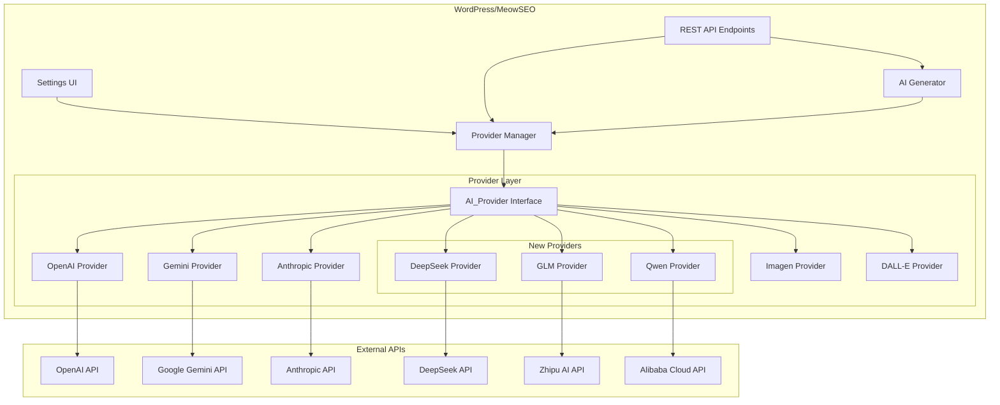
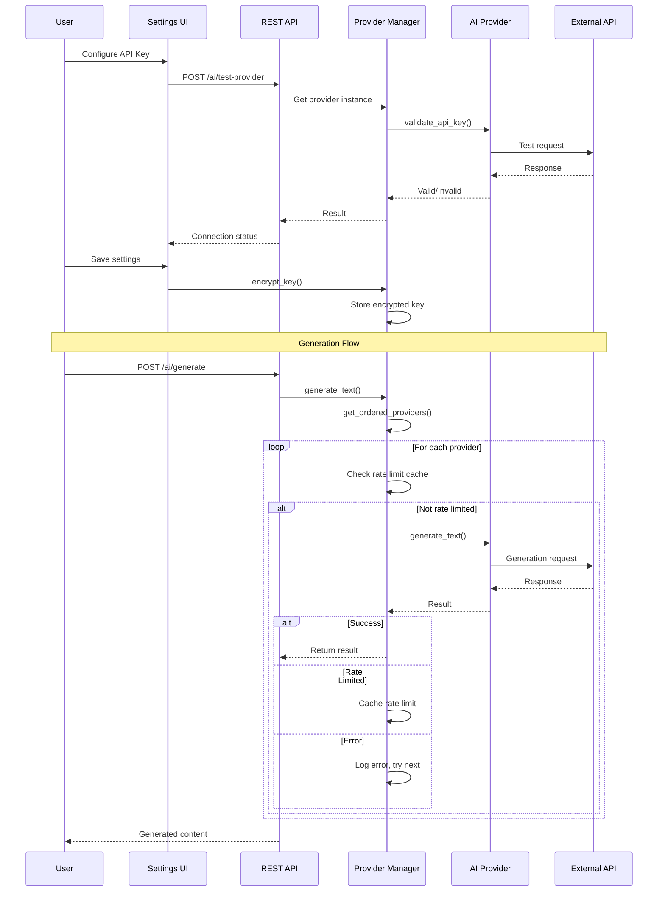
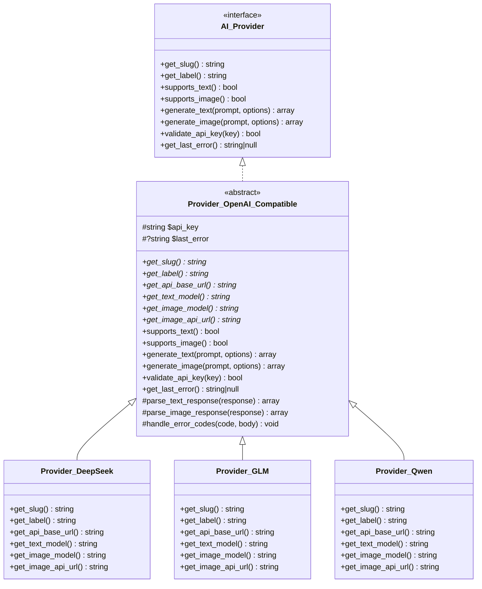
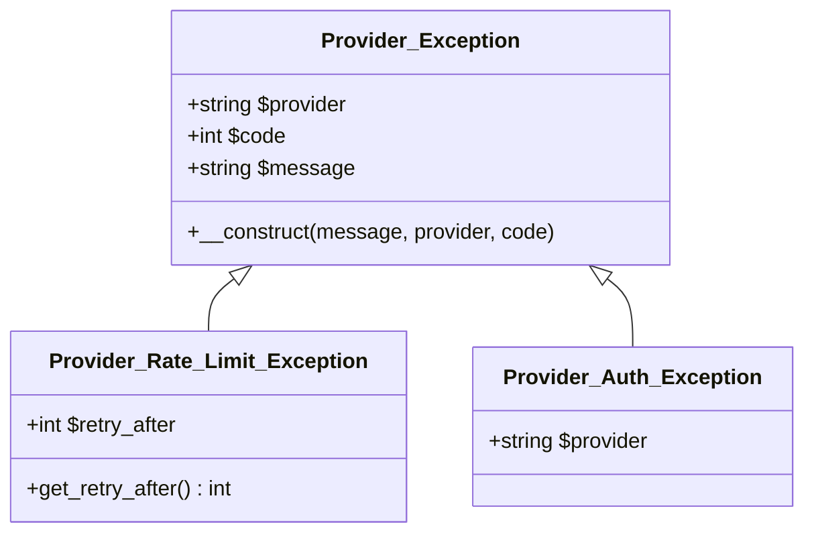
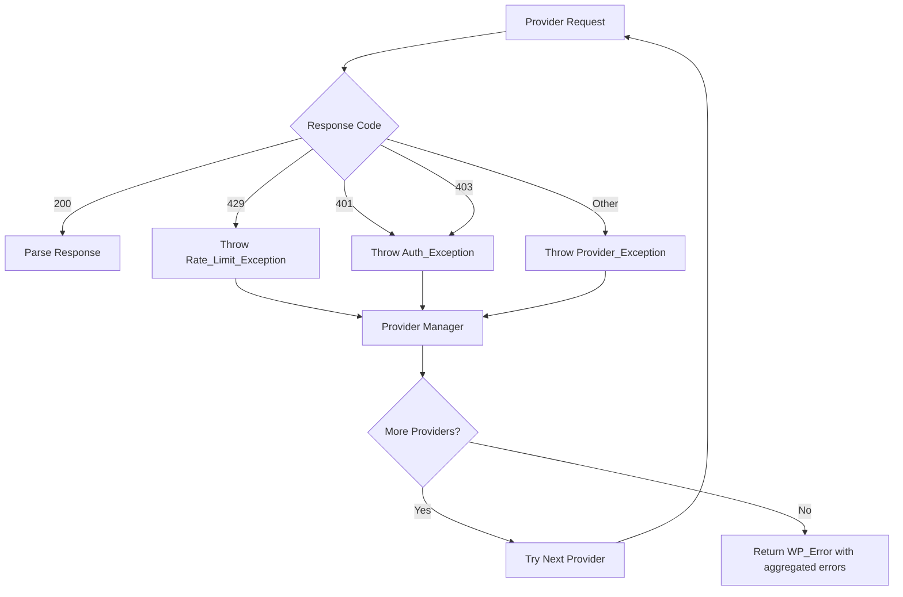

# Design Document: AI Provider Expansion

## Overview

This design document describes the technical implementation for expanding AI provider support in MeowSEO. The expansion adds three new AI providers (DeepSeek, GLM/Zhipu AI, and Qwen/Alibaba) and enhances the existing Gemini provider with image generation capabilities.

### Design Goals

1. **Code Reuse**: Leverage OpenAI-compatible API format for DeepSeek, GLM, and Qwen to minimize code duplication
2. **Backward Compatibility**: Ensure existing provider configurations continue working without modification
3. **Extensibility**: Design a pattern that makes adding future OpenAI-compatible providers straightforward
4. **Security**: Maintain AES-256-CBC encryption for all API keys
5. **Testability**: Design for comprehensive unit and integration testing

### Key Design Decisions

| Decision | Rationale |
|----------|-----------|
| Create abstract `Provider_OpenAI_Compatible` base class | All three new providers use OpenAI-compatible APIs, reducing code duplication by ~70% |
| Update Gemini provider in-place | Gemini image generation uses the same authentication, just a different endpoint |
| Extend existing arrays in Provider Manager | Maintains backward compatibility while adding new providers |
| No database schema changes | All configuration stored in existing WordPress options |

---

## Architecture

### System Context



### Component Interaction Flow



---

## Components and Interfaces

### AI_Provider Interface (Unchanged)

The existing interface remains unchanged to ensure backward compatibility.

```php
interface AI_Provider {
    public function get_slug(): string;
    public function get_label(): string;
    public function supports_text(): bool;
    public function supports_image(): bool;
    public function generate_text( string $prompt, array $options = [] ): array;
    public function generate_image( string $prompt, array $options = [] ): array;
    public function validate_api_key( string $key ): bool;
    public function get_last_error(): ?string;
}
```

### New Abstract Base Class: Provider_OpenAI_Compatible

Since DeepSeek, GLM, and Qwen all use OpenAI-compatible APIs, we create an abstract base class that handles the common request/response logic.



### Provider_OpenAI_Compatible Implementation

```php
<?php
namespace MeowSEO\Modules\AI\Providers;

use MeowSEO\Modules\AI\Contracts\AI_Provider;
use MeowSEO\Modules\AI\Exceptions\Provider_Exception;
use MeowSEO\Modules\AI\Exceptions\Provider_Rate_Limit_Exception;
use MeowSEO\Modules\AI\Exceptions\Provider_Auth_Exception;

abstract class Provider_OpenAI_Compatible implements AI_Provider {
    
    protected string $api_key;
    protected ?string $last_error = null;
    
    // Constants to be overridden by subclasses
    abstract protected function get_api_base_url(): string;
    abstract protected function get_text_model(): string;
    abstract protected function get_image_model(): string;
    abstract protected function get_image_api_url(): string;
    
    // Default implementations
    public function supports_text(): bool {
        return true;
    }
    
    public function supports_image(): bool {
        return true; // Override in subclasses if needed
    }
    
    public function generate_text( string $prompt, array $options = [] ): array {
        $this->last_error = null;
        
        $request_body = [
            'model'      => $options['model'] ?? $this->get_text_model(),
            'messages'   => [
                [ 'role' => 'user', 'content' => $prompt ],
            ],
            'temperature' => $options['temperature'] ?? 0.7,
            'max_tokens'  => $options['max_tokens'] ?? 2048,
        ];
        
        $response = wp_remote_post(
            $this->get_api_base_url() . '/chat/completions',
            [
                'headers' => [
                    'Content-Type'  => 'application/json',
                    'Authorization' => 'Bearer ' . $this->api_key,
                ],
                'body'    => wp_json_encode( $request_body ),
                'timeout' => 60,
            ]
        );
        
        return $this->parse_text_response( $response );
    }
    
    public function generate_image( string $prompt, array $options = [] ): array {
        $this->last_error = null;
        
        $request_body = [
            'model'           => $options['model'] ?? $this->get_image_model(),
            'prompt'          => $prompt,
            'n'               => 1,
            'size'            => $options['size'] ?? '1024x1024',
            'response_format' => 'url',
        ];
        
        $response = wp_remote_post(
            $this->get_image_api_url(),
            [
                'headers' => [
                    'Content-Type'  => 'application/json',
                    'Authorization' => 'Bearer ' . $this->api_key,
                ],
                'body'    => wp_json_encode( $request_body ),
                'timeout' => 60,
            ]
        );
        
        return $this->parse_image_response( $response );
    }
    
    public function validate_api_key( string $key ): bool {
        $this->last_error = null;
        
        // Make minimal request to validate key
        $response = wp_remote_post(
            $this->get_api_base_url() . '/chat/completions',
            [
                'headers' => [
                    'Content-Type'  => 'application/json',
                    'Authorization' => 'Bearer ' . $key,
                ],
                'body'    => wp_json_encode( [
                    'model'      => $this->get_text_model(),
                    'messages'   => [ [ 'role' => 'user', 'content' => 'test' ] ],
                    'max_tokens' => 5,
                ] ),
                'timeout' => 10,
            ]
        );
        
        if ( is_wp_error( $response ) ) {
            $this->last_error = $response->get_error_message();
            return false;
        }
        
        $code = wp_remote_retrieve_response_code( $response );
        
        if ( 401 === $code || 403 === $code ) {
            $body = json_decode( wp_remote_retrieve_body( $response ), true );
            $this->last_error = $body['error']['message'] ?? 'Invalid API key';
            return false;
        }
        
        return true;
    }
    
    public function get_last_error(): ?string {
        return $this->last_error;
    }
    
    // Shared parsing methods
    protected function parse_text_response( $response ): array {
        if ( is_wp_error( $response ) ) {
            $this->last_error = $response->get_error_message();
            throw new Provider_Exception( $this->last_error ?? 'Request failed', $this->get_slug() );
        }
        
        $code = wp_remote_retrieve_response_code( $response );
        $body = json_decode( wp_remote_retrieve_body( $response ), true );
        
        $this->handle_error_codes( $code, $body );
        
        if ( 200 !== $code ) {
            $error_message = $body['error']['message'] ?? "HTTP {$code}";
            $this->last_error = $error_message;
            throw new Provider_Exception( $error_message, $this->get_slug(), $code );
        }
        
        if ( empty( $body['choices'][0]['message']['content'] ) ) {
            $this->last_error = 'Empty response from API';
            throw new Provider_Exception( $this->last_error, $this->get_slug() );
        }
        
        return [
            'content' => $body['choices'][0]['message']['content'],
            'usage'   => [
                'input_tokens'  => $body['usage']['prompt_tokens'] ?? 0,
                'output_tokens' => $body['usage']['completion_tokens'] ?? 0,
            ],
        ];
    }
    
    protected function parse_image_response( $response ): array {
        if ( is_wp_error( $response ) ) {
            $this->last_error = $response->get_error_message();
            throw new Provider_Exception( $this->last_error ?? 'Request failed', $this->get_slug() );
        }
        
        $code = wp_remote_retrieve_response_code( $response );
        $body = json_decode( wp_remote_retrieve_body( $response ), true );
        
        $this->handle_error_codes( $code, $body );
        
        if ( 200 !== $code ) {
            $error_message = $body['error']['message'] ?? "HTTP {$code}";
            $this->last_error = $error_message;
            throw new Provider_Exception( $error_message, $this->get_slug(), $code );
        }
        
        if ( empty( $body['data'][0]['url'] ) ) {
            $this->last_error = 'Empty response from Image API';
            throw new Provider_Exception( $this->last_error, $this->get_slug() );
        }
        
        return [
            'url'            => $body['data'][0]['url'],
            'revised_prompt' => $body['data'][0]['revised_prompt'] ?? null,
        ];
    }
    
    protected function handle_error_codes( int $code, array $body ): void {
        if ( 429 === $code ) {
            $retry_after = $body['error']['retry_after'] ?? 60;
            throw new Provider_Rate_Limit_Exception( $this->get_slug(), $retry_after );
        }
        
        if ( 401 === $code ) {
            throw new Provider_Auth_Exception( $this->get_slug() );
        }
    }
}
```

### Provider_DeepSeek Implementation

```php
<?php
namespace MeowSEO\Modules\AI\Providers;

class Provider_DeepSeek extends Provider_OpenAI_Compatible {
    
    private const API_BASE_URL = 'https://api.deepseek.com/v1';
    private const IMAGE_API_URL = 'https://api.deepseek.com/v1/images/generations';
    private const DEFAULT_TEXT_MODEL = 'deepseek-chat';
    private const DEFAULT_IMAGE_MODEL = 'janus-pro-7b';
    
    public function __construct( string $api_key ) {
        $this->api_key = $api_key;
    }
    
    public function get_slug(): string {
        return 'deepseek';
    }
    
    public function get_label(): string {
        return 'DeepSeek';
    }
    
    protected function get_api_base_url(): string {
        return self::API_BASE_URL;
    }
    
    protected function get_text_model(): string {
        return self::DEFAULT_TEXT_MODEL;
    }
    
    protected function get_image_model(): string {
        return self::DEFAULT_IMAGE_MODEL;
    }
    
    protected function get_image_api_url(): string {
        return self::IMAGE_API_URL;
    }
}
```

### Provider_GLM Implementation

```php
<?php
namespace MeowSEO\Modules\AI\Providers;

class Provider_GLM extends Provider_OpenAI_Compatible {
    
    private const API_BASE_URL = 'https://api.z.ai/api/paas/v4';
    private const IMAGE_API_URL = 'https://api.z.ai/api/paas/v4/images/generations';
    private const DEFAULT_TEXT_MODEL = 'glm-4.7-flash';
    private const DEFAULT_IMAGE_MODEL = 'glm-image';
    
    public function __construct( string $api_key ) {
        $this->api_key = $api_key;
    }
    
    public function get_slug(): string {
        return 'glm';
    }
    
    public function get_label(): string {
        return 'Zhipu AI GLM';
    }
    
    protected function get_api_base_url(): string {
        return self::API_BASE_URL;
    }
    
    protected function get_text_model(): string {
        return self::DEFAULT_TEXT_MODEL;
    }
    
    protected function get_image_model(): string {
        return self::DEFAULT_IMAGE_MODEL;
    }
    
    protected function get_image_api_url(): string {
        return self::IMAGE_API_URL;
    }
    
    // GLM supports larger image sizes
    public function generate_image( string $prompt, array $options = [] ): array {
        // GLM supports 512x512 to 4096x4096
        $options['size'] = $options['size'] ?? '1024x1024';
        return parent::generate_image( $prompt, $options );
    }
}
```

### Provider_Qwen Implementation

```php
<?php
namespace MeowSEO\Modules\AI\Providers;

class Provider_Qwen extends Provider_OpenAI_Compatible {
    
    private const API_BASE_URL = 'https://dashscope.aliyuncs.com/compatible-mode/v1';
    private const IMAGE_API_URL = 'https://dashscope.aliyuncs.com/api/v1/services/aigc/text2image/image-synthesis';
    private const DEFAULT_TEXT_MODEL = 'qwen-plus';
    private const DEFAULT_IMAGE_MODEL = 'qwen-image';
    
    public function __construct( string $api_key ) {
        $this->api_key = $api_key;
    }
    
    public function get_slug(): string {
        return 'qwen';
    }
    
    public function get_label(): string {
        return 'Alibaba Qwen';
    }
    
    protected function get_api_base_url(): string {
        return self::API_BASE_URL;
    }
    
    protected function get_text_model(): string {
        return self::DEFAULT_TEXT_MODEL;
    }
    
    protected function get_image_model(): string {
        return self::DEFAULT_IMAGE_MODEL;
    }
    
    protected function get_image_api_url(): string {
        return self::IMAGE_API_URL;
    }
    
    // Qwen uses X-DashScope-Authorization header
    protected function get_auth_headers(): array {
        return [
            'Content-Type'           => 'application/json',
            'X-DashScope-Authorization' => 'Bearer ' . $this->api_key,
        ];
    }
}
```

### Provider_Gemini Enhancement

The existing Gemini provider will be updated to support image generation via the Nano Banana 2 model.

```php
// Add to Provider_Gemini class

private const IMAGE_API_URL = 'https://generativelanguage.googleapis.com/v1beta/models/gemini-3.1-flash-image-preview:generateImage';
private const DEFAULT_IMAGE_MODEL = 'gemini-3.1-flash-image-preview';

public function supports_image(): bool {
    return true; // Changed from false
}

public function generate_image( string $prompt, array $options = [] ): array {
    $this->last_error = null;
    
    $request_body = [
        'prompt' => [
            'text' => $prompt,
        ],
        'generationConfig' => [
            'outputOptions' => [
                'mimeType' => 'image/png',
            ],
        ],
    ];
    
    // Support sizes from 512px to 4K
    if ( isset( $options['size'] ) ) {
        $dimensions = explode( 'x', $options['size'] );
        if ( count( $dimensions ) === 2 ) {
            $request_body['generationConfig']['width'] = (int) $dimensions[0];
            $request_body['generationConfig']['height'] = (int) $dimensions[1];
        }
    }
    
    $response = wp_remote_post(
        self::IMAGE_API_URL . '?key=' . $this->api_key,
        [
            'headers' => [
                'Content-Type' => 'application/json',
            ],
            'body'    => wp_json_encode( $request_body ),
            'timeout' => 90, // Image generation may take longer
        ]
    );
    
    return $this->parse_image_response( $response );
}

private function parse_image_response( $response ): array {
    if ( is_wp_error( $response ) ) {
        $this->last_error = $response->get_error_message();
        throw new Provider_Exception( $this->last_error ?? 'Request failed', 'gemini' );
    }
    
    $code = wp_remote_retrieve_response_code( $response );
    $body = json_decode( wp_remote_retrieve_body( $response ), true );
    
    // Handle rate limit
    if ( 429 === $code ) {
        throw new Provider_Rate_Limit_Exception( 'gemini', 60 );
    }
    
    // Handle auth errors
    if ( 401 === $code || 403 === $code ) {
        throw new Provider_Auth_Exception( 'gemini' );
    }
    
    if ( 200 !== $code ) {
        $error_message = $body['error']['message'] ?? "HTTP {$code}";
        $this->last_error = $error_message;
        throw new Provider_Exception( $error_message, 'gemini', $code );
    }
    
    // Extract image URL from Gemini response
    if ( empty( $body['images'][0]['url'] ) && empty( $body['generatedImages'][0]['image']['url'] ) ) {
        $this->last_error = 'Empty response from Gemini Image API';
        throw new Provider_Exception( $this->last_error, 'gemini' );
    }
    
    $url = $body['images'][0]['url'] ?? $body['generatedImages'][0]['image']['url'] ?? null;
    
    return [
        'url'            => $url,
        'revised_prompt' => $body['prompt'] ?? null,
    ];
}
```

---

## Data Models

### Provider Configuration Schema

All provider configuration is stored in WordPress options table. No schema changes required.

| Option Name | Type | Description |
|-------------|------|-------------|
| `meowseo_ai_deepseek_api_key` | string (encrypted) | DeepSeek API key |
| `meowseo_ai_glm_api_key` | string (encrypted) | Zhipu AI API key |
| `meowseo_ai_qwen_api_key` | string (encrypted) | Alibaba Cloud API key |
| `meowseo_ai_provider_order` | array | Ordered list of provider slugs |
| `meowseo_ai_active_providers` | array | List of active provider slugs |

### Provider Status Response Schema

```json
{
  "deepseek": {
    "label": "DeepSeek",
    "active": true,
    "has_api_key": true,
    "supports_text": true,
    "supports_image": true,
    "rate_limited": false,
    "rate_limit_remaining": 0,
    "priority": 3
  },
  "glm": {
    "label": "Zhipu AI GLM",
    "active": true,
    "has_api_key": true,
    "supports_text": true,
    "supports_image": true,
    "rate_limited": false,
    "rate_limit_remaining": 0,
    "priority": 4
  },
  "qwen": {
    "label": "Alibaba Qwen",
    "active": false,
    "has_api_key": false,
    "supports_text": true,
    "supports_image": true,
    "rate_limited": false,
    "rate_limit_remaining": 0,
    "priority": 5
  },
  "gemini": {
    "label": "Google Gemini",
    "active": true,
    "has_api_key": true,
    "supports_text": true,
    "supports_image": true,
    "rate_limited": false,
    "rate_limit_remaining": 0,
    "priority": 1
  }
}
```

---

## Error Handling

### Exception Hierarchy



### Error Handling Flow



### Error Messages

| Error Type | User Message | Log Level |
|------------|--------------|-----------|
| Invalid API Key | "Invalid API key for {provider}. Please check your credentials." | Warning |
| Rate Limited | "{provider} is rate limited. Try again in {n} seconds." | Warning |
| Network Error | "Unable to connect to {provider}. Please try again." | Error |
| Empty Response | "{provider} returned an empty response. Please try again." | Error |
| All Providers Failed | "All AI providers failed. Please check your API keys." | Error |

---

## Testing Strategy

### Unit Tests

Unit tests will cover each provider class in isolation using mocked HTTP responses.

**Test Categories:**

1. **Provider Instantiation**
   - Constructor accepts API key
   - Getters return correct values (slug, label, capabilities)

2. **Text Generation**
   - Successful response parsing
   - Error code handling (429, 401, 403, 500)
   - Empty response handling
   - WP_Error handling

3. **Image Generation**
   - Successful response parsing
   - Error code handling
   - Size option handling

4. **API Key Validation**
   - Valid key returns true
   - Invalid key returns false
   - Network error handling

5. **Provider Manager Integration**
   - Provider loading with API keys
   - Provider ordering
   - Rate limit caching
   - Fallback logic

### Integration Tests

Integration tests will verify the complete flow from REST API to provider.

**Test Scenarios:**

1. **Provider Configuration Flow**
   - Save API key via settings
   - Verify encryption
   - Test connection via REST endpoint
   - Verify provider appears in status list

2. **Generation Flow**
   - Generate text with single provider
   - Generate text with fallback
   - Generate image with single provider
   - Handle rate limit during generation

3. **Backward Compatibility**
   - Existing configurations remain valid
   - Existing providers continue working
   - Provider order migration

### Test File Structure

```
includes/modules/ai/tests/
├── providers/
│   ├── test-provider-deepseek.php
│   ├── test-provider-glm.php
│   ├── test-provider-qwen.php
│   └── test-provider-gemini-image.php
├── test-ai-provider-manager-expansion.php
└── test-ai-rest-expansion.php
```

### Mock HTTP Responses

```php
// Example mock for DeepSeek text generation
$mock_response = [
    'response' => [
        'code' => 200,
        'message' => 'OK',
    ],
    'body' => json_encode( [
        'id' => 'chatcmpl-123',
        'object' => 'chat.completion',
        'model' => 'deepseek-chat',
        'choices' => [
            [
                'index' => 0,
                'message' => [
                    'role' => 'assistant',
                    'content' => 'Generated SEO title here',
                ],
                'finish_reason' => 'stop',
            ],
        ],
        'usage' => [
            'prompt_tokens' => 150,
            'completion_tokens' => 25,
            'total_tokens' => 175,
        ],
    ] ),
];
```

---

## File Structure After Implementation

```
includes/modules/ai/
├── class-ai-generator.php           (unchanged)
├── class-ai-module.php              (unchanged)
├── class-ai-optimizer.php           (unchanged)
├── class-ai-provider-manager.php    (modified - add new providers)
├── class-ai-rest.php                (modified - add new provider slugs)
├── class-ai-settings.php            (modified - add new provider UI)
├── contracts/
│   └── interface-ai-provider.php    (unchanged)
├── exceptions/
│   └── (unchanged)
├── providers/
│   ├── class-provider-anthropic.php (unchanged)
│   ├── class-provider-dalle.php     (unchanged)
│   ├── class-provider-deepseek.php  (NEW)
│   ├── class-provider-gemini.php    (modified - add image support)
│   ├── class-provider-glm.php       (NEW)
│   ├── class-provider-imagen.php    (unchanged)
│   ├── class-provider-open-ai-compatible.php (NEW - abstract base)
│   ├── class-provider-open-ai.php   (unchanged)
│   └── class-provider-qwen.php      (NEW)
├── tests/
│   ├── providers/
│   │   ├── test-provider-deepseek.php (NEW)
│   │   ├── test-provider-glm.php      (NEW)
│   │   ├── test-provider-qwen.php     (NEW)
│   │   └── test-provider-gemini-image.php (NEW)
│   ├── test-ai-provider-manager-expansion.php (NEW)
│   └── test-ai-rest-expansion.php    (NEW)
└── assets/
    ├── js/
    │   └── ai-settings.js            (modified - add new provider handling)
    └── css/
        └── ai-settings.css           (modified - add new provider styles)
```

---

## Security Considerations

### API Key Encryption

All API keys are encrypted using AES-256-CBC before storage:

- **Encryption Key**: Derived from WordPress `AUTH_KEY` constant via SHA-256
- **IV**: Random 16-byte IV generated for each encryption
- **Storage Format**: Base64-encoded IV + encrypted data
- **Decryption**: Only happens in memory during provider instantiation

### Key Management

```php
// Encryption flow
$api_key = sanitize_text_field( $_POST['api_key'] );
$encrypted = $provider_manager->encrypt_key( $api_key );
update_option( "meowseo_ai_{$provider}_api_key", $encrypted );

// Decryption flow (in Provider Manager)
$encrypted = get_option( "meowseo_ai_{$provider}_api_key" );
$api_key = $this->decrypt_key( $encrypted );
$provider = new Provider_Class( $api_key );
```

### Security Best Practices

1. **Never log API keys** - Error logs include provider slug only
2. **Validate on input** - All API keys sanitized before encryption
3. **Encrypt at rest** - Keys never stored in plaintext
4. **Decrypt on demand** - Keys decrypted only when needed
5. **Clear from memory** - PHP garbage collection handles cleanup

### REST API Security

- All endpoints require authentication (`edit_posts` or `manage_options` capability)
- Nonce verification on all POST requests
- API keys never exposed via REST API
- Provider test endpoint validates before storing

---

## Performance Considerations

### Rate Limit Caching

Rate limit status is cached in WordPress Object Cache to avoid unnecessary API calls:

```php
// Cache structure
wp_cache_set(
    "ai_ratelimit_{$provider_slug}",
    time() + $retry_after,  // Expiration timestamp
    'meowseo',
    $retry_after  // TTL matches rate limit duration
);
```

### Provider Status Caching

Provider statuses are cached for 5 minutes to reduce database queries:

```php
wp_cache_set(
    'ai_provider_statuses',
    $statuses,
    'meowseo',
    300  // 5 minutes
);
```

### HTTP Request Optimization

1. **Timeout Configuration**: 60 seconds for text, 90 seconds for image generation
2. **Minimal Validation Requests**: API key validation uses minimal token requests
3. **Connection Reuse**: WordPress HTTP API handles connection pooling

### Memory Management

- Provider instances only created when API key exists
- Decrypted keys held in provider instance, cleared on destruction
- Error messages stored in transient array, cleared after response

---

## Implementation Phases

### Phase 1: Core Infrastructure (Priority: High)

1. Create `Provider_OpenAI_Compatible` abstract base class
2. Implement `Provider_DeepSeek` class
3. Implement `Provider_GLM` class
4. Implement `Provider_Qwen` class
5. Update `AI_Provider_Manager` to load new providers

### Phase 2: Gemini Enhancement (Priority: High)

1. Add image generation support to `Provider_Gemini`
2. Update `supports_image()` to return true
3. Add image API endpoint and parsing logic

### Phase 3: UI Integration (Priority: Medium)

1. Update `AI_Settings` to display new provider configuration
2. Add provider capability badges
3. Add pricing information hints
4. Add API key documentation links

### Phase 4: REST API Updates (Priority: Medium)

1. Update `AI_REST` valid providers list
2. Update provider instance factory method
3. Add provider-specific validation if needed

### Phase 5: Testing (Priority: High)

1. Write unit tests for each new provider
2. Write integration tests for Provider Manager
3. Write backward compatibility tests
4. Test rate limit handling
5. Test fallback chain

---

## API Endpoint Specifications

### DeepSeek API

| Endpoint | URL | Method |
|----------|-----|--------|
| Text Generation | `https://api.deepseek.com/v1/chat/completions` | POST |
| Image Generation | `https://api.deepseek.com/v1/images/generations` | POST |
| Authentication | `Authorization: Bearer {api_key}` | Header |

**Text Request:**
```json
{
  "model": "deepseek-chat",
  "messages": [{"role": "user", "content": "..."}],
  "temperature": 0.7,
  "max_tokens": 2048
}
```

**Text Response:**
```json
{
  "id": "chatcmpl-...",
  "choices": [{
    "message": {"role": "assistant", "content": "..."},
    "finish_reason": "stop"
  }],
  "usage": {
    "prompt_tokens": 150,
    "completion_tokens": 25
  }
}
```

### GLM (Zhipu AI) API

| Endpoint | URL | Method |
|----------|-----|--------|
| Text Generation | `https://api.z.ai/api/paas/v4/chat/completions` | POST |
| Image Generation | `https://api.z.ai/api/paas/v4/images/generations` | POST |
| Authentication | `Authorization: Bearer {api_key}` | Header |

**Text Request:**
```json
{
  "model": "glm-4.7-flash",
  "messages": [{"role": "user", "content": "..."}],
  "temperature": 0.7,
  "max_tokens": 2048
}
```

### Qwen (Alibaba Cloud) API

| Endpoint | URL | Method |
|----------|-----|--------|
| Text Generation | `https://dashscope.aliyuncs.com/compatible-mode/v1/chat/completions` | POST |
| Image Generation | `https://dashscope.aliyuncs.com/api/v1/services/aigc/text2image/image-synthesis` | POST |
| Authentication | `Authorization: Bearer {api_key}` or `X-DashScope-Authorization: Bearer {api_key}` | Header |

### Gemini Image Generation API

| Endpoint | URL | Method |
|----------|-----|--------|
| Image Generation | `https://generativelanguage.googleapis.com/v1beta/models/gemini-3.1-flash-image-preview:generateImage` | POST |
| Authentication | `?key={api_key}` | Query param |

**Image Request:**
```json
{
  "prompt": {"text": "..."},
  "generationConfig": {
    "width": 1024,
    "height": 1024,
    "outputOptions": {"mimeType": "image/png"}
  }
}
```

---

## Backward Compatibility

### Configuration Migration

When the plugin is updated, existing configurations are preserved:

```php
// In AI_Provider_Manager::load_providers()
$provider_classes = [
    'gemini'    => Provider_Gemini::class,
    'openai'    => Provider_OpenAI::class,
    'anthropic' => Provider_Anthropic::class,
    'imagen'    => Provider_Imagen::class,
    'dalle'     => Provider_Dalle::class,
    // New providers added
    'deepseek'  => Provider_DeepSeek::class,
    'glm'       => Provider_GLM::class,
    'qwen'      => Provider_Qwen{}
::class,
];

// In AI_Settings::sanitize_provider_order()
$valid_slugs = [
    'gemini', 'openai', 'anthropic', 'imagen', 'dalle',
    // New providers added
    'deepseek', 'glm', 'qwen',
];

// Ensure all valid slugs are present (add missing ones at the end)
foreach ( $valid_slugs as $slug ) {
    if ( ! in_array( $slug, $sanitized, true ) ) {
        $sanitized[] = $slug;
    }
}
```

### Interface Stability

The `AI_Provider` interface remains unchanged. All existing providers continue to implement the same interface without modification.

### Settings Migration

- Existing API keys remain encrypted and valid
- Provider order is automatically extended with new providers
- Active providers list is preserved
- No database migration required

---

## Documentation Requirements

### Settings UI Help Text

Each new provider will display:

1. **Provider Description**: Brief overview of the provider and its strengths
2. **Pricing Information**: Cost per 1M tokens for text, cost per image
3. **API Key Link**: Direct link to obtain an API key
4. **Regional Availability**: Note about accessibility in different regions
5. **Model Information**: Default model, context window size

### Provider Comparison Table

| Provider | Text Model | Image Model | Context | Text Cost | Image Cost | Free Tier |
|----------|------------|-------------|---------|-----------|------------|-----------|
| DeepSeek | DeepSeek-V3.2 | Janus-Pro-7B | 128K | $0.07/$0.28 | Varies | Yes (limited) |
| GLM | GLM-4.7-flash | GLM-Image | 128K | $0.014/$0.014 | ~$0.02 | Yes |
| Qwen | Qwen-Plus | Qwen-Image | 128K | $0.40/$2.00 | ~$0.03 | No |
| Gemini | Gemini 2.0 Flash | Nano Banana 2 | 1M | $0.10/$0.40 | $0.045-$0.150 | Yes (limited) |

### Code Documentation

All new classes and methods will include:

- PHPDoc blocks with `@since` version tags
- Parameter and return type documentation
- Example usage in docblocks
- Link to requirements being implemented

---

## Risks and Mitigations

| Risk | Impact | Likelihood | Mitigation |
|------|--------|------------|------------|
| API format changes | High | Low | Abstract base class isolates changes; version pinning |
| Rate limit differences | Medium | Medium | Configurable retry-after per provider |
| Regional availability | Medium | High | Document regional issues; suggest alternatives |
| API key format differences | Low | Low | Validation handles format differences |
| Image API differences | Medium | Medium | Override methods in subclasses as needed |

---

## Success Criteria

1. **Functional Requirements**
   - All three new providers can generate text
   - All three new providers can generate images (where API supports)
   - Gemini can generate images via Nano Banana 2
   - Provider fallback chain works with new providers
   - Settings UI displays all new providers

2. **Non-Functional Requirements**
   - No performance degradation
   - No security vulnerabilities
   - All existing tests pass
   - New code coverage > 80%

3. **Compatibility Requirements**
   - Existing provider configurations work unchanged
   - No database migration required
   - Backward compatible with WordPress 5.0+


---

## Correctness Properties

This feature involves external API integrations, HTTP I/O operations, and WordPress configuration management. Property-based testing is not applicable because:

1. **External Service Behavior**: Testing API responses validates external services, not our code logic
2. **I/O-Bound Operations**: HTTP requests and responses are side effects, not pure functions
3. **Configuration CRUD**: Settings management is simple storage/retrieval, not algorithmic
4. **Integration Focus**: The value is in correct API integration, not mathematical properties

**Testing Approach**: Unit tests with mocked HTTP responses, integration tests with actual APIs, and example-based tests for error scenarios. See Testing Strategy section for details.
