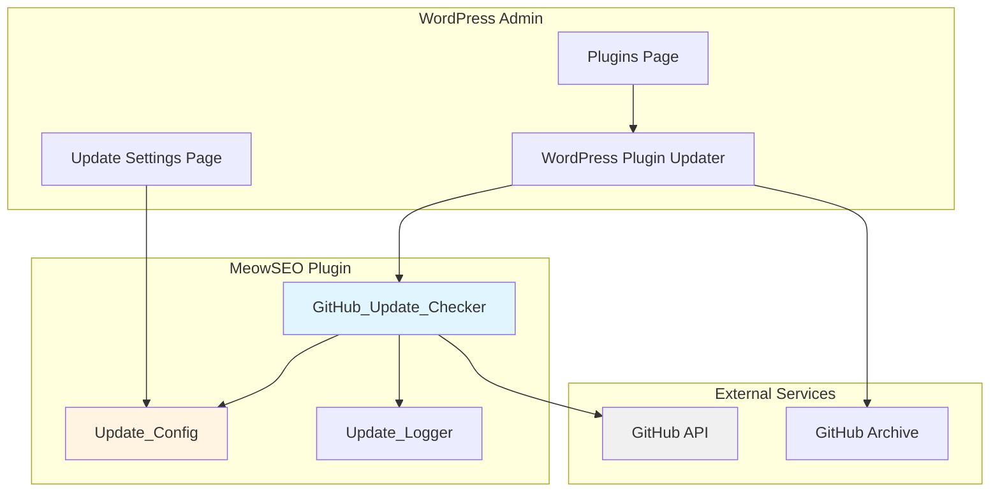
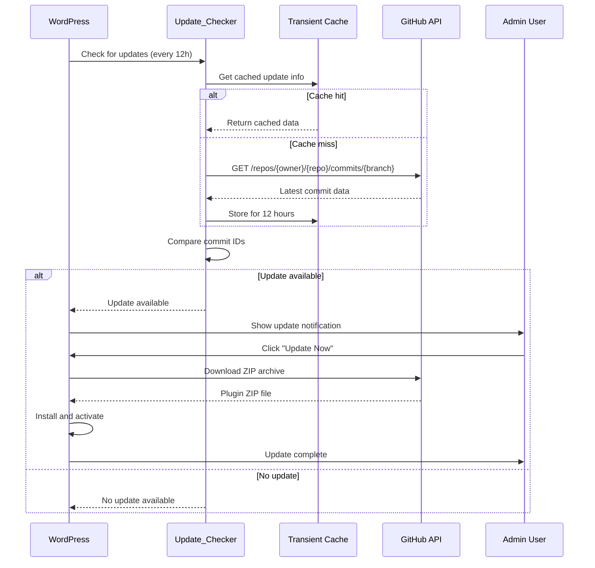
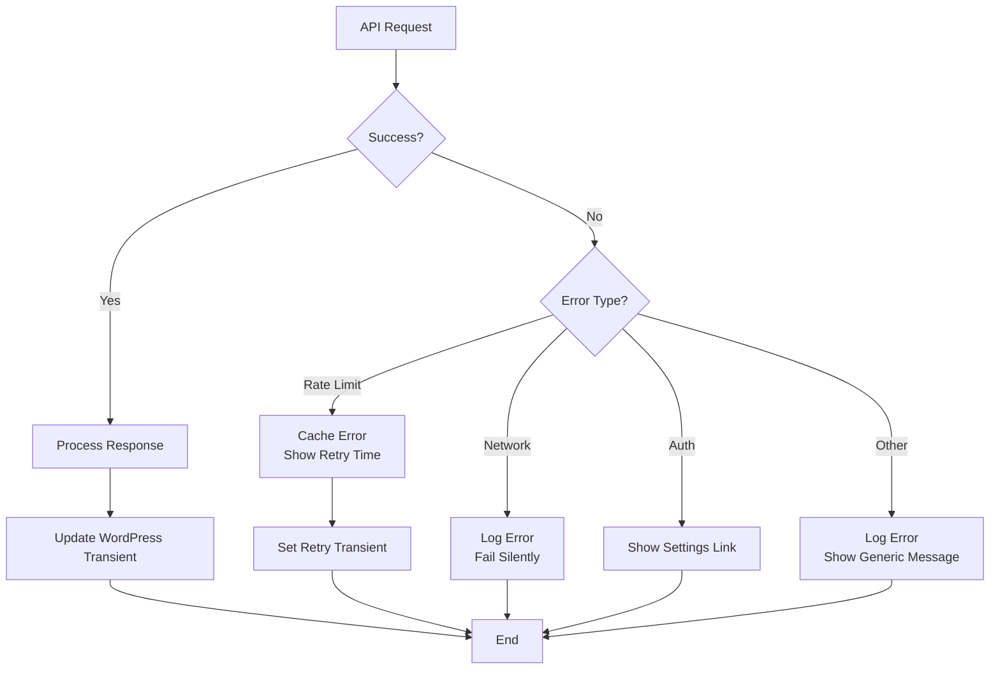

# Design Document: GitHub Auto-Update System

## Overview

This design document describes the technical implementation for a GitHub-based auto-update system for the MeowSEO WordPress plugin. The system enables automatic update checks and one-click installations using Git commit IDs for versioning, without requiring GitHub releases.

### Design Goals

1. **Seamless Integration**: Work identically to standard WordPress plugin updates
2. **Commit-Based Versioning**: Use Git commit IDs instead of semantic versioning
3. **Minimal Dependencies**: Use only WordPress core and GitHub API
4. **Performance**: Minimize API calls and page load impact
5. **Security**: Encrypt sensitive data and validate all inputs
6. **Reliability**: Handle errors gracefully without breaking WordPress

### Key Design Decisions

| Decision | Rationale |
|----------|-----------|
| Use WordPress Plugin Update API | Provides seamless integration with existing WordPress update UI |
| Store commit ID in version string | Format: `1.0.0-abc1234` allows both semantic and commit tracking |
| Cache API responses for 12 hours | Balances freshness with GitHub rate limits (60/hour) |
| Use transients for caching | WordPress-native caching with automatic expiration |
| Download from GitHub archive endpoint | Reliable ZIP downloads without requiring releases or authentication |
| No authentication required | Public repository accessible without tokens, simplifies implementation |

---

## Architecture

### System Context



### Component Interaction Flow



---

## Components and Interfaces

### 1. GitHub_Update_Checker Class

The main class that integrates with WordPress plugin update system.

```php
<?php
namespace MeowSEO\Updater;

class GitHub_Update_Checker {
    
    /**
     * Plugin file path
     */
    private string $plugin_file;
    
    /**
     * Plugin slug
     */
    private string $plugin_slug;
    
    /**
     * Configuration instance
     */
    private Update_Config $config;
    
    /**
     * Logger instance
     */
    private Update_Logger $logger;
    
    /**
     * Constructor
     */
    public function __construct( string $plugin_file, Update_Config $config, Update_Logger $logger );
    
    /**
     * Initialize hooks
     */
    public function init(): void;
    
    /**
     * Check for plugin updates
     * Hook: pre_set_site_transient_update_plugins
     */
    public function check_for_update( $transient );
    
    /**
     * Get plugin information for update details
     * Hook: plugins_api
     */
    public function get_plugin_info( $result, $action, $args );
    
    /**
     * Modify update package URL
     * Hook: upgrader_pre_download
     */
    public function modify_package_url( $reply, $package, $updater );
    
    /**
     * Get latest commit from GitHub
     */
    private function get_latest_commit(): ?array;
    
    /**
     * Get current installed commit ID
     */
    private function get_current_commit_id(): string;
    
    /**
     * Compare commit IDs
     */
    private function is_update_available( string $current, string $latest ): bool;
    
    /**
     * Get commit history for changelog
     */
    private function get_commit_history( int $limit = 20 ): array;
    
    /**
     * Make GitHub API request
     */
    private function github_api_request( string $endpoint, array $args = [] ): ?array;
    
    /**
     * Get cached data
     */
    private function get_cache( string $key );
    
    /**
     * Set cached data
     */
    private function set_cache( string $key, $data, int $expiration = 43200 ): void;
    
    /**
     * Clear all update caches
     */
    public function clear_cache(): void;
}
```

### 2. Update_Config Class

Manages update configuration and settings.

```php
<?php
namespace MeowSEO\Updater;

class Update_Config {
    
    /**
     * Option name for settings
     */
    private const OPTION_NAME = 'meowseo_github_update_config';
    
    /**
     * Get repository owner
     */
    public function get_repo_owner(): string;
    
    /**
     * Get repository name
     */
    public function get_repo_name(): string;
    
    /**
     * Get branch to track
     */
    public function get_branch(): string;
    
    /**
     * Check if automatic updates are enabled
     */
    public function is_auto_update_enabled(): bool;
    
    /**
     * Get update check frequency in seconds
     */
    public function get_check_frequency(): int;
    
    /**
     * Save configuration
     */
    public function save( array $config ): bool;
    
    /**
     * Get all configuration
     */
    public function get_all(): array;
    
    /**
     * Validate repository accessibility
     */
    public function validate_repository(): bool;
}
```

### 3. Update_Logger Class

Handles logging for update operations.

```php
<?php
namespace MeowSEO\Updater;

class Update_Logger {
    
    /**
     * Log update check
     */
    public function log_check( bool $success, ?string $error = null ): void;
    
    /**
     * Log API request
     */
    public function log_api_request( string $endpoint, int $response_code, array $rate_limit ): void;
    
    /**
     * Log update installation
     */
    public function log_installation( bool $success, string $version, ?string $error = null ): void;
    
    /**
     * Log configuration change
     */
    public function log_config_change( array $old_config, array $new_config ): void;
    
    /**
     * Get recent logs
     */
    public function get_recent_logs( int $limit = 50 ): array;
    
    /**
     * Clear old logs
     */
    public function clear_old_logs( int $days = 30 ): void;
    
    /**
     * Write log entry
     */
    private function write_log( string $level, string $message, array $context = [] ): void;
}
```

### 4. Update_Settings_Page Class

Admin settings page for update configuration.

```php
<?php
namespace MeowSEO\Updater;

class Update_Settings_Page {
    
    /**
     * Configuration instance
     */
    private Update_Config $config;
    
    /**
     * Update checker instance
     */
    private GitHub_Update_Checker $checker;
    
    /**
     * Logger instance
     */
    private Update_Logger $logger;
    
    /**
     * Register settings page
     */
    public function register(): void;
    
    /**
     * Render settings page
     */
    public function render_page(): void;
    
    /**
     * Handle form submission
     */
    public function handle_save(): void;
    
    /**
     * Handle manual update check
     */
    public function handle_check_now(): void;
    
    /**
     * Handle cache clear
     */
    public function handle_clear_cache(): void;
    
    /**
     * Display current status
     */
    private function render_status_section(): void;
    
    /**
     * Display configuration form
     */
    private function render_config_form(): void;
    
    /**
     * Display recent logs
     */
    private function render_logs_section(): void;
}
```

---

## Data Models

### Update Configuration Schema

Stored in WordPress options table as `meowseo_github_update_config`:

```json
{
  "repo_owner": "akbarbahaulloh",
  "repo_name": "meowseo",
  "branch": "main",
  "auto_update_enabled": true,
  "check_frequency": 43200,
  "last_check": "2025-01-15 10:30:00"
}
```

### Update Transient Schema

Stored as WordPress transient `meowseo_github_update_info`:

```json
{
  "current_commit": "abc1234",
  "latest_commit": "def5678",
  "latest_commit_message": "Fix: Update AI provider integration",
  "latest_commit_author": "akbarbahaulloh",
  "latest_commit_date": "2025-01-15T10:00:00Z",
  "update_available": true,
  "package_url": "https://github.com/akbarbahaulloh/meowseo/archive/def5678.zip",
  "checked_at": "2025-01-15T10:30:00Z"
}
```

### Changelog Transient Schema

Stored as WordPress transient `meowseo_github_changelog`:

```json
{
  "commits": [
    {
      "sha": "def5678",
      "short_sha": "def5678",
      "message": "Fix: Update AI provider integration",
      "author": "akbarbahaulloh",
      "date": "2025-01-15T10:00:00Z",
      "url": "https://github.com/akbarbahaulloh/meowseo/commit/def5678"
    }
  ],
  "fetched_at": "2025-01-15T10:30:00Z"
}
```

### Log Entry Schema

Stored in WordPress options as `meowseo_github_update_logs`:

```json
{
  "timestamp": "2025-01-15 10:30:00",
  "level": "info",
  "type": "check",
  "message": "Update check completed successfully",
  "context": {
    "current_version": "1.0.0-abc1234",
    "latest_version": "1.0.0-def5678",
    "update_available": true
  }
}
```

---

## WordPress Integration Points

### 1. Plugin Update Check Hook

```php
add_filter( 'pre_set_site_transient_update_plugins', [ $checker, 'check_for_update' ] );
```

**Purpose**: Inject update information into WordPress plugin update system

**When Called**: Every 12 hours (WordPress default) or when user clicks "Check for updates"

**Return Value**: Modified transient object with update information

### 2. Plugin Information Hook

```php
add_filter( 'plugins_api', [ $checker, 'get_plugin_info' ], 10, 3 );
```

**Purpose**: Provide plugin information for "View details" modal

**When Called**: When user clicks "View details" on update notification

**Return Value**: Object with plugin information and changelog

### 3. Package Download Hook

```php
add_filter( 'upgrader_pre_download', [ $checker, 'modify_package_url' ], 10, 3 );
```

**Purpose**: Modify download URL to point to GitHub archive

**When Called**: Before WordPress downloads the update package

**Return Value**: Modified package URL or WP_Error on failure

### 4. Admin Menu Hook

```php
add_action( 'admin_menu', [ $settings_page, 'register' ] );
```

**Purpose**: Register settings page in WordPress admin

**When Called**: On admin page load

**Menu Location**: Settings > GitHub Updates

---

## GitHub API Integration

### API Endpoints Used

#### 1. Get Latest Commit

```
GET https://api.github.com/repos/{owner}/{repo}/commits/{branch}
```

**Response:**
```json
{
  "sha": "def567890abcdef567890abcdef567890abcdef5",
  "commit": {
    "message": "Fix: Update AI provider integration",
    "author": {
      "name": "akbarbahaulloh",
      "date": "2025-01-15T10:00:00Z"
    }
  },
  "html_url": "https://github.com/akbarbahaulloh/meowseo/commit/def5678"
}
```

#### 2. Get Commit History

```
GET https://api.github.com/repos/{owner}/{repo}/commits?sha={branch}&per_page=20
```

**Response:**
```json
[
  {
    "sha": "def567890abcdef567890abcdef567890abcdef5",
    "commit": {
      "message": "Fix: Update AI provider integration",
      "author": {
        "name": "akbarbahaulloh",
        "date": "2025-01-15T10:00:00Z"
      }
    }
  }
]
```

#### 3. Download Archive

```
GET https://github.com/{owner}/{repo}/archive/{commit_sha}.zip
```

**Response**: Binary ZIP file

### Rate Limit Handling

```php
private function check_rate_limit( array $headers ): array {
    return [
        'limit' => (int) ( $headers['x-ratelimit-limit'] ?? 60 ),
        'remaining' => (int) ( $headers['x-ratelimit-remaining'] ?? 60 ),
        'reset' => (int) ( $headers['x-ratelimit-reset'] ?? time() + 3600 ),
    ];
}
```

### Authentication

For public repositories, no authentication is required:

```php
private function get_request_headers(): array {
    return [
        'User-Agent' => 'MeowSEO-Updater/1.0 (WordPress Plugin)',
    ];
}
```

**Note:** GitHub allows 60 unauthenticated requests per hour per IP address, which is sufficient for update checks every 12 hours.

---

## Version Management

### Version String Format

```
{semantic_version}-{short_commit_id}
```

**Examples:**
- `1.0.0-abc1234` (with commit ID)
- `1.0.0` (without commit ID, initial installation)

### Extracting Commit ID

```php
private function extract_commit_id( string $version ): ?string {
    if ( preg_match( '/^[\d.]+-([\da-f]{7,40})$/', $version, $matches ) ) {
        return $matches[1];
    }
    return null;
}
```

### Updating Version String

When updating the plugin, the version string in `meowseo.php` header is updated:

```php
/**
 * Version: 1.0.0-def5678
 */
```

This is done by the WordPress updater automatically when extracting the ZIP file.

---

## Caching Strategy

### Cache Keys

| Key | Purpose | Expiration |
|-----|---------|------------|
| `meowseo_github_update_info` | Update check results | 12 hours |
| `meowseo_github_changelog` | Commit history | 12 hours |
| `meowseo_github_rate_limit` | Rate limit status | 1 hour |

### Cache Invalidation

Caches are cleared when:
1. User clicks "Check for updates now"
2. User saves update settings
3. User clicks "Clear cache" button
4. Update is installed successfully

### Cache Implementation

```php
private function get_cache( string $key ) {
    return get_transient( $key );
}

private function set_cache( string $key, $data, int $expiration = 43200 ): void {
    set_transient( $key, $data, $expiration );
}

public function clear_cache(): void {
    delete_transient( 'meowseo_github_update_info' );
    delete_transient( 'meowseo_github_changelog' );
    delete_transient( 'meowseo_github_rate_limit' );
}
```

---

## Error Handling

### Error Types and Messages

| Error Type | User Message | Log Message | Action |
|------------|--------------|-------------|--------|
| GitHub API unavailable | "Unable to check for updates. Please try again later." | "GitHub API request failed: {error}" | Fail silently, retry later |
| Rate limit exceeded | "GitHub rate limit exceeded. Updates will resume in {time}." | "Rate limit exceeded. Reset at: {timestamp}" | Cache error, retry after reset |
| Invalid repository | "Invalid GitHub repository. Please check settings." | "Repository not found: {owner}/{repo}" | Show settings link |
| Network timeout | "Update check timed out. Please try again." | "API request timeout after 10s" | Retry with exponential backoff |
| Invalid ZIP file | "Downloaded update file is invalid." | "ZIP validation failed: {error}" | Abort update, show error |
| Insufficient permissions | "Unable to write to plugins directory." | "File write failed: {path}" | Show permissions error |

### Error Handling Flow



### Logging Implementation

```php
public function log_error( string $type, string $message, array $context = [] ): void {
    $log_entry = [
        'timestamp' => current_time( 'mysql' ),
        'level' => 'error',
        'type' => $type,
        'message' => $message,
        'context' => $context,
    ];
    
    // Add to logs array
    $logs = get_option( 'meowseo_github_update_logs', [] );
    array_unshift( $logs, $log_entry );
    
    // Keep only last 100 entries
    $logs = array_slice( $logs, 0, 100 );
    
    update_option( 'meowseo_github_update_logs', $logs );
    
    // Also log to WordPress debug log if enabled
    if ( defined( 'WP_DEBUG' ) && WP_DEBUG ) {
        error_log( sprintf(
            'MeowSEO Update [%s]: %s - %s',
            $type,
            $message,
            wp_json_encode( $context )
        ) );
    }
}
```

---

## Security Considerations

### 1. API Token Encryption

Not required for public repositories. Configuration is stored in plain text (no sensitive data).

```php
// No encryption needed - public repository
public function save( array $config ): bool {
    $sanitized = [
        'repo_owner' => sanitize_text_field( $config['repo_owner'] ?? 'akbarbahaulloh' ),
        'repo_name' => sanitize_text_field( $config['repo_name'] ?? 'meowseo' ),
        'branch' => sanitize_text_field( $config['branch'] ?? 'main' ),
        'auto_update_enabled' => (bool) ( $config['auto_update_enabled'] ?? true ),
        'check_frequency' => (int) ( $config['check_frequency'] ?? 43200 ),
    ];
    
    return update_option( self::OPTION_NAME, $sanitized );
}
```

### 2. Input Validation

```php
private function validate_repo_owner( string $owner ): bool {
    return (bool) preg_match( '/^[a-zA-Z0-9]([a-zA-Z0-9-]*[a-zA-Z0-9])?$/', $owner );
}

private function validate_repo_name( string $name ): bool {
    return (bool) preg_match( '/^[a-zA-Z0-9._-]+$/', $name );
}

private function validate_commit_id( string $commit ): bool {
    return (bool) preg_match( '/^[a-f0-9]{7,40}$/', $commit );
}
```

### 3. Nonce Verification

```php
public function handle_save(): void {
    if ( ! check_admin_referer( 'meowseo_update_settings' ) ) {
        wp_die( 'Security check failed' );
    }
    
    if ( ! current_user_can( 'manage_options' ) ) {
        wp_die( 'Insufficient permissions' );
    }
    
    // Process form...
}
```

### 4. Output Escaping

```php
echo esc_html( $commit_message );
echo esc_url( $github_url );
echo esc_attr( $config_value );
```

---

## Performance Optimization

### 1. Lazy Loading

Update checker is only initialized when needed:

```php
add_action( 'admin_init', function() {
    if ( current_user_can( 'update_plugins' ) ) {
        $checker = new GitHub_Update_Checker( /* ... */ );
        $checker->init();
    }
} );
```

### 2. Conditional API Requests

```php
private function should_check_for_update(): bool {
    $last_check = get_option( 'meowseo_github_last_check', 0 );
    $frequency = $this->config->get_check_frequency();
    
    return ( time() - $last_check ) > $frequency;
}
```

### 3. Async Processing

Update checks don't block page loads:

```php
add_action( 'wp_ajax_meowseo_check_update', [ $this, 'ajax_check_update' ] );
```

### 4. Database Query Optimization

Logs are stored as a single option to minimize queries:

```php
// Single query to get all logs
$logs = get_option( 'meowseo_github_update_logs', [] );
```

---

## Testing Strategy

### Unit Tests

```php
class GitHub_Update_Checker_Test extends WP_UnitTestCase {
    
    public function test_extract_commit_id_from_version() {
        $checker = new GitHub_Update_Checker( /* ... */ );
        $commit = $checker->extract_commit_id( '1.0.0-abc1234' );
        $this->assertEquals( 'abc1234', $commit );
    }
    
    public function test_is_update_available() {
        $checker = new GitHub_Update_Checker( /* ... */ );
        $this->assertTrue( $checker->is_update_available( 'abc1234', 'def5678' ) );
        $this->assertFalse( $checker->is_update_available( 'abc1234', 'abc1234' ) );
    }
    
    public function test_github_api_request_with_mock() {
        // Mock wp_remote_get response
        add_filter( 'pre_http_request', function() {
            return [
                'response' => [ 'code' => 200 ],
                'body' => json_encode( [ 'sha' => 'abc1234' ] ),
            ];
        } );
        
        $checker = new GitHub_Update_Checker( /* ... */ );
        $result = $checker->github_api_request( '/repos/test/test/commits/main' );
        
        $this->assertIsArray( $result );
        $this->assertEquals( 'abc1234', $result['sha'] );
    }
}
```

### Integration Tests

```php
class Update_Integration_Test extends WP_UnitTestCase {
    
    public function test_full_update_check_flow() {
        // 1. Configure settings
        $config = new Update_Config();
        $config->save( [
            'repo_owner' => 'akbarbahaulloh',
            'repo_name' => 'meowseo',
            'branch' => 'main',
        ] );
        
        // 2. Trigger update check
        $checker = new GitHub_Update_Checker( MEOWSEO_FILE, $config, new Update_Logger() );
        $transient = $checker->check_for_update( new stdClass() );
        
        // 3. Verify update info
        $this->assertObjectHasAttribute( 'response', $transient );
    }
}
```

### Manual Testing Checklist

- [ ] Update notification appears on Plugins page
- [ ] "View details" shows changelog
- [ ] "Update Now" downloads and installs update
- [ ] Settings page saves configuration
- [ ] "Check for updates now" triggers immediate check
- [ ] Rate limit error displays correctly
- [ ] Logs display recent activity
- [ ] Cache clear works correctly
- [ ] Update preserves plugin settings
- [ ] Works with WordPress multisite

---

## File Structure

```
includes/
├── updater/
│   ├── class-github-update-checker.php
│   ├── class-update-config.php
│   ├── class-update-logger.php
│   └── class-update-settings-page.php
├── admin/
│   └── views/
│       └── update-settings.php
└── class-plugin.php (modified to initialize updater)

tests/
└── updater/
    ├── test-github-update-checker.php
    ├── test-update-config.php
    └── test-update-logger.php
```

---

## Deployment Considerations

### Initial Deployment

1. **Add commit ID to current version**:
   ```php
   // In meowseo.php
   // Version: 1.0.0-{current_commit_id}
   ```

2. **Initialize configuration**:
   ```php
   // On plugin activation
   $config = new Update_Config();
   $config->save( [
       'repo_owner' => 'akbarbahaulloh',
       'repo_name' => 'meowseo',
       'branch' => 'main',
       'auto_update_enabled' => true,
   ] );
   ```

3. **Clear existing update transients**:
   ```php
   delete_site_transient( 'update_plugins' );
   ```

### Rollback Plan

If update system fails:

1. Users can still manually update via ZIP upload
2. Disable auto-update in settings
3. Clear update transients to reset state
4. Revert to previous version via WordPress plugin rollback

### Monitoring

Monitor the following metrics:

- Update check success rate
- API request failures
- Rate limit hits
- Update installation success rate
- Average update check duration

---

## Future Enhancements

### Phase 2 (Optional)

1. **Automatic Updates**: Support WordPress automatic background updates
2. **Beta Channel**: Allow users to opt into beta/development branch
3. **Rollback Feature**: One-click rollback to previous version
4. **Update Notifications**: Email notifications for new updates
5. **Changelog Formatting**: Parse commit messages for better formatting
6. **Release Notes**: Support for release notes in commit messages
7. **Multi-Repository**: Support for premium/pro versions from different repos
8. **Update Scheduling**: Schedule updates for specific times
9. **Backup Before Update**: Automatic backup before installing updates
10. **Update Analytics**: Track update adoption rates

---

## Conclusion

This design provides a robust, secure, and performant GitHub-based auto-update system for the MeowSEO plugin. The system integrates seamlessly with WordPress, uses commit IDs for versioning, and handles errors gracefully while maintaining security and performance standards.

The modular architecture allows for easy testing, maintenance, and future enhancements while keeping the codebase clean and following WordPress best practices.
