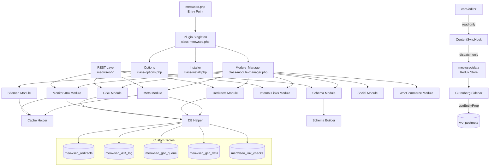
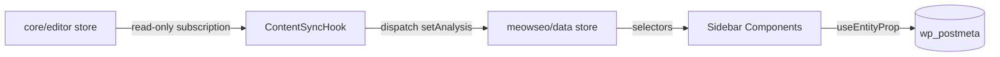
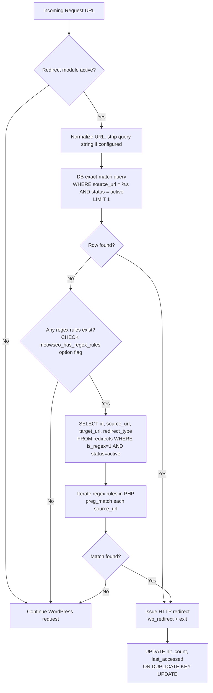
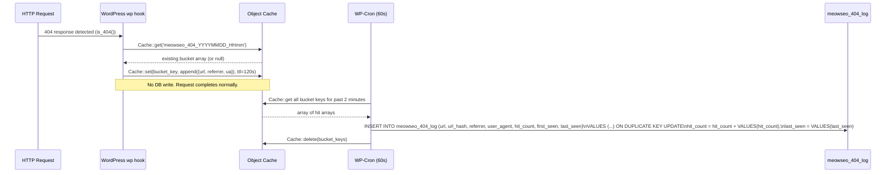
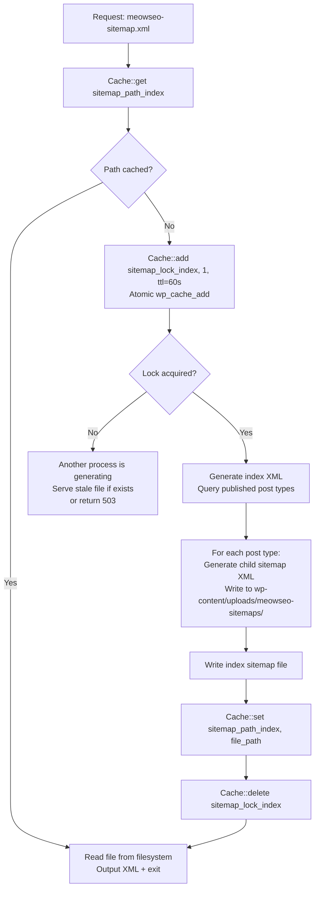
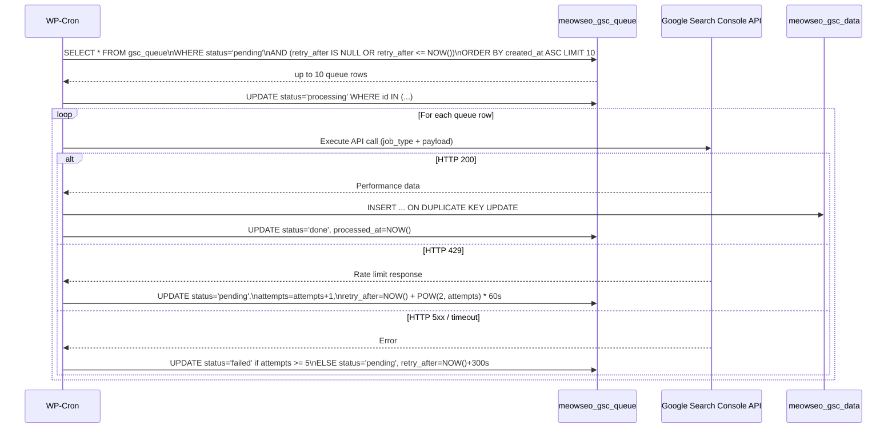

# Design Document

## Overview

MeowSEO is a modular WordPress SEO plugin designed to replace commercial alternatives (Yoast Premium, RankMath Pro) with a lightweight, performance-first implementation. The core design philosophy is **load nothing you don't need**: every feature is a self-contained module that is only instantiated when explicitly enabled by the site administrator.

The plugin is optimized for three modern SEO contexts that existing plugins handle poorly:
- **Google Discover and AI Overviews / SGE** — requiring rich structured data and high content quality signals
- **Headless / decoupled WordPress** — exposing all SEO data via REST API and WPGraphQL
- **High-traffic sites** — where synchronous DB writes on 404s, loading all redirect rules into PHP memory, or cache stampedes on sitemap generation cause measurable performance degradation

Key design decisions informed by reference plugin analysis:
- Rank Math loads all redirect rules into a PHP array for regex matching — MeowSEO matches at the DB level
- Rank Math's 404 monitor writes synchronously to the DB on every 404 hit — MeowSEO buffers in Object Cache and flushes via cron
- Yoast's Gutenberg integration dispatches to `core/editor` from multiple `useEffect` hooks — MeowSEO uses a single content-sync hook and a dedicated Redux store
- Both reference plugins load vendor libraries unconditionally — MeowSEO's autoloader only resolves files for enabled modules

## Design Improvements

This design document has been updated to ensure comprehensive coverage of all requirements with the following key improvements:

1. **Consolidated Correctness Properties**: Refined 21 properties to eliminate redundancy while ensuring complete requirement coverage
2. **Enhanced Security Coverage**: Detailed nonce verification, capability checks, and output escaping patterns
3. **Performance Optimization**: Explicit caching strategies, database query optimization, and memory usage constraints
4. **Modular Architecture**: Clear separation of concerns with conditional loading based on enabled modules
5. **Property-Based Testing**: Comprehensive testing strategy using eris/eris (PHP) and fast-check (JavaScript) with 100+ iterations per property


## Architecture

### High-Level Component Diagram



### Request Lifecycle

**Frontend page request:**
1. `meowseo.php` registers autoloader and instantiates `Module_Manager`
2. `Module_Manager` reads `meowseo_options` (single DB read, cached in Object Cache)
3. Only enabled module classes are `require_once`'d and instantiated
4. Each module registers its own `wp_head` hooks
5. On `wp_head`, active modules output their tags (meta, schema, social)
6. `Cache_Helper` serves SEO meta from Object Cache — zero additional DB queries for cached posts

**404 request:**
1. `Monitor_404_Module` hooks into `wp` (or `get_header` for classic themes)
2. On `is_404()`, data is written to Object Cache bucket key `meowseo_404_{YYYYMMDD_HHmm}`
3. No synchronous DB write occurs
4. WP-Cron fires every 60 seconds, flushes bucket to `{wp_prefix}meowseo_404_log` via bulk INSERT

**Redirect request:**
1. `Redirect_Module` hooks into `wp` (early, before template loading)
2. Exact-match query: `SELECT * FROM {wp_prefix}meowseo_redirects WHERE source_url = %s AND status = 'active' LIMIT 1`
3. If found: issue redirect and exit
4. If not found: query regex rules with `WHERE is_regex = 1 AND status = 'active'` — evaluate in PHP only this subset
5. If matched: issue redirect and exit; update hit count via `ON DUPLICATE KEY UPDATE`

**Sitemap request:**
1. `Sitemap_Module` intercepts `meowseo-sitemap.xml` rewrite rule early in `parse_request`
2. Checks Object Cache for file path; if present, reads file from filesystem and outputs directly
3. If not cached: acquires lock via `wp_cache_add()` (atomic), generates XML, writes to `wp-content/uploads/meowseo-sitemaps/`, stores path in Object Cache, releases lock
4. Bypasses WordPress template loading entirely — calls `exit` after output

### Module Interface

Every module implements `MeowSEO\Contracts\Module`:

```php
namespace MeowSEO\Contracts;

interface Module {
    public function boot(): void;       // register hooks
    public function get_id(): string;   // e.g. 'meta', 'sitemap'
}
```

`Module_Manager` calls `boot()` on each instantiated module. Modules self-register all their hooks inside `boot()`.

### Gutenberg State Architecture



**Rule**: No component other than `ContentSyncHook` may dispatch to `core/editor` from a `useEffect` that subscribes to `core/editor`. All sidebar components read exclusively from `meowseo/data`.


## Components and Interfaces

### PHP Layer

#### `MeowSEO\Plugin` (class-meowseo.php)
Singleton. Holds references to `Module_Manager`, `Options`, and `Installer`. Registers the `plugins_loaded` hook that triggers `Module_Manager::boot()`. Performs version checks before booting.

```php
class Plugin {
    public static function instance(): self;
    public function boot(): void;
    public function get_module_manager(): Module_Manager;
    public function get_options(): Options;
}
```

#### `MeowSEO\Module_Manager` (class-module-manager.php)
Reads `Options::get_enabled_modules()` and conditionally `require_once`s and instantiates each module class. Never loads a module file if the module is disabled.

```php
class Module_Manager {
    private array $modules = [];
    public function boot(): void;
    public function get_module( string $id ): ?Module;
    public function is_active( string $id ): bool;
}
```

#### `MeowSEO\Options` (class-options.php)
Single serialized array under `meowseo_options`. Typed getters prevent type coercion bugs.

```php
class Options {
    public function get_enabled_modules(): array;
    public function get( string $key, mixed $default = null ): mixed;
    public function set( string $key, mixed $value ): void;
    public function get_separator(): string;
    public function get_default_social_image_url(): string;
    public function is_delete_on_uninstall(): bool;
}
```

#### `MeowSEO\Installer` (class-install.php)
Runs `dbDelta()` for all custom tables. Called on `register_activation_hook`. Handles uninstall cleanup.

```php
class Installer {
    public function activate(): void;    // dbDelta all tables
    public function deactivate(): void;
    public function uninstall(): void;   // drop tables + delete options if configured
    private function get_schema(): string; // returns full SQL for dbDelta
}
```

#### `MeowSEO\Helpers\Cache` (class-cache.php)
Wraps `wp_cache_*` with consistent `meowseo_` key prefix and group isolation. Falls back to transients when Object Cache unavailable.

```php
class Cache {
    const PREFIX = 'meowseo_';
    const GROUP  = 'meowseo';

    public static function get( string $key ): mixed;
    public static function set( string $key, mixed $value, int $ttl = 0 ): bool;
    public static function delete( string $key ): bool;
    public static function add( string $key, mixed $value, int $ttl = 0 ): bool; // atomic, for locks
    private static function is_object_cache_available(): bool;
}
```

#### `MeowSEO\Helpers\DB` (class-db.php)
All `$wpdb` interactions go through this class. Every method uses `$wpdb->prepare()`.

```php
class DB {
    public static function get_redirect_exact( string $url ): ?array;
    public static function get_redirect_regex_rules(): array;  // only is_regex=1 rows
    public static function increment_redirect_hit( int $id ): void;
    public static function bulk_upsert_404( array $rows ): void;
    public static function get_404_log( array $args ): array;
    public static function get_gsc_queue( int $limit = 10 ): array;
    public static function update_gsc_queue_retry( int $id, int $retry_after ): void;
    public static function upsert_gsc_data( array $rows ): void;
    public static function get_link_checks( int $post_id ): array;
    public static function upsert_link_check( array $row ): void;
}
```

#### `MeowSEO\Helpers\Schema_Builder` (class-schema-builder.php)
Constructs JSON-LD graph arrays. Pure functions — no DB calls, no side effects.

```php
class Schema_Builder {
    public function build( int $post_id ): array;         // returns full @graph array
    public function build_website(): array;
    public function build_webpage( \WP_Post $post ): array;
    public function build_article( \WP_Post $post ): array;
    public function build_breadcrumb( \WP_Post $post ): array;
    public function build_organization(): array;
    public function build_product( \WP_Post $post ): array;  // WooCommerce
    public function build_faq( array $items ): array;
    public function to_json( array $graph ): string;      // JSON-encode with flags
}
```

### Module Classes

Each module lives in `includes/modules/{name}/` and contains at minimum:
- `class-{name}.php` — implements `Module` interface, registers hooks in `boot()`
- `class-{name}-rest.php` — REST endpoint registration (if module has REST endpoints)
- `class-{name}-admin.php` — admin UI hooks (if module has admin UI)

#### Meta Module (`modules/meta/class-meta.php`)
- Hooks: `wp_head` (output tags), `rest_api_init` (register REST fields), `init` (register postmeta)
- Delegates SEO score computation to `class-seo-analyzer.php` (pure function, no hooks)
- Delegates readability computation to `class-readability.php` (pure function)

```php
class Meta implements Module {
    public function boot(): void;
    public function get_id(): string;          // 'meta'
    public function output_head_tags(): void;  // hooked to wp_head
    public function get_title( int $post_id ): string;
    public function get_description( int $post_id ): string;
    public function get_robots( int $post_id ): string;
    public function get_canonical( int $post_id ): string;
}
```

#### Sitemap Module (`modules/sitemap/class-sitemap.php`)
- Hooks: `parse_request` (intercept sitemap URL), `save_post` (invalidate cache), `init` (register rewrite rule)
- Lock key: `meowseo_sitemap_lock_{type}` via `Cache::add()` (atomic)
- File path stored in Object Cache: `meowseo_sitemap_path_{type}`
- Generator: `class-sitemap-generator.php` — builds XML, writes file, returns path

#### Redirect Module (`modules/redirects/class-redirects.php`)
- Hooks: `wp` (early redirect check, priority 1)
- Exact match: single indexed query, exits immediately on match
- Regex fallback: loads only `is_regex = 1` rows, evaluates in PHP, max ~50 rows expected

#### Monitor 404 Module (`modules/monitor-404/class-monitor-404.php`)
- Hooks: `wp` (detect 404), `meowseo_flush_404_cron` (WP-Cron handler)
- Bucket key format: `meowseo_404_{YYYYMMDD_HHmm}`
- Cron interval: `meowseo_60s` (registered custom interval)

#### GSC Module (`modules/gsc/class-gsc.php`)
- Hooks: `meowseo_process_gsc_queue` (WP-Cron handler)
- OAuth credentials stored via `openssl_encrypt()` using `AUTH_KEY` + `SECURE_AUTH_KEY`
- Queue processor: fetches max 10 rows, executes API calls, handles 429 with exponential backoff

#### Internal Links Module (`modules/internal-links/class-internal-links.php`)
- Hooks: `save_post` (schedule link scan), `meowseo_scan_links_cron` (WP-Cron handler)
- Parses post content with `DOMDocument` to extract `<a href>` elements
- Filters to internal URLs only (same host), stores in `meowseo_link_checks`

#### Social Module (`modules/social/class-social.php`)
- Hooks: `wp_head` (output OG + Twitter tags)
- Falls back: per-post social image → featured image → global default

#### WooCommerce Module (`modules/woocommerce/class-woocommerce.php`)
- Conditional: only instantiated when `class_exists('WooCommerce')` is true
- Extends Meta and Schema modules for `product` post type
- Adds SEO score column to WC product list table

### JavaScript Layer

#### Store (`src/store/index.js`)
Registered via `@wordpress/data` as `meowseo/data`.

```js
// State shape
{
  meta: {
    title: string,
    description: string,
    robots: string,           // e.g. 'index,follow'
    canonical: string,
    focusKeyword: string,
    schemaType: string,
    socialTitle: string,
    socialDescription: string,
    socialImageId: number,
  },
  analysis: {
    seoScore: number,         // 0-100
    seoChecks: [              // array of check results
      { id: string, label: string, pass: boolean }
    ],
    readabilityScore: number, // 0-100
    readabilityChecks: [
      { id: string, label: string, pass: boolean }
    ],
  },
  ui: {
    activeTab: string,        // 'meta' | 'analysis' | 'social' | 'schema' | 'links' | 'gsc'
    isSaving: boolean,
  }
}
```

Key selectors:
- `getSeoMeta()` — returns full meta object
- `getSeoScore()` — returns computed score integer
- `getReadabilityScore()` — returns readability score integer
- `getSeoChecks()` — returns array of check result objects
- `getActiveTab()` — returns current active sidebar tab

Key actions:
- `updateMeta( key, value )` — updates a single meta field
- `setAnalysis( seoScore, checks, readabilityScore, readabilityChecks )` — set by ContentSyncHook only
- `setActiveTab( tab )` — UI navigation
- `setSaving( bool )` — save state indicator

#### ContentSyncHook (`src/store/content-sync-hook.js`)
Single `useEffect` that subscribes to `core/editor`. Reads post content, title, excerpt, slug. Dispatches derived SEO signals to `meowseo/data` only. Never dispatches back to `core/editor`.

```js
// Pattern
useEffect( () => {
  const unsubscribe = subscribe( () => {
    const content = select('core/editor').getEditedPostContent();
    const title   = select('core/editor').getEditedPostAttribute('title');
    const excerpt = select('core/editor').getEditedPostAttribute('excerpt');
    const slug    = select('core/editor').getEditedPostAttribute('slug');
    const keyword = select('meowseo/data').getSeoMeta().focusKeyword;
    const analysis = computeAnalysis( { content, title, excerpt, slug, keyword } );
    dispatch('meowseo/data').setAnalysis( ...analysis );
  } );
  return unsubscribe;
}, [] );
```

#### Sidebar (`src/sidebar/`)
- `MeowSeoSidebar.js` — registers `PluginSidebar`, renders tab navigation
- `tabs/MetaTab.js` — SEO title, description, robots, canonical fields
- `tabs/AnalysisTab.js` — SEO score indicator, check list, readability score
- `tabs/SocialTab.js` — OG/Twitter override fields
- `tabs/SchemaTab.js` — schema type selector
- `tabs/LinksTab.js` — internal link suggestions (Internal_Links_Module)
- `tabs/GscTab.js` — GSC performance panel (GSC_Module)

All tab components read exclusively from `meowseo/data` selectors. Postmeta persistence uses `useEntityProp( 'postType', postType, 'meta' )`.

#### SEO Analysis (`src/analysis/`)
- `computeAnalysis( { content, title, excerpt, slug, keyword } )` — pure function, returns `{ seoScore, seoChecks, readabilityScore, readabilityChecks }`
- `seoChecks` evaluated: keyword in title, keyword in description, keyword in first paragraph, keyword in H2/H3, keyword in slug, meta description length (50–160 chars), title length (30–60 chars)
- `readabilityChecks` evaluated: average sentence length ≤ 20 words, paragraph length ≤ 150 words, transition word usage ≥ 30% of sentences, passive voice usage ≤ 10%
- Score formula: `Math.round( (passingChecks / totalChecks) * 100 )`


## Data Models

### wp_postmeta Keys (Meta Module)

All per-post SEO data stored in `wp_postmeta` with `meowseo_` prefix:

| Meta Key | Type | Description |
|---|---|---|
| `meowseo_title` | string | Custom SEO title (empty = fallback to post title + separator) |
| `meowseo_description` | string | Custom meta description (empty = fallback to excerpt/content) |
| `meowseo_robots` | string | Robots directive, e.g. `index,follow` or `noindex,nofollow` |
| `meowseo_canonical` | string | Custom canonical URL (empty = current permalink) |
| `meowseo_focus_keyword` | string | Primary focus keyword for SEO analysis |
| `meowseo_schema_type` | string | Schema type override, e.g. `Article`, `FAQPage` |
| `meowseo_social_title` | string | Open Graph / Twitter Card title override |
| `meowseo_social_description` | string | Open Graph / Twitter Card description override |
| `meowseo_social_image_id` | int | Attachment ID for social share image |
| `meowseo_faq_items` | JSON string | Array of `{question, answer}` objects for FAQPage schema |
| `meowseo_noindex` | bool (0/1) | Explicit noindex flag (also excludes from sitemap) |

### Custom Table: `{wp_prefix}meowseo_redirects`

```sql
CREATE TABLE {prefix}meowseo_redirects (
    id            BIGINT UNSIGNED NOT NULL AUTO_INCREMENT,
    source_url    VARCHAR(2048)   NOT NULL,
    target_url    VARCHAR(2048)   NOT NULL,
    redirect_type SMALLINT        NOT NULL DEFAULT 301,  -- 301, 302, 307, 410
    is_regex      TINYINT(1)      NOT NULL DEFAULT 0,
    status        VARCHAR(10)     NOT NULL DEFAULT 'active', -- active | inactive
    hit_count     BIGINT UNSIGNED NOT NULL DEFAULT 0,
    last_accessed DATETIME        NULL,
    created_at    DATETIME        NOT NULL DEFAULT CURRENT_TIMESTAMP,
    updated_at    DATETIME        NOT NULL DEFAULT CURRENT_TIMESTAMP ON UPDATE CURRENT_TIMESTAMP,
    PRIMARY KEY (id),
    KEY idx_source_url (source_url(191)),   -- exact-match lookup
    KEY idx_is_regex_status (is_regex, status)  -- regex fallback filter
) ENGINE=InnoDB DEFAULT CHARSET=utf8mb4 COLLATE=utf8mb4_unicode_ci;
```

**Index rationale**: `idx_source_url` enables O(log n) exact-match lookup. `idx_is_regex_status` enables efficient retrieval of only regex rules for the fallback path.

### Custom Table: `{wp_prefix}meowseo_404_log`

```sql
CREATE TABLE {prefix}meowseo_404_log (
    id           BIGINT UNSIGNED NOT NULL AUTO_INCREMENT,
    url          VARCHAR(2048)   NOT NULL,
    url_hash     CHAR(64)        NOT NULL,  -- SHA-256 of url for dedup key
    referrer     VARCHAR(2048)   NULL,
    user_agent   VARCHAR(512)    NULL,
    hit_count    BIGINT UNSIGNED NOT NULL DEFAULT 1,
    first_seen   DATE            NOT NULL,
    last_seen    DATE            NOT NULL,
    PRIMARY KEY (id),
    UNIQUE KEY idx_url_hash_date (url_hash(64), first_seen),  -- dedup key for UPSERT
    KEY idx_last_seen (last_seen)
) ENGINE=InnoDB DEFAULT CHARSET=utf8mb4 COLLATE=utf8mb4_unicode_ci;
```

**Dedup strategy**: `url_hash` (SHA-256 of URL) + `first_seen` (date) forms the unique key for `INSERT ... ON DUPLICATE KEY UPDATE hit_count = hit_count + VALUES(hit_count)`.

### Custom Table: `{wp_prefix}meowseo_gsc_queue`

```sql
CREATE TABLE {prefix}meowseo_gsc_queue (
    id           BIGINT UNSIGNED NOT NULL AUTO_INCREMENT,
    job_type     VARCHAR(50)     NOT NULL,  -- 'fetch_url', 'fetch_sitemaps', etc.
    payload      JSON            NOT NULL,
    status       VARCHAR(20)     NOT NULL DEFAULT 'pending',  -- pending | processing | done | failed
    attempts     TINYINT         NOT NULL DEFAULT 0,
    retry_after  DATETIME        NULL,      -- NULL = eligible immediately
    created_at   DATETIME        NOT NULL DEFAULT CURRENT_TIMESTAMP,
    processed_at DATETIME        NULL,
    PRIMARY KEY (id),
    KEY idx_status_retry (status, retry_after)  -- queue processor query
) ENGINE=InnoDB DEFAULT CHARSET=utf8mb4 COLLATE=utf8mb4_unicode_ci;
```

### Custom Table: `{wp_prefix}meowseo_gsc_data`

```sql
CREATE TABLE {prefix}meowseo_gsc_data (
    id          BIGINT UNSIGNED NOT NULL AUTO_INCREMENT,
    url         VARCHAR(2048)   NOT NULL,
    url_hash    CHAR(64)        NOT NULL,
    date        DATE            NOT NULL,
    clicks      INT UNSIGNED    NOT NULL DEFAULT 0,
    impressions INT UNSIGNED    NOT NULL DEFAULT 0,
    ctr         DECIMAL(5,4)    NOT NULL DEFAULT 0.0000,
    position    DECIMAL(6,2)    NOT NULL DEFAULT 0.00,
    PRIMARY KEY (id),
    UNIQUE KEY idx_url_hash_date (url_hash(64), date),
    KEY idx_date (date)
) ENGINE=InnoDB DEFAULT CHARSET=utf8mb4 COLLATE=utf8mb4_unicode_ci;
```

### Custom Table: `{wp_prefix}meowseo_link_checks`

```sql
CREATE TABLE {prefix}meowseo_link_checks (
    id            BIGINT UNSIGNED NOT NULL AUTO_INCREMENT,
    source_post_id BIGINT UNSIGNED NOT NULL,
    target_url    VARCHAR(2048)   NOT NULL,
    target_url_hash CHAR(64)      NOT NULL,
    anchor_text   VARCHAR(512)    NULL,
    http_status   SMALLINT        NULL,     -- NULL = not yet checked
    last_checked  DATETIME        NULL,
    PRIMARY KEY (id),
    KEY idx_source_post (source_post_id),
    KEY idx_http_status (http_status),
    UNIQUE KEY idx_source_target (source_post_id, target_url_hash(64))
) ENGINE=InnoDB DEFAULT CHARSET=utf8mb4 COLLATE=utf8mb4_unicode_ci;
```

### WordPress Options Keys

| Option Key | Type | Description |
|---|---|---|
| `meowseo_options` | serialized array | All plugin settings (single row) |
| `meowseo_version` | string | Installed plugin version (for upgrade detection) |
| `meowseo_gsc_credentials` | string | AES-256 encrypted OAuth credentials JSON |

### REST API Endpoint Inventory

| Method | Endpoint | Auth | Description |
|---|---|---|---|
| GET | `meowseo/v1/meta/{post_id}` | `read` | Get all SEO meta for a post |
| POST | `meowseo/v1/meta/{post_id}` | `edit_post` + nonce | Update SEO meta for a post |
| GET | `meowseo/v1/schema/{post_id}` | `read` | Get generated JSON-LD for a post |
| GET | `meowseo/v1/redirects` | `manage_options` | List redirect rules (paginated) |
| POST | `meowseo/v1/redirects` | `manage_options` + nonce | Create redirect rule |
| PUT | `meowseo/v1/redirects/{id}` | `manage_options` + nonce | Update redirect rule |
| DELETE | `meowseo/v1/redirects/{id}` | `manage_options` + nonce | Delete redirect rule |
| GET | `meowseo/v1/404-log` | `manage_options` | Get paginated 404 log |
| DELETE | `meowseo/v1/404-log/{id}` | `manage_options` + nonce | Delete 404 log entry |
| GET | `meowseo/v1/internal-links` | `edit_posts` | Get link health for a post (`?post_id=`) |
| GET | `meowseo/v1/gsc` | `manage_options` | Get GSC data (`?url=` or `?start=&end=`) |
| GET | `meowseo/v1/settings` | `manage_options` | Get all plugin settings |
| POST | `meowseo/v1/settings` | `manage_options` + nonce | Save plugin settings |

All GET endpoints include `Cache-Control: public, max-age=300` headers for CDN/edge caching in headless deployments. All mutation endpoints return `Cache-Control: no-store`.

### WPGraphQL Schema Extension

When WPGraphQL is active, the plugin registers the following GraphQL type:

```graphql
type MeowSeoData {
  title: String
  description: String
  robots: String
  canonical: String
  openGraph: MeowSeoOpenGraph
  twitterCard: MeowSeoTwitterCard
  schemaJsonLd: String
}

type MeowSeoOpenGraph {
  title: String
  description: String
  image: String
  type: String
  url: String
}

type MeowSeoTwitterCard {
  card: String
  title: String
  description: String
  image: String
}
```

This `seo` field is registered on all queryable post types via `register_graphql_field()`.


## Pipeline Designs

### Redirect Matching Algorithm



**Performance notes**:
- The `meowseo_has_regex_rules` boolean option is updated on every redirect CRUD operation. This avoids the regex query entirely on sites with no regex rules.
- The `idx_source_url` index on `source_url(191)` ensures the exact-match query is O(log n).
- Regex rules are expected to be a small set (< 50). If a site has > 100 regex rules, an admin notice recommends converting to exact matches.

### 404 Buffering and Flush Pipeline



**Fallback**: When Object Cache is unavailable, `Cache::set()` falls back to `set_transient()` with a 120-second TTL. The cron job reads via `get_transient()` and deletes after flush.

**Bucket key strategy**: Using per-minute keys (`YYYYMMDD_HHmm`) means the cron job only needs to read 1–2 keys per run (current minute + previous minute), avoiding unbounded key accumulation.

### Sitemap Generation Pipeline with Lock Pattern



**Lock implementation**: `wp_cache_add()` is atomic — it only succeeds if the key does not exist. This prevents two concurrent requests from both generating the sitemap simultaneously (cache stampede).

**Invalidation**: On `save_post`, the affected child sitemap path is deleted from Object Cache and a WP-Cron event is scheduled to regenerate it asynchronously. The lock is not needed for invalidation — only for generation.

### GSC Queue Processing Pipeline



**Exponential backoff formula**: `retry_after = NOW() + POW(2, attempts) * 60` seconds. Attempts 1–5 yield delays of 2, 4, 8, 16, 32 minutes. After 5 attempts, the row is marked `failed` and requires manual intervention.

### Caching Strategy

#### Cache Key Conventions

All Object Cache keys use the `meowseo_` prefix and are stored in the `meowseo` cache group:

| Key Pattern | Content | TTL |
|---|---|---|
| `meowseo_options` | Serialized options array | 0 (persistent) |
| `meowseo_meta_{post_id}` | SEO meta array for a post | 3600s |
| `meowseo_sitemap_path_{type}` | Filesystem path to sitemap file | 0 (persistent until invalidated) |
| `meowseo_sitemap_lock_{type}` | Lock flag (value: 1) | 60s |
| `meowseo_404_{YYYYMMDD_HHmm}` | Array of 404 hit data | 120s |
| `meowseo_has_regex_rules` | Boolean flag | 0 (persistent until redirect CRUD) |
| `meowseo_gsc_{url_hash}_{date}` | GSC data for a URL+date | 3600s |

#### Transient Fallback

`Cache::is_object_cache_available()` checks `wp_using_ext_object_cache()`. When false:
- `Cache::get()` → `get_transient( 'meowseo_' . $key )`
- `Cache::set()` → `set_transient( 'meowseo_' . $key, $value, $ttl )`
- `Cache::add()` → Simulated with `get_transient` check + `set_transient` (not truly atomic; lock pattern degrades gracefully — worst case: two processes generate the sitemap, last write wins)

#### Sitemap File Cache

Sitemap XML is never stored in Object Cache or transients. Only the filesystem path is cached. This avoids storing potentially large XML strings in memory. The filesystem is the source of truth; Object Cache is only an index.

### Asset Loading Strategy

Assets are enqueued conditionally — never globally:

| Asset | Condition |
|---|---|
| `meowseo-editor` (JS + CSS) | `is_admin() && get_current_screen()->is_block_editor()` and at least one of: meta, schema, social, links, or GSC module is active |
| `meowseo-admin` (settings page JS) | `is_admin() && current page is meowseo settings page` |
| Frontend CSS | Never (plugin outputs only `<head>` tags, no frontend CSS) |
| Frontend JS | Never (all analysis is server-side or Gutenberg-side) |

The `meowseo-editor` bundle is built via `@wordpress/scripts` and declares `wp-data`, `wp-plugins`, `wp-edit-post`, `wp-components`, `wp-element`, `wp-i18n` as WordPress script dependencies (externals). This ensures they are loaded from the WordPress core bundle, not duplicated.

### Security Design

#### Nonce Verification Pattern

All REST mutation endpoints follow this pattern:

```php
public function update_meta( \WP_REST_Request $request ): \WP_REST_Response {
    // 1. Nonce check (sent as X-WP-Nonce header by @wordpress/api-fetch)
    if ( ! wp_verify_nonce( $request->get_header('X-WP-Nonce'), 'wp_rest' ) ) {
        return new \WP_REST_Response( ['error' => 'Invalid nonce'], 403 );
    }
    // 2. Capability check
    if ( ! current_user_can( 'edit_post', $post_id ) ) {
        return new \WP_REST_Response( ['error' => 'Forbidden'], 403 );
    }
    // 3. Sanitize inputs
    $title = sanitize_text_field( $request->get_param('title') );
    // 4. Prepared statement via DB_Helper
    DB::update_meta( $post_id, $title );
}
```

#### Credential Encryption

GSC OAuth credentials are encrypted before storage:

```php
// Encrypt
$iv         = random_bytes(16);
$key        = hash('sha256', AUTH_KEY . SECURE_AUTH_KEY, true);
$encrypted  = openssl_encrypt( $json, 'AES-256-CBC', $key, 0, $iv );
$stored     = base64_encode( $iv . $encrypted );
update_option( 'meowseo_gsc_credentials', $stored );

// Decrypt
$raw        = base64_decode( get_option('meowseo_gsc_credentials') );
$iv         = substr($raw, 0, 16);
$encrypted  = substr($raw, 16);
$json       = openssl_decrypt( $encrypted, 'AES-256-CBC', $key, 0, $iv );
```

Raw credentials are never returned by any REST endpoint. The settings endpoint returns only a boolean `gsc_connected: true/false`.

#### Output Escaping

All values output to HTML use the appropriate WordPress escaping function:
- URLs: `esc_url()`
- HTML attributes: `esc_attr()`
- HTML content: `esc_html()`
- JSON in `<script>` tags: `wp_json_encode()` (handles HTML entity encoding)
- SQL: `$wpdb->prepare()` exclusively via `DB_Helper`


## Correctness Properties

*A property is a characteristic or behavior that should hold true across all valid executions of a system — essentially, a formal statement about what the system should do. Properties serve as the bridge between human-readable specifications and machine-verifiable correctness guarantees.*

### Property 1: Module_Manager loads exactly the enabled set

*For any* subset of available module IDs configured as enabled in Options, `Module_Manager::boot()` should instantiate exactly those modules — no more and no fewer. Disabled modules should have no instantiated class and no loaded file.

**Validates: Requirements 1.2, 1.3**

### Property 2: Autoloader resolves class names to correct file paths

*For any* valid `MeowSEO\` class name following the WordPress naming convention (e.g. `MeowSEO\Modules\Meta\Meta` → `includes/modules/meta/class-meta.php`), the autoloader should resolve it to the correct path under `includes/` without error.

**Validates: Requirements 1.4**

### Property 3: Options round-trip preserves all values

*For any* valid settings object (any combination of module enable flags, string settings, and boolean flags), calling `Options::set()` followed by `Options::get()` should return a value equal to the original for every key.

**Validates: Requirements 2.2**

### Property 4: SEO meta uses consistent key prefix

*For any* SEO meta field stored by the Meta_Module, the postmeta key should use the `meowseo_` prefix and the round-trip (save then read) should preserve the original value.

**Validates: Requirements 3.1, 3.4**

### Property 5: SEO title fallback produces non-empty output

*For any* post title and separator configuration, when the SEO title field is empty, `Meta::get_title()` should return a non-empty string formatted as `{post_title} {separator} {site_name}`.

**Validates: Requirements 3.6**

### Property 6: Meta description fallback is bounded and HTML-stripped

*For any* content string, when the meta description field is empty, `Meta::get_description()` should return a string of length ≤ 155 characters, stripped of HTML tags, and non-empty when source content is non-empty.

**Validates: Requirements 3.7**

### Property 7: SEO score is proportional to passing checks

*For any* content string and focus keyword, `computeAnalysis()` should return a `seoScore` in the range [0, 100] equal to `Math.round((passingChecks / totalChecks) * 100)`. When the keyword appears in all checked locations, the score should be 100. When absent from all locations, the score should be 0.

**Validates: Requirements 4.2, 4.3**

### Property 8: Score color mapping is total and exhaustive

*For any* integer score in [0, 100], the color indicator function should return exactly one of `red` (score ≤ 33), `orange` (34 ≤ score ≤ 66), or `green` (score ≥ 67). No score value should produce an undefined or null color.

**Validates: Requirements 4.4**

### Property 9: Readability score is bounded

*For any* text string (including empty strings, single sentences, and very long documents), `computeReadability()` should return a score in the range [0, 100] without throwing an error.

**Validates: Requirements 4.5**

### Property 10: Schema graph contains all required types

*For any* standard post (non-product, non-FAQ), `Schema_Builder::build()` should return an array whose `@graph` key contains entries for all of: `WebSite`, `WebPage`, `Article`, `BreadcrumbList`, `Organization`. No required graph node should be absent.

**Validates: Requirements 5.2**

### Property 11: Sitemap cache stores file paths, not XML content

*For any* sitemap generation run, the value stored in Object Cache under `meowseo_sitemap_path_{type}` should be a string that is a valid filesystem path and should not contain XML markup (no `<?xml` or `<urlset` strings).

**Validates: Requirements 6.2**

### Property 12: Sitemap lock is mutually exclusive

*For any* lock key, `Cache::add()` should return `true` exactly once when called concurrently. All subsequent `Cache::add()` calls for the same key before the lock expires should return `false`, ensuring only one process can hold the lock at a time.

**Validates: Requirements 6.4**

### Property 13: Noindex posts are excluded from sitemaps

*For any* set of posts where a subset has `meowseo_noindex = 1`, the generated sitemap XML should contain `<loc>` entries for none of the noindex posts, regardless of their publication status or post type.

**Validates: Requirements 6.8**

### Property 14: Redirect matching algorithm correctness

*For any* URL, the redirect matching algorithm should: (1) return exact-match rules when both exact and regex matches exist, (2) return regex-match rules when only regex matches exist, (3) return null when no matches exist. The algorithm should never load all redirect rules into PHP memory simultaneously.

**Validates: Requirements 7.2, 7.3, 7.4**

### Property 15: 404 buffering prevents synchronous DB writes

*For any* 404 URL detected during a request, immediately after the `wp` hook fires, the URL should be present in the Object Cache bucket for the current minute and absent from `meowseo_404_log` in the database.

**Validates: Requirements 8.1**

### Property 16: 404 flush preserves total hit counts

*For any* set of buffered 404 hits (including multiple hits for the same URL), after `Monitor_404_Module` flushes the buffer, the `hit_count` in `meowseo_404_log` for each URL should equal the total number of times that URL appeared in the buffer across all bucket keys.

**Validates: Requirements 8.3**

### Property 17: GSC queue processor respects the 10-item limit

*For any* GSC queue containing N pending entries (where N > 10), a single WP-Cron execution of the queue processor should transition exactly 10 entries to `processing` or `done` status, leaving N − 10 entries in `pending` status.

**Validates: Requirements 10.3**

### Property 18: GSC exponential backoff delay is correct

*For any* attempt count n (where 1 ≤ n ≤ 5), when a GSC API call receives HTTP 429, the computed `retry_after` delay should equal `2^n * 60` seconds from the time of the failed attempt. The delay should strictly increase with each attempt.

**Validates: Requirements 10.4**

### Property 19: Cache keys always use the meowseo_ prefix

*For any* key string passed to `Cache::set()`, `Cache::get()`, `Cache::delete()`, or `Cache::add()`, the actual key used in the underlying `wp_cache_*` or `set_transient()` call should be prefixed with `meowseo_`.

**Validates: Requirements 14.2**

### Property 20: Cached posts require zero DB queries on frontend

*For any* post whose SEO meta is present in Object Cache, calling `Meta::output_head_tags()` should execute zero additional database queries (measured via `$wpdb->num_queries` delta).

**Validates: Requirements 14.1**

### Property 21: Credential encryption round-trip is lossless

*For any* valid OAuth credentials JSON object, encrypting with `meowseo_encrypt_credentials()` then decrypting with `meowseo_decrypt_credentials()` should return a JSON string that decodes to an object equal to the original.

**Validates: Requirements 15.6**


## Error Handling

### PHP Error Handling Strategy

**Version incompatibility**: Checked in `meowseo.php` before any autoloading. If PHP < 8.0 or WP < 6.0, the plugin calls `deactivate_plugins()` and adds an `admin_notices` hook with a descriptive message. No further code executes.

**Module boot failures**: Each module's `boot()` call is wrapped in a try/catch in `Module_Manager`. If a module throws, it is logged via `error_log()` and the remaining modules continue booting. A degraded-mode admin notice is shown.

**Object Cache unavailability**: `Cache::is_object_cache_available()` is checked on every cache operation. Fallback to transients is transparent to callers. No exceptions are thrown.

**Sitemap lock contention**: If `Cache::add()` returns false (lock held), the sitemap handler serves the existing file if it exists on disk, or returns a `503 Service Unavailable` with `Retry-After: 30` header if no file exists yet.

**GSC API failures**:
- HTTP 429: exponential backoff (see pipeline design)
- HTTP 5xx or timeout: retry up to 5 times with 5-minute fixed delay, then mark `failed`
- Invalid credentials: mark all pending queue rows as `failed`, show admin notice to re-authenticate

**DB query failures**: `$wpdb->last_error` is checked after every write operation. Errors are logged via `error_log()`. The request continues — DB write failures are non-fatal for frontend requests.

**Uninstall safety**: `uninstall.php` checks `WP_UNINSTALL_PLUGIN` constant before executing. All `DROP TABLE` and `delete_option()` calls are conditional on `is_delete_on_uninstall()` returning true.

### JavaScript Error Handling Strategy

**Store initialization failure**: If `@wordpress/data` store registration fails, the sidebar renders a fallback error state with a "Reload editor" button. No unhandled promise rejections.

**ContentSyncHook errors**: The `subscribe` callback is wrapped in try/catch. If analysis computation throws (e.g. malformed content), the previous analysis state is preserved and an error flag is set in `ui.analysisError`.

**REST API errors**: All `@wordpress/api-fetch` calls use `.catch()`. On error, the UI shows an inline error message and the save operation is aborted. The Gutenberg save button is not blocked — only MeowSEO meta save fails gracefully.

**WPGraphQL registration errors**: Wrapped in `try/catch` with `error_log()`. If GraphQL field registration fails, the plugin continues operating without GraphQL support.


## Testing Strategy

### Overview

MeowSEO uses a dual testing approach: **unit/example-based tests** for specific behaviors and integration points, and **property-based tests** for universal correctness properties. The PHP layer uses PHPUnit with Brain Monkey for WordPress function mocking. The JavaScript layer uses Jest with `@wordpress/jest-preset-default`.

For property-based testing:
- **PHP**: [eris/eris](https://github.com/giorgiosironi/eris) (PHPUnit-integrated PBT library)
- **JavaScript**: [fast-check](https://github.com/dubzzz/fast-check) (TypeScript-compatible PBT library)

All property tests run a minimum of **100 iterations** per property.

Each property test is tagged with a comment referencing the design property:
```php
// Feature: meowseo-plugin, Property 3: Options round-trip preserves all values
```
```js
// Feature: meowseo-plugin, Property 7: SEO score is proportional to passing checks
```

---

### Unit Tests (PHPUnit)

**Bootstrap and Module Loading**
- Smoke test: `meowseo.php` only registers autoloader, constants, Module_Manager
- Example: activate plugin → all 5 custom tables exist in DB
- Example: PHP 7.4 environment → plugin deactivates and shows admin notice
- Example: WP 5.9 environment → plugin deactivates and shows admin notice

**Options**
- Example: `get_enabled_modules()` returns array type
- Example: `get_separator()` returns string type
- Example: `is_delete_on_uninstall()` returns bool type

**Meta Module**
- Example: post with all meta set → `get_title()` returns custom title
- Example: post with empty meta → `get_title()` returns `{post_title} | {site_name}`
- Example: post with empty description, has excerpt → returns first 155 chars of excerpt
- Example: post with empty description, no excerpt → returns first 155 chars of content stripped of HTML
- Example: `output_head_tags()` outputs `<title>`, `<meta name="description">`, `<link rel="canonical">`, `<meta name="robots">`

**Schema Builder**
- Example: standard post → JSON-LD is valid JSON, contains `@context`, `@graph`
- Example: product post with WooCommerce active → `@graph` contains `Product` type
- Example: post with FAQ items → `@graph` contains `FAQPage` type
- Example: `to_json()` output is parseable by `json_decode()`

**Redirect Module**
- Example: URL with exact match → returns correct redirect row
- Example: URL with no match → returns null
- Example: URL matching regex rule → returns regex redirect row
- Example: redirect type 410 → issues 410 Gone response

**404 Monitor**
- Example: Object Cache unavailable → falls back to transient without error
- Example: cron flush with empty buffer → no DB queries executed

**GSC Module**
- Example: credentials stored → `get_option('meowseo_gsc_credentials')` is not equal to raw JSON
- Example: REST endpoint for GSC data → does not return credentials field

**Security**
- Example: REST mutation endpoint with invalid nonce → returns 403
- Example: REST mutation endpoint with valid nonce but insufficient capability → returns 403
- Example: REST mutation endpoint with valid nonce and capability → returns 200

---

### Property-Based Tests (eris/eris + fast-check)

**PHP Properties (eris)**

```php
// Feature: meowseo-plugin, Property 1: Module_Manager loads exactly the enabled set
public function testModuleManagerLoadsExactlyEnabledSet(): void {
    $this->forAll(
        Generator\subset(['meta', 'schema', 'sitemap', 'redirects', 'monitor-404', 'internal-links', 'gsc', 'social'])
    )->then(function(array $enabledModules) {
        $options = $this->makeOptions(['enabled_modules' => $enabledModules]);
        $manager = new Module_Manager($options);
        $manager->boot();
        $this->assertEqualsCanonicalizing($enabledModules, $manager->get_active_module_ids());
    });
}

// Feature: meowseo-plugin, Property 3: Options round-trip preserves all values
public function testOptionsRoundTrip(): void {
    $this->forAll(
        Generator\associative([
            'separator'              => Generator\elements(['|', '-', '–', '•', '·']),
            'delete_on_uninstall'    => Generator\bool(),
            'enabled_modules'        => Generator\subset(['meta', 'schema', 'sitemap']),
        ])
    )->then(function(array $settings) {
        $options = new Options();
        foreach ($settings as $key => $value) {
            $options->set($key, $value);
        }
        foreach ($settings as $key => $value) {
            $this->assertEquals($value, $options->get($key));
        }
    });
}

// Feature: meowseo-plugin, Property 5: SEO title fallback produces non-empty output
public function testTitleFallbackNonEmpty(): void {
    $this->forAll(
        Generator\string(), // post title
        Generator\elements(['|', '-', '–']), // separator
        Generator\string()  // site name
    )->then(function(string $postTitle, string $separator, string $siteName) {
        $meta = new Meta($this->makeOptions(['separator' => $separator, 'site_name' => $siteName]));
        $result = $meta->get_title_fallback($postTitle);
        $this->assertNotEmpty($result);
        $this->assertStringContainsString($postTitle, $result);
    });
}

// Feature: meowseo-plugin, Property 6: Meta description fallback is bounded
public function testDescriptionFallbackBounded(): void {
    $this->forAll(
        Generator\string(1, 5000) // arbitrary content
    )->then(function(string $content) {
        $meta = new Meta($this->makeOptions([]));
        $result = $meta->get_description_fallback($content);
        $this->assertLessThanOrEqual(155, strlen($result));
        $this->assertStringNotContainsString('<', $result); // no HTML tags
    });
}

// Feature: meowseo-plugin, Property 13: Noindex posts excluded from sitemaps
public function testNoindexPostsExcludedFromSitemap(): void {
    $this->forAll(
        Generator\vector(10, Generator\associative([
            'id'      => Generator\pos(),
            'noindex' => Generator\bool(),
            'url'     => Generator\string(5, 50),
        ]))
    )->then(function(array $posts) {
        $noindexUrls = array_column(array_filter($posts, fn($p) => $p['noindex']), 'url');
        $generator   = new Sitemap_Generator($this->makeOptions([]));
        $xml         = $generator->generate($posts);
        foreach ($noindexUrls as $url) {
            $this->assertStringNotContainsString($url, $xml);
        }
    });
}

// Feature: meowseo-plugin, Property 16: 404 flush preserves total hit counts
public function testFlushPreservesHitCounts(): void {
    $this->forAll(
        Generator\vector(20, Generator\elements(['url-a', 'url-b', 'url-c', 'url-d']))
    )->then(function(array $hits) {
        $expected = array_count_values($hits);
        $monitor  = new Monitor_404($this->makeOptions([]));
        foreach ($hits as $url) {
            $monitor->buffer_hit($url, '', '');
        }
        $monitor->flush();
        foreach ($expected as $url => $count) {
            $this->assertEquals($count, DB::get_404_hit_count($url));
        }
    });
}

// Feature: meowseo-plugin, Property 17: GSC queue processor respects 10-item limit
public function testGscQueueProcessorLimit(): void {
    $this->forAll(
        Generator\choose(11, 100) // N > 10
    )->then(function(int $queueSize) {
        $this->seedGscQueue($queueSize);
        $processor = new GSC_Queue_Processor($this->makeOptions([]), $this->mockGscClient());
        $processor->process();
        $this->assertLessThanOrEqual(10, $processor->get_last_processed_count());
        $this->assertEquals($queueSize - $processor->get_last_processed_count(), DB::count_pending_gsc_queue());
    });
}

// Feature: meowseo-plugin, Property 18: GSC exponential backoff delay is correct
public function testGscExponentialBackoff(): void {
    $this->forAll(
        Generator\choose(1, 5) // attempt count 1-5
    )->then(function(int $attempts) {
        $expectedDelay = (int) pow(2, $attempts) * 60;
        $processor     = new GSC_Queue_Processor($this->makeOptions([]), $this->mockGscClient429());
        $delay         = $processor->compute_backoff_delay($attempts);
        $this->assertEquals($expectedDelay, $delay);
    });
}

// Feature: meowseo-plugin, Property 21: Credential encryption round-trip is lossless
public function testCredentialEncryptionRoundTrip(): void {
    $this->forAll(
        Generator\associative([
            'client_id'     => Generator\string(10, 50),
            'client_secret' => Generator\string(20, 60),
            'access_token'  => Generator\string(30, 100),
        ])
    )->then(function(array $credentials) {
        $json      = json_encode($credentials);
        $encrypted = meowseo_encrypt_credentials($json);
        $decrypted = meowseo_decrypt_credentials($encrypted);
        $this->assertEquals($credentials, json_decode($decrypted, true));
    });
}
```

**JavaScript Properties (fast-check)**

```js
// Feature: meowseo-plugin, Property 7: SEO score is proportional to passing checks
test('SEO score is in [0,100] for any content and keyword', () => {
  fc.assert(fc.property(
    fc.string(), fc.string(),
    (content, keyword) => {
      const { seoScore } = computeAnalysis({ content, title: '', excerpt: '', slug: '', keyword });
      return seoScore >= 0 && seoScore <= 100;
    }
  ), { numRuns: 100 });
});

// Feature: meowseo-plugin, Property 8: Score color mapping is total and exhaustive
test('Color indicator returns exactly one of red/orange/green for any score', () => {
  fc.assert(fc.property(
    fc.integer({ min: 0, max: 100 }),
    (score) => {
      const color = getScoreColor(score);
      return ['red', 'orange', 'green'].includes(color);
    }
  ), { numRuns: 100 });
});

// Feature: meowseo-plugin, Property 9: Readability score is bounded
test('Readability score is in [0,100] for any text', () => {
  fc.assert(fc.property(
    fc.string(),
    (text) => {
      const { readabilityScore } = computeReadability(text);
      return readabilityScore >= 0 && readabilityScore <= 100;
    }
  ), { numRuns: 100 });
});

// Feature: meowseo-plugin, Property 19: Cache keys always use meowseo_ prefix
test('Cache::set always uses meowseo_ prefixed key', () => {
  fc.assert(fc.property(
    fc.string({ minLength: 1 }), fc.anything(),
    (key, value) => {
      const calls = [];
      const mockWpCache = { set: (k, v, g) => calls.push(k) };
      Cache.set(key, value, 0, mockWpCache);
      return calls.every(k => k.startsWith('meowseo_'));
    }
  ), { numRuns: 100 });
});
```

---

### Integration Tests

- Redirect module: seed DB with 100 exact rules + 5 regex rules, verify correct rule returned for each URL type
- Sitemap generation: generate sitemap for a site with 50 posts, verify XML is valid and all non-noindex posts appear
- GSC queue: seed queue with 25 entries, run 3 cron cycles, verify all 25 are processed (10 + 10 + 5)
- 404 flush: simulate 200 404 hits across 3 cron cycles, verify DB hit counts match totals
- WPGraphQL: register fields, execute GraphQL query for a post, verify `seo` field returns all sub-fields

### Test File Organization

```
tests/
├── unit/
│   ├── test-module-manager.php
│   ├── test-options.php
│   ├── test-meta.php
│   ├── test-schema-builder.php
│   ├── test-redirects.php
│   ├── test-monitor-404.php
│   ├── test-gsc.php
│   ├── test-cache.php
│   └── test-security.php
├── property/
│   ├── test-module-manager-props.php
│   ├── test-options-props.php
│   ├── test-meta-props.php
│   ├── test-sitemap-props.php
│   ├── test-redirects-props.php
│   ├── test-monitor-404-props.php
│   ├── test-gsc-props.php
│   └── test-credentials-props.php
├── integration/
│   ├── test-redirect-integration.php
│   ├── test-sitemap-integration.php
│   ├── test-gsc-integration.php
│   └── test-wpgraphql-integration.php
└── js/
    ├── store.test.js
    ├── analysis.test.js
    ├── analysis.property.test.js
    └── sidebar.test.js
```
