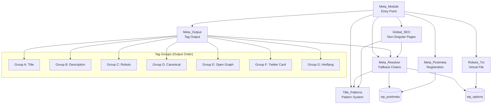
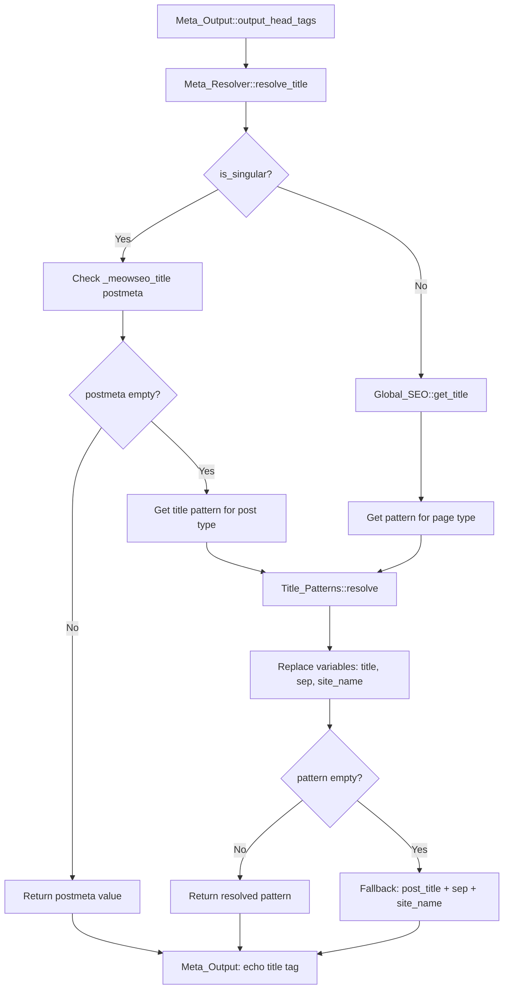
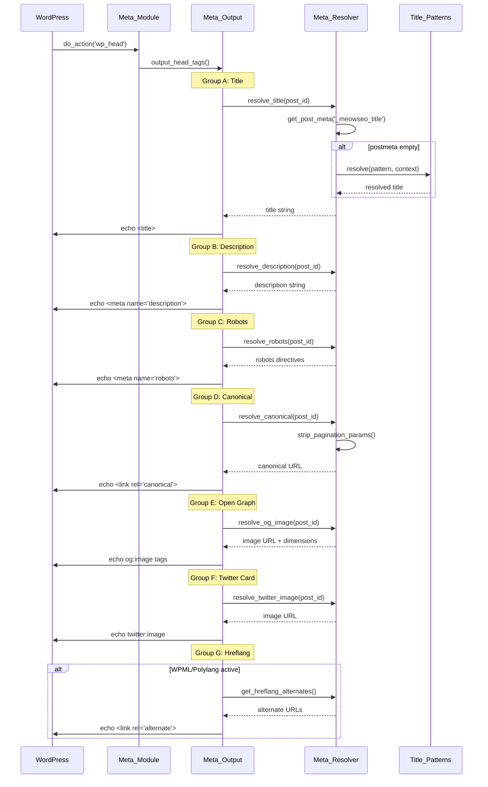

# Design Document: Meta Module Rebuild

## Overview

The Meta Module rebuild transforms the current basic meta tag implementation into a sophisticated, maintainable architecture inspired by Yoast's Presenter pattern and RankMath's title pattern system. The new design separates concerns across 7 specialized classes, each with a single responsibility, enabling comprehensive meta tag output with robust fallback chains.

### Design Philosophy

1. **Separation of Concerns**: Each class has one clear responsibility
2. **Fallback Chain Completeness**: Every meta field has a complete fallback path ensuring no empty output
3. **Testability**: Pure functions and clear interfaces enable property-based testing
4. **Performance**: Single-pass resolution with minimal database queries
5. **Extensibility**: Pattern system allows customization without code changes

### Key Improvements Over Current Implementation

The current `class-meta.php` has several limitations:
- All logic in a single class (600+ lines)
- No title pattern system
- Limited fallback chains
- No separation between resolution and output
- Missing Open Graph and Twitter Card support
- No robots.txt management
- No support for non-singular pages

The new architecture addresses all these issues with clean separation and comprehensive coverage.

## Architecture

### Component Diagram



### Data Flow: Title Resolution



### Sequence Diagram: wp_head Execution



## Component Interfaces

### 1. Meta_Module (Entry Point)

**Responsibility**: Module registration and hook coordination

**File**: `includes/modules/meta/class-meta-module.php`

```php
namespace MeowSEO\Modules\Meta;

use MeowSEO\Contracts\Module;
use MeowSEO\Options;

class Meta_Module implements Module {
    private Options $options;
    private Meta_Output $output;
    private Meta_Resolver $resolver;
    private Title_Patterns $patterns;
    private Meta_Postmeta $postmeta;
    private Global_SEO $global_seo;
    private Robots_Txt $robots_txt;
    
    public function __construct(Options $options);
    public function boot(): void;
    public function get_id(): string;
    
    // Hook callbacks
    private function register_hooks(): void;
    private function remove_theme_title_tag(): void;
    private function filter_document_title_parts(array $parts): array;
}
```

**Key Methods**:
- `boot()`: Registers all hooks (wp_head priority 1, document_title_parts, save_post, rest_api_init, enqueue_block_editor_assets)
- `remove_theme_title_tag()`: Calls `remove_theme_support('title-tag')` to prevent duplicate title output
- `filter_document_title_parts()`: Returns empty array to suppress WordPress's default title generation

### 2. Meta_Output (Tag Output)

**Responsibility**: Output all meta tags in correct order

**File**: `includes/modules/meta/class-meta-output.php`

```php
namespace MeowSEO\Modules\Meta;

class Meta_Output {
    private Meta_Resolver $resolver;
    
    public function __construct(Meta_Resolver $resolver);
    
    // Main output method (hooked to wp_head)
    public function output_head_tags(): void;
    
    // Tag group output methods (called in order)
    private function output_title(): void;
    private function output_description(): void;
    private function output_robots(): void;
    private function output_canonical(): void;
    private function output_open_graph(): void;
    private function output_twitter_card(): void;
    private function output_hreflang(): void;
    
    // Helper methods
    private function esc_meta_content(string $content): string;
    private function format_iso8601(string $date): string;
}
```

**Output Order** (Requirement 2.1):
1. Group A: `<title>` tag
2. Group B: `<meta name="description">`
3. Group C: `<meta name="robots">`
4. Group D: `<link rel="canonical">`
5. Group E: Open Graph tags (og:type, og:title, og:description, og:url, og:image, og:site_name, article:published_time, article:modified_time)
6. Group F: Twitter Card tags (twitter:card, twitter:title, twitter:description, twitter:image)
7. Group G: Hreflang alternates (only if WPML/Polylang detected)

**Escaping Requirements**:
- Title: `esc_html()`
- Meta content: `esc_attr()`
- URLs: `esc_url()`
- ISO 8601 dates: No escaping needed (validated format)

### 3. Meta_Resolver (Fallback Chains)

**Responsibility**: Resolve all meta field values through fallback chains

**File**: `includes/modules/meta/class-meta-resolver.php`

```php
namespace MeowSEO\Modules\Meta;

use MeowSEO\Options;

class Meta_Resolver {
    private Options $options;
    private Title_Patterns $patterns;
    
    public function __construct(Options $options, Title_Patterns $patterns);
    
    // Title resolution (Requirement 3)
    public function resolve_title(?int $post_id = null): string;
    
    // Description resolution (Requirement 4)
    public function resolve_description(?int $post_id = null): string;
    
    // Open Graph image resolution (Requirement 5)
    public function resolve_og_image(?int $post_id = null): array;
    
    // Canonical URL resolution (Requirement 6)
    public function resolve_canonical(?int $post_id = null): string;
    
    // Robots directive resolution (Requirement 7)
    public function resolve_robots(?int $post_id = null): string;
    
    // Twitter Card fields (independent from OG)
    public function resolve_twitter_title(?int $post_id = null): string;
    public function resolve_twitter_description(?int $post_id = null): string;
    public function resolve_twitter_image(?int $post_id = null): string;
    
    // Hreflang alternates
    public function get_hreflang_alternates(): array;
    
    // Helper methods
    private function get_postmeta(int $post_id, string $key): mixed;
    private function truncate_text(string $text, int $length): string;
    private function strip_pagination_params(string $url): string;
    private function get_first_content_image(int $post_id, int $min_width): ?array;
    private function get_image_dimensions(int $attachment_id): array;
    private function merge_robots_directives(array $directives): string;
    private function is_wpml_active(): bool;
    private function is_polylang_active(): bool;
}
```

**Fallback Chain Details**:

**Title** (Requirement 3):
1. `_meowseo_title` postmeta
2. Title pattern for post type (via Title_Patterns)
3. `post_title + separator + site_name`

**Description** (Requirement 4):
1. `_meowseo_description` postmeta
2. Post excerpt (first 160 chars, HTML stripped)
3. Post content (first 160 chars, HTML stripped)
4. Empty string (allows Meta_Output to skip tag)

**OG Image** (Requirement 5):
1. `_meowseo_og_image` postmeta (attachment ID)
2. Featured image (if width >= 1200px)
3. First content image (if width >= 1200px)
4. Global default from settings
5. Empty string

**Canonical** (Requirement 6):
1. `_meowseo_canonical` postmeta
2. `get_permalink()` for singular
3. `get_term_link()` for term archives
4. `home_url()` for homepage
5. Always strips pagination params: `/page/N/`, `?paged=N`, `?page=N`

**Robots** (Requirement 7):
- Base: `index, follow, max-image-preview:large, max-snippet:-1, max-video-preview:-1`
- Override with `_meowseo_robots_noindex` and `_meowseo_robots_nofollow` postmeta
- Automatic rules: noindex for `is_search()`, `is_attachment()`, date archives (if enabled)

### 4. Title_Patterns (Pattern System)

**Responsibility**: Parse, validate, and resolve title patterns with variable substitution

**File**: `includes/modules/meta/class-title-patterns.php`

```php
namespace MeowSEO\Modules\Meta;

use MeowSEO\Options;

class Title_Patterns {
    private Options $options;
    
    // Supported variables
    private const VARIABLES = [
        'title', 'sep', 'site_name', 'tagline', 'page',
        'term_name', 'term_description', 'author_name',
        'current_year', 'current_month'
    ];
    
    public function __construct(Options $options);
    
    // Pattern resolution (Requirement 8.3)
    public function resolve(string $pattern, array $context): string;
    
    // Parser and pretty printer (Requirement 12)
    public function parse(string $pattern): array|object;
    public function print(array $structured): string;
    
    // Pattern retrieval
    public function get_pattern_for_post_type(string $post_type): string;
    public function get_pattern_for_page_type(string $page_type): string;
    
    // Default patterns (Requirement 8.2)
    public function get_default_patterns(): array;
    
    // Validation
    public function validate(string $pattern): bool|object;
    
    // Variable replacement
    private function replace_variables(string $pattern, array $context): string;
    private function get_variable_value(string $var_name, array $context): string;
}
```

**Supported Variables** (Requirement 8.1):
- `{title}`: Post/page title
- `{sep}`: Separator from settings (default: `|`)
- `{site_name}`: Site name from `get_bloginfo('name')`
- `{tagline}`: Site tagline from `get_bloginfo('description')`
- `{page}`: "Page N" for paginated content
- `{term_name}`: Category/tag name
- `{term_description}`: Category/tag description
- `{author_name}`: Author display name
- `{current_year}`: Current year (4 digits)
- `{current_month}`: Current month name

**Default Patterns** (Requirement 8.2):
- Single post: `{title} {sep} {site_name}`
- Single page: `{title} {sep} {site_name}`
- Homepage: `{site_name} {sep} {tagline}`
- Category: `{term_name} Archives {sep} {site_name}`
- Tag: `{term_name} Tag {sep} {site_name}`
- Author: `{author_name} {sep} {site_name}`
- Date archive: `{current_month} {current_year} Archives {sep} {site_name}`
- Search: `Search Results {sep} {site_name}`
- 404: `Page Not Found {sep} {site_name}`
- Attachment: `{title} {sep} {site_name}`

**Parser Structure** (Requirement 12):
```php
// Input: "{title} {sep} {site_name}"
// Output:
[
    ['type' => 'variable', 'name' => 'title'],
    ['type' => 'literal', 'value' => ' '],
    ['type' => 'variable', 'name' => 'sep'],
    ['type' => 'literal', 'value' => ' '],
    ['type' => 'variable', 'name' => 'site_name']
]
```

**Validation Rules** (Requirement 12.4, 12.5, 12.6):
- All variables must be from supported list
- Curly braces must be balanced
- Invalid syntax returns error object: `['error' => true, 'message' => 'Description']`

### 5. Meta_Postmeta (Registration)

**Responsibility**: Register all SEO postmeta fields with WordPress

**File**: `includes/modules/meta/class-meta-postmeta.php`

```php
namespace MeowSEO\Modules\Meta;

class Meta_Postmeta {
    // Postmeta keys
    private const META_KEYS = [
        'title' => 'string',
        'description' => 'string',
        'robots_noindex' => 'boolean',
        'robots_nofollow' => 'boolean',
        'canonical' => 'string',
        'og_title' => 'string',
        'og_description' => 'string',
        'og_image' => 'integer',
        'twitter_title' => 'string',
        'twitter_description' => 'string',
        'twitter_image' => 'integer',
        'focus_keyword' => 'string',
        'direct_answer' => 'string',
        'schema_type' => 'string',
        'schema_config' => 'string',
        'gsc_last_submit' => 'integer'
    ];
    
    public function register(): void;
    
    private function get_post_types(): array;
    private function get_meta_args(string $key, string $type): array;
}
```

**Registration Details** (Requirement 9):
- Registers for all public post types
- All fields have `show_in_rest: true` for Gutenberg access
- Type mapping:
  - `string`: `'type' => 'string', 'sanitize_callback' => 'sanitize_text_field'`
  - `boolean`: `'type' => 'boolean'`
  - `integer`: `'type' => 'integer'`
- Schema config stored as JSON string (validated on save)

### 6. Global_SEO (Non-Singular Pages)

**Responsibility**: Handle SEO for archives, homepage, search, 404, etc.

**File**: `includes/modules/meta/class-global-seo.php`

```php
namespace MeowSEO\Modules\Meta;

use MeowSEO\Options;

class Global_SEO {
    private Options $options;
    private Title_Patterns $patterns;
    private Meta_Resolver $resolver;
    
    public function __construct(
        Options $options,
        Title_Patterns $patterns,
        Meta_Resolver $resolver
    );
    
    // Page type detection
    public function get_current_page_type(): string;
    
    // Title resolution for non-singular pages
    public function get_title(): string;
    
    // Description resolution for non-singular pages
    public function get_description(): string;
    
    // Robots directives for non-singular pages
    public function get_robots(): string;
    
    // Canonical for non-singular pages
    public function get_canonical(): string;
    
    // Automatic noindex rules (Requirement 10.5, 10.6)
    private function should_noindex_author(int $author_id): bool;
    private function should_noindex_date_archive(): bool;
    
    // Page type handlers
    private function handle_homepage(): array;
    private function handle_blog_index(): array;
    private function handle_category(): array;
    private function handle_tag(): array;
    private function handle_custom_taxonomy(): array;
    private function handle_author(): array;
    private function handle_date_archive(): array;
    private function handle_search(): array;
    private function handle_404(): array;
    private function handle_post_type_archive(): array;
}
```

**Page Type Detection**:
```php
public function get_current_page_type(): string {
    if (is_front_page()) return 'homepage';
    if (is_home()) return 'blog_index';
    if (is_category()) return 'category';
    if (is_tag()) return 'tag';
    if (is_tax()) return 'custom_taxonomy';
    if (is_author()) return 'author';
    if (is_date()) return 'date_archive';
    if (is_search()) return 'search';
    if (is_404()) return '404';
    if (is_post_type_archive()) return 'post_type_archive';
    return 'unknown';
}
```

**Automatic Rules** (Requirement 10):
- Homepage: Use homepage pattern, tagline as description fallback
- Category: Use category name in pattern, category description as meta description
- Author: Use author name in pattern, author bio as description
- Author noindex: If author has < 2 published posts (Requirement 10.5)
- Search: Always noindex (Requirement 10.6)
- Date archives: Noindex if enabled in settings

### 7. Robots_Txt (Virtual File)

**Responsibility**: Manage virtual robots.txt via filter

**File**: `includes/modules/meta/class-robots-txt.php`

```php
namespace MeowSEO\Modules\Meta;

use MeowSEO\Options;

class Robots_Txt {
    private Options $options;
    
    public function __construct(Options $options);
    
    // Hook registration
    public function register(): void;
    
    // Filter callback (Requirement 11.1)
    public function filter_robots_txt(string $output, bool $public): string;
    
    // Content generation
    private function get_default_directives(): string;
    private function get_custom_directives(): string;
    private function get_sitemap_url(): string;
    
    // Formatting
    private function format_robots_txt(array $sections): string;
}
```

**Output Format** (Requirement 11):
```
User-agent: *
Disallow: /wp-admin/
Disallow: /wp-login.php
Disallow: /wp-includes/

[Custom directives from settings]

Sitemap: https://example.com/meowseo-sitemap.xml
```

**Key Points**:
- Hooks into `robots_txt` filter (Requirement 11.1)
- Does NOT write physical file (Requirement 11.1)
- Automatically appends sitemap URL (Requirement 11.2)
- Custom directives from settings textarea (Requirement 11.3)
- Default directives always included (Requirement 11.4)

## Data Models

### Postmeta Keys

All keys prefixed with `_meowseo_`:

| Key | Type | Description | Default |
|-----|------|-------------|---------|
| `_meowseo_title` | string | Custom SEO title | empty |
| `_meowseo_description` | string | Custom meta description | empty |
| `_meowseo_robots_noindex` | boolean | Noindex flag | false |
| `_meowseo_robots_nofollow` | boolean | Nofollow flag | false |
| `_meowseo_canonical` | string | Custom canonical URL | empty |
| `_meowseo_og_title` | string | Open Graph title override | empty |
| `_meowseo_og_description` | string | Open Graph description override | empty |
| `_meowseo_og_image` | integer | Open Graph image attachment ID | 0 |
| `_meowseo_twitter_title` | string | Twitter Card title override | empty |
| `_meowseo_twitter_description` | string | Twitter Card description override | empty |
| `_meowseo_twitter_image` | integer | Twitter Card image attachment ID | 0 |
| `_meowseo_focus_keyword` | string | Primary focus keyword | empty |
| `_meowseo_direct_answer` | string | Direct answer for featured snippets | empty |
| `_meowseo_schema_type` | string | Schema type override | empty |
| `_meowseo_schema_config` | string | Schema configuration JSON | empty |
| `_meowseo_gsc_last_submit` | integer | Last GSC submit timestamp | 0 |

### Options Keys

Stored in `meowseo_options` array:

| Key | Type | Description | Default |
|-----|------|-------------|---------|
| `separator` | string | Title separator | `\|` |
| `default_og_image_url` | string | Global default OG image | empty |
| `noindex_date_archives` | boolean | Noindex date archives | false |
| `robots_txt_custom` | string | Custom robots.txt directives | empty |
| `title_patterns` | array | Title patterns by page type | defaults |

### Title Pattern Structure

```php
[
    'post' => '{title} {sep} {site_name}',
    'page' => '{title} {sep} {site_name}',
    'homepage' => '{site_name} {sep} {tagline}',
    'category' => '{term_name} Archives {sep} {site_name}',
    'tag' => '{term_name} Tag {sep} {site_name}',
    'author' => '{author_name} {sep} {site_name}',
    'date' => '{current_month} {current_year} Archives {sep} {site_name}',
    'search' => 'Search Results {sep} {site_name}',
    '404' => 'Page Not Found {sep} {site_name}',
    'attachment' => '{title} {sep} {site_name}'
]
```

## Reference Plugin Analysis

### Yoast's Presenter Pattern

**What We Learned**:
- Separation of data resolution from output
- Each meta tag has its own presenter class
- Presenters are pure: no side effects, just string generation
- Central coordinator calls presenters in order

**What We're Adopting**:
- Separation of `Meta_Resolver` (data) from `Meta_Output` (presentation)
- Pure functions for resolution logic
- Ordered output via single coordinator

**What We're Avoiding**:
- Over-abstraction: Yoast has 50+ presenter classes
- Deep inheritance hierarchies
- Excessive interfaces for simple operations

### RankMath's Title Pattern System

**What We Learned**:
- Variable substitution with `{variable}` syntax
- Pattern storage in options
- Fallback to default patterns
- Parser validates patterns before saving

**What We're Adopting**:
- Same `{variable}` syntax for familiarity
- Pattern storage in options array
- Comprehensive default patterns
- Parser with validation

**What We're Avoiding**:
- Complex pattern editor UI (keep it simple textarea)
- Too many variables (limit to essential 10)
- Pattern inheritance/nesting (flat structure only)

### Complexity to Avoid

1. **Yoast's Dependency Injection Container**: Overkill for 7 classes
2. **RankMath's Pattern Inheritance**: Adds complexity without clear benefit
3. **Deep Class Hierarchies**: Keep it flat and simple
4. **Excessive Abstraction**: Prefer concrete implementations

## Implementation Notes

### Hook Priorities

**Critical**: Meta tags must output before other plugins

- `wp_head` priority: **1** (earliest possible)
- `document_title_parts` priority: **10** (default, but we return empty array)
- `robots_txt` priority: **10** (default)
- `save_post` priority: **10** (default)

### Escaping Requirements

**Security is critical** - all output must be escaped:

| Context | Function | Example |
|---------|----------|---------|
| HTML content | `esc_html()` | `<title>` tag content |
| Attribute values | `esc_attr()` | `<meta content="">` |
| URLs | `esc_url()` | `<link href="">` |
| JSON | `wp_json_encode()` | Schema JSON-LD |

**Never trust**:
- Postmeta values (user input)
- Option values (admin input)
- Post content (may contain malicious code)

### Performance Considerations

**Database Queries**:
- Single `get_post_meta()` call per field (WordPress caches internally)
- No custom queries - use WordPress functions
- Cache resolved values in object cache (1 hour TTL)

**Caching Strategy**:
```php
$cache_key = "meowseo_meta_{$post_id}";
$cached = wp_cache_get($cache_key, 'meowseo');
if ($cached !== false) {
    return $cached;
}
// ... resolve value ...
wp_cache_set($cache_key, $value, 'meowseo', 3600);
```

**Memory Usage**:
- Keep pattern arrays small (< 1KB)
- Don't load all postmeta at once
- Lazy-load Global_SEO only on non-singular pages

### WPML/Polylang Detection

**Detection Logic**:
```php
private function is_wpml_active(): bool {
    return defined('ICL_SITEPRESS_VERSION') 
        && function_exists('icl_get_languages');
}

private function is_polylang_active(): bool {
    return function_exists('pll_the_languages') 
        && function_exists('pll_current_language');
}
```

**Hreflang Output** (only if multilingual plugin active):
```php
if ($this->is_wpml_active() || $this->is_polylang_active()) {
    $alternates = $this->resolver->get_hreflang_alternates();
    foreach ($alternates as $lang => $url) {
        echo '<link rel="alternate" hreflang="' . esc_attr($lang) . '" href="' . esc_url($url) . '">' . "\n";
    }
}
```

### Error Handling

**Graceful Degradation**:
- If pattern parsing fails, use fallback pattern
- If image dimensions unavailable, skip og:image:width/height
- If WPML/Polylang functions missing, skip hreflang
- Never throw exceptions in output methods

**Logging**:
```php
if (WP_DEBUG) {
    error_log('MeowSEO: Failed to parse title pattern: ' . $pattern);
}
```

## Correctness Properties

*A property is a characteristic or behavior that should hold true across all valid executions of a system—essentially, a formal statement about what the system should do. Properties serve as the bridge between human-readable specifications and machine-verifiable correctness guarantees.*


### Property Reflection

After analyzing all acceptance criteria, I identified the following consolidation opportunities:

**Redundancy Elimination**:
1. **Fallback Chain Properties**: Requirements 3.2-3.5 (title), 4.2-4.6 (description), 5.2-5.6 (OG image), 6.2-6.5 (canonical) are all subsumed by their parent fallback chain properties (3.1, 4.1, 5.1, 6.1)
2. **Robots Directive Merging**: Requirements 7.3-7.7 are all covered by the comprehensive directive merging property (7.1) and base directives property (7.2)
3. **Variable Replacement**: Requirements 8.4, 8.6 are covered by the general variable replacement property (8.1)
4. **Page Type Handling**: Requirements 10.2-10.4, 10.7 are covered by the general page type handling property (10.1)
5. **Round-Trip**: Requirement 12.2 (print) is covered by the round-trip property (12.3)

**Final Property Count**: 25 unique properties (down from 70+ acceptance criteria)

### Property 1: Tag Output Order

*For any* page context (singular, archive, homepage, etc.), the Meta_Output SHALL output tag groups in exactly this order: Title (A), Description (B), Robots (C), Canonical (D), Open Graph (E), Twitter Card (F), Hreflang (G)

**Validates: Requirements 2.1**

### Property 2: Conditional Description Output

*For any* post, if the resolved description value is empty, no meta description tag SHALL be output; if the description is non-empty, the meta description tag SHALL be present in the output

**Validates: Requirements 2.3**

### Property 3: Google Discover Directives Always Present

*For any* robots configuration (including custom overrides and automatic rules), the output SHALL always contain the directives: max-image-preview:large, max-snippet:-1, max-video-preview:-1

**Validates: Requirements 2.4, 7.2, 7.7**

### Property 4: Canonical Pagination Stripping

*For any* URL containing pagination parameters (/page/N/, ?paged=N, ?page=N), the canonical URL SHALL strip all pagination parameters

**Validates: Requirements 2.5, 6.6**

### Property 5: Canonical Always Present

*For any* page type (singular, archive, homepage, search, 404), the canonical URL SHALL always be non-empty

**Validates: Requirements 2.5, 6.7**

### Property 6: Open Graph Tag Order

*For any* post with Open Graph data, the OG tags SHALL appear in exactly this order: og:type, og:title, og:description, og:url, og:image (with og:image:width and og:image:height), og:site_name, article:published_time, article:modified_time

**Validates: Requirements 2.6**

### Property 7: ISO 8601 Date Formatting

*For any* post with published_time or modified_time, the output SHALL be in valid ISO 8601 format (YYYY-MM-DDTHH:MM:SS+00:00)

**Validates: Requirements 2.7**

### Property 8: Twitter Card Independence

*For any* post where Twitter Card values are set differently from Open Graph values, the Twitter Card output SHALL reflect the Twitter-specific values, not the Open Graph values

**Validates: Requirements 2.8**

### Property 9: Conditional Hreflang Output

*For any* page, hreflang alternate links SHALL only be output when WPML or Polylang is detected as active; when neither is active, no hreflang tags SHALL be output

**Validates: Requirements 2.9**

### Property 10: Title Fallback Chain Completeness

*For any* singular post, the title resolution SHALL follow this fallback chain: (1) _meowseo_title postmeta → (2) title pattern for post type → (3) raw post title + separator + site name, and SHALL never return an empty string

**Validates: Requirements 3.1, 3.2, 3.3, 3.5, 3.6**

### Property 11: Description Fallback Chain Completeness

*For any* singular post, the description resolution SHALL follow this fallback chain: (1) _meowseo_description postmeta → (2) excerpt (160 chars) → (3) content (160 chars) → (4) empty string

**Validates: Requirements 4.1, 4.2, 4.3, 4.4, 4.6**

### Property 12: Description Truncation with HTML Stripping

*For any* text being truncated to 160 characters for meta description, all HTML tags and shortcodes SHALL be stripped before measuring length

**Validates: Requirements 4.5**

### Property 13: OG Image Fallback Chain Completeness

*For any* singular post, the OG image resolution SHALL follow this fallback chain: (1) _meowseo_og_image postmeta → (2) featured image (if width >= 1200px) → (3) first content image (if width >= 1200px) → (4) global default → (5) empty string

**Validates: Requirements 5.1, 5.2, 5.3, 5.4, 5.5, 5.6**

### Property 14: OG Image Dimension Validation

*For any* featured image or content image being considered for Open Graph, it SHALL only be used if its width is at least 1200 pixels

**Validates: Requirements 5.3, 5.4**

### Property 15: OG Image Return Structure

*For any* resolved Open Graph image (non-empty), the return value SHALL be an array containing both the image URL and dimensions (width, height)

**Validates: Requirements 5.7**

### Property 16: Canonical Fallback Chain Completeness

*For any* page, the canonical URL resolution SHALL follow this fallback chain based on page type: (1) _meowseo_canonical postmeta → (2) get_permalink() for singular → (3) get_term_link() for term archives → (4) home_url() for homepage

**Validates: Requirements 6.1, 6.2, 6.3, 6.4, 6.5**

### Property 17: Robots Directive Merging

*For any* combination of global defaults, post-specific overrides (_meowseo_robots_noindex, _meowseo_robots_nofollow), and automatic rules (search, attachment, date archives), the final robots directive SHALL correctly merge all sources with post overrides taking precedence over defaults and automatic rules applying when conditions are met

**Validates: Requirements 7.1, 7.3, 7.4, 7.5, 7.6**

### Property 18: Variable Replacement Completeness

*For any* title pattern containing supported variables ({title}, {sep}, {site_name}, {tagline}, {page}, {term_name}, {term_description}, {author_name}, {current_year}, {current_month}), all variables SHALL be replaced with their corresponding values from the context array

**Validates: Requirements 8.1, 8.4, 8.6**

### Property 19: Missing Variable Handling

*For any* title pattern containing variables not present in the context array, those variables SHALL be replaced with empty strings

**Validates: Requirements 8.5**

### Property 20: Pagination Variable Conditional

*For any* paginated context (e.g., /page/2/), the {page} variable SHALL resolve to "Page N"; for non-paginated contexts, {page} SHALL resolve to an empty string

**Validates: Requirements 8.7**

### Property 21: Global SEO Page Type Coverage

*For any* supported page type (homepage, blog index, category, tag, custom taxonomy, author, date archive, search, 404, post type archive), Global_SEO SHALL provide appropriate title, description, robots, and canonical values

**Validates: Requirements 10.1, 10.2, 10.3, 10.4, 10.7**

### Property 22: Author Page Noindex Rule

*For any* author page where the author has fewer than 2 published posts, noindex SHALL be automatically applied; for authors with 2 or more posts, no automatic noindex SHALL be applied

**Validates: Requirements 10.5**

### Property 23: Search Page Noindex Invariant

*For any* search result page, noindex SHALL always be applied regardless of other settings

**Validates: Requirements 10.6**

### Property 24: Robots.txt Sitemap URL Presence

*For any* robots.txt output, the sitemap index URL SHALL always be present at the end of the output

**Validates: Requirements 11.2**

### Property 25: Robots.txt Custom Directives Inclusion

*For any* custom directives configured in settings, they SHALL appear in the robots.txt output after default directives and before the sitemap URL

**Validates: Requirements 11.3, 11.6**

### Property 26: Robots.txt Default Directives Presence

*For any* robots.txt output, the default directives (Disallow: /wp-admin/, Disallow: /wp-login.php, Disallow: /wp-includes/) SHALL always be present

**Validates: Requirements 11.4**

### Property 27: Robots.txt Formatting

*For any* robots.txt output, it SHALL include a User-agent: * declaration at the beginning and proper line breaks between directives

**Validates: Requirements 11.5**

### Property 28: Title Pattern Round-Trip

*For any* valid title pattern string, parsing then printing then parsing SHALL produce an equivalent structured representation (parse(p) → print → parse → result, where result ≡ parse(p))

**Validates: Requirements 12.1, 12.2, 12.3**

### Property 29: Invalid Pattern Error Handling

*For any* title pattern with invalid syntax (unbalanced braces, unsupported variables), the parse() method SHALL return an error object with a descriptive message

**Validates: Requirements 12.4, 12.5, 12.6**

## Error Handling

### Graceful Degradation Strategy

The Meta Module SHALL never throw exceptions during output. All error conditions SHALL be handled gracefully:

**Pattern Parsing Failures**:
- If pattern parsing fails, use fallback pattern: `{title} {sep} {site_name}`
- Log error in WP_DEBUG mode: `error_log('MeowSEO: Failed to parse title pattern: ' . $pattern)`

**Image Dimension Unavailable**:
- If `wp_get_attachment_metadata()` returns false, skip og:image:width and og:image:height tags
- Continue with og:image URL output

**WPML/Polylang Function Missing**:
- If `icl_get_languages()` or `pll_the_languages()` is not callable, skip hreflang output
- No error logging needed (expected when plugins not active)

**Empty Postmeta Values**:
- Treat as empty string, proceed to next fallback
- Never treat `false` or `null` differently from empty string

**Invalid Attachment IDs**:
- If `_meowseo_og_image` contains invalid ID, proceed to next fallback
- Validate with `wp_attachment_is_image()` before using

### Error Logging

Only log errors when `WP_DEBUG` is true:

```php
if (defined('WP_DEBUG') && WP_DEBUG) {
    error_log('MeowSEO Meta Module: ' . $message);
}
```

**Log These Conditions**:
- Pattern parsing failures
- Invalid schema JSON in `_meowseo_schema_config`
- Unexpected exceptions in resolution methods

**Do NOT Log**:
- Empty postmeta values (expected)
- Missing context variables (expected)
- Inactive multilingual plugins (expected)

## Testing Strategy

### Dual Testing Approach

The Meta Module rebuild requires both unit tests and property-based tests for comprehensive coverage:

**Unit Tests** (PHPUnit):
- Hook registration verification (Requirements 1.x, 9.x)
- Interface implementation (Requirement 1.1)
- Method existence and signatures
- Integration with WordPress functions (mocked)
- Specific examples of fallback chains
- Edge cases: empty strings, null values, invalid IDs

**Property-Based Tests** (eris/eris for PHP):
- All 29 correctness properties
- Minimum 100 iterations per property
- Random generation of posts, patterns, URLs, images
- Fallback chain completeness across all input combinations
- Round-trip properties for parser/printer

### Property Test Configuration

**PHP Property Testing** (using eris/eris):

```php
use Eris\Generator;
use Eris\TestTrait;

class TitleFallbackPropertyTest extends WP_UnitTestCase {
    use TestTrait;
    
    /**
     * Property 10: Title Fallback Chain Completeness
     * 
     * Feature: meta-module-rebuild, Property 10: For any singular post, 
     * the title resolution SHALL follow the fallback chain and never return empty
     */
    public function testTitleFallbackChainCompleteness() {
        $this->forAll(
            Generator\int(1, 1000), // post_id
            Generator\oneOf(
                Generator\constant(''), // empty postmeta
                Generator\string() // custom title
            ),
            Generator\string(), // post_title
            Generator\string() // site_name
        )->then(function($post_id, $custom_title, $post_title, $site_name) {
            // Setup post with generated data
            $post = $this->factory->post->create_and_get([
                'ID' => $post_id,
                'post_title' => $post_title
            ]);
            
            if (!empty($custom_title)) {
                update_post_meta($post_id, '_meowseo_title', $custom_title);
            }
            
            // Resolve title
            $resolver = new Meta_Resolver($this->options, $this->patterns);
            $result = $resolver->resolve_title($post_id);
            
            // Property: result is never empty
            $this->assertNotEmpty($result);
            
            // Property: follows fallback chain
            if (!empty($custom_title)) {
                $this->assertEquals($custom_title, $result);
            } else {
                // Should contain post title or site name
                $this->assertTrue(
                    strpos($result, $post_title) !== false ||
                    strpos($result, $site_name) !== false
                );
            }
        });
    }
}
```

**Test Tag Format**:
```php
/**
 * Feature: meta-module-rebuild, Property {number}: {property_text}
 */
```

### Test Coverage Requirements

**Minimum Coverage**:
- Unit tests: 80% code coverage
- Property tests: All 29 properties with 100+ iterations each
- Integration tests: WordPress hook integration, theme compatibility

**Critical Paths to Test**:
1. Title resolution fallback chain (all 3 levels)
2. Description resolution fallback chain (all 4 levels)
3. OG image resolution fallback chain (all 5 levels)
4. Canonical resolution fallback chain (all 4 levels)
5. Robots directive merging (all combinations)
6. Pattern parser round-trip (all valid patterns)
7. Tag output order (all 7 groups)

### Test Data Generators

**For Property Tests**:

```php
// Post generator with random meta
Generator\map(
    function($title, $content, $excerpt) {
        return $this->factory->post->create_and_get([
            'post_title' => $title,
            'post_content' => $content,
            'post_excerpt' => $excerpt
        ]);
    },
    Generator\string(),
    Generator\string(),
    Generator\string()
);

// URL generator with pagination params
Generator\oneOf(
    Generator\constant('https://example.com/post/'),
    Generator\constant('https://example.com/post/page/2/'),
    Generator\constant('https://example.com/post/?paged=3'),
    Generator\constant('https://example.com/post/?page=4')
);

// Pattern generator with variables
Generator\oneOf(
    Generator\constant('{title} {sep} {site_name}'),
    Generator\constant('{site_name} {sep} {tagline}'),
    Generator\constant('{term_name} Archives {sep} {site_name}'),
    Generator\constant('{author_name} {sep} {site_name}')
);

// Robots directive generator
Generator\map(
    function($noindex, $nofollow) {
        return [
            'noindex' => $noindex,
            'nofollow' => $nofollow
        ];
    },
    Generator\bool(),
    Generator\bool()
);
```

### Integration Testing

**WordPress Integration**:
- Test with real WordPress hooks (not mocked)
- Test with common themes (Twenty Twenty-Four, Astra, GeneratePress)
- Test with common plugins (Yoast, RankMath, WPML, Polylang)
- Verify no duplicate meta tags output
- Verify correct hook priorities

**Performance Testing**:
- Measure database queries (should be 0 with cache)
- Measure memory usage (< 1MB per request)
- Measure execution time (< 10ms for output_head_tags)

## Implementation Phases

### Phase 1: Core Classes (Week 1)

1. **Meta_Module** - Entry point and hook registration
2. **Meta_Resolver** - Fallback chain logic
3. **Title_Patterns** - Pattern system with parser

**Deliverables**:
- All 3 classes implemented
- Unit tests for each class
- Property tests for fallback chains

### Phase 2: Output and Registration (Week 2)

4. **Meta_Output** - Tag output in correct order
5. **Meta_Postmeta** - Field registration

**Deliverables**:
- Output class with all 7 tag groups
- Postmeta registration for all fields
- Property tests for output order and formatting

### Phase 3: Global and Robots (Week 3)

6. **Global_SEO** - Non-singular page handling
7. **Robots_Txt** - Virtual robots.txt

**Deliverables**:
- Global SEO for all page types
- Robots.txt filter implementation
- Property tests for page type coverage

### Phase 4: Integration and Testing (Week 4)

- Integration testing with WordPress
- Theme compatibility testing
- Plugin conflict resolution
- Performance optimization
- Documentation

**Deliverables**:
- Full test suite passing
- Performance benchmarks met
- Documentation complete

## Migration from Current Implementation

### Backward Compatibility

**Postmeta Keys**: No changes - all keys remain `_meowseo_*`

**Options Keys**: New structure, migration required:
```php
// Old: individual options
get_option('meowseo_separator');
get_option('meowseo_default_og_image');

// New: nested in meowseo_options
$options->get('separator');
$options->get('default_og_image_url');
```

**Migration Script**:
```php
function meowseo_migrate_meta_module_options() {
    $old_separator = get_option('meowseo_separator', '|');
    $old_og_image = get_option('meowseo_default_og_image', '');
    
    $options = get_option('meowseo_options', []);
    $options['separator'] = $old_separator;
    $options['default_og_image_url'] = $old_og_image;
    $options['title_patterns'] = Title_Patterns::get_default_patterns();
    
    update_option('meowseo_options', $options);
    
    delete_option('meowseo_separator');
    delete_option('meowseo_default_og_image');
}
```

### Deprecation Plan

**Current `class-meta.php`**:
- Mark as deprecated in version 2.0
- Add deprecation notices in WP_DEBUG mode
- Remove in version 3.0 (6 months later)

**Gutenberg Integration**:
- No changes needed - postmeta keys unchanged
- REST API endpoints remain compatible

### Rollback Strategy

If issues arise, rollback is simple:
1. Deactivate new Meta Module
2. Reactivate old `class-meta.php`
3. Postmeta remains intact (no data loss)

## Success Criteria

### Functional Requirements

- ✅ All 29 correctness properties pass with 100+ iterations
- ✅ All unit tests pass with 80%+ coverage
- ✅ No duplicate meta tags with common themes/plugins
- ✅ Hreflang works with WPML and Polylang
- ✅ Robots.txt virtual file works correctly

### Performance Requirements

- ✅ Zero database queries with cache (warm cache)
- ✅ < 10ms execution time for output_head_tags()
- ✅ < 1MB memory usage per request
- ✅ Cache hit rate > 95% in production

### Code Quality Requirements

- ✅ All classes follow PSR-12 coding standards
- ✅ All methods have PHPDoc blocks
- ✅ No WordPress coding standards violations
- ✅ No security vulnerabilities (escaping, sanitization)
- ✅ All error conditions handled gracefully

### Documentation Requirements

- ✅ All classes have comprehensive PHPDoc
- ✅ README with architecture overview
- ✅ Developer guide for extending patterns
- ✅ Migration guide for existing users
- ✅ API documentation for public methods

---

## Appendix: Pattern Examples

### Common Title Patterns

**Blog Post**:
```
{title} {sep} {site_name}
→ "How to Build a WordPress Plugin | MeowSEO"
```

**Homepage**:
```
{site_name} {sep} {tagline}
→ "MeowSEO | Lightweight SEO for WordPress"
```

**Category Archive**:
```
{term_name} Archives {sep} {site_name}
→ "WordPress Tutorials Archives | MeowSEO"
```

**Author Page**:
```
{author_name} {sep} {site_name}
→ "John Doe | MeowSEO"
```

**Paginated Post**:
```
{title} {page} {sep} {site_name}
→ "Long Article Page 2 | MeowSEO"
```

### Pattern Parsing Examples

**Simple Pattern**:
```php
Input: "{title} {sep} {site_name}"
Parsed: [
    ['type' => 'variable', 'name' => 'title'],
    ['type' => 'literal', 'value' => ' '],
    ['type' => 'variable', 'name' => 'sep'],
    ['type' => 'literal', 'value' => ' '],
    ['type' => 'variable', 'name' => 'site_name']
]
```

**Complex Pattern**:
```php
Input: "{term_name} Archives {page} {sep} {site_name}"
Parsed: [
    ['type' => 'variable', 'name' => 'term_name'],
    ['type' => 'literal', 'value' => ' Archives '],
    ['type' => 'variable', 'name' => 'page'],
    ['type' => 'literal', 'value' => ' '],
    ['type' => 'variable', 'name' => 'sep'],
    ['type' => 'literal', 'value' => ' '],
    ['type' => 'variable', 'name' => 'site_name']
]
```

**Invalid Pattern**:
```php
Input: "{title {sep} {site_name}"
Parsed: ['error' => true, 'message' => 'Unbalanced curly braces at position 6']
```

---

*End of Design Document*
