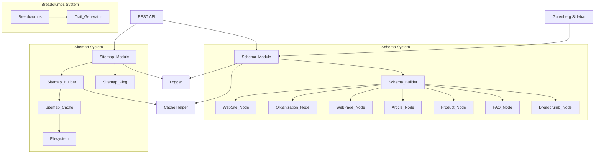
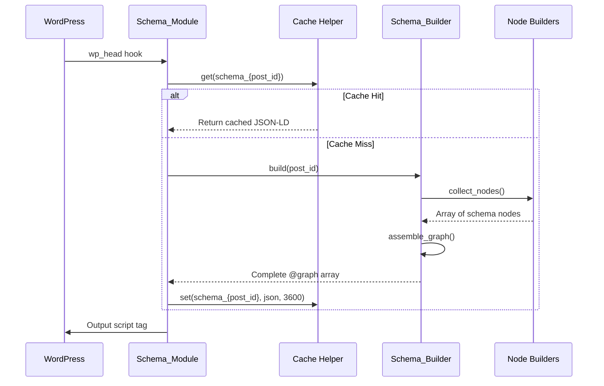
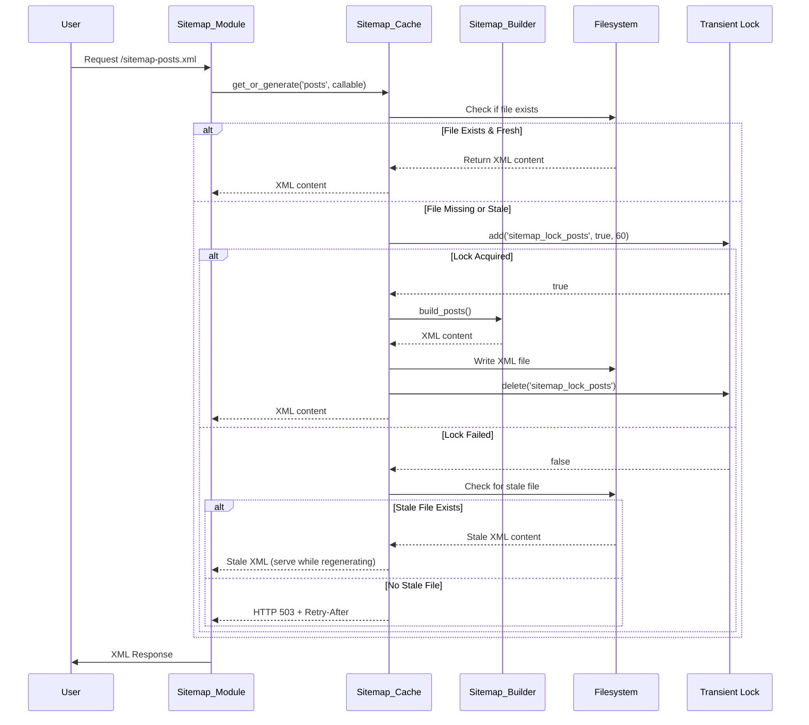

# Design Document: Schema Generator and XML Sitemap System

## Overview

The Schema Generator and XML Sitemap System provides comprehensive structured data and sitemap functionality for the MeowSEO WordPress plugin. The system consists of three major components:

1. **Schema System**: JSON-LD structured data generator using @graph array approach for Google Knowledge Graph resolution
2. **XML Sitemap System**: High-performance sitemap generator with filesystem caching and lock pattern to prevent cache stampede
3. **Breadcrumbs System**: Semantic breadcrumb trail generator with Schema.org microdata

### Design Goals

- **Performance**: Filesystem-based caching with lock pattern to prevent cache stampede
- **Scalability**: Handle sites with 50,000+ posts without memory exhaustion
- **Correctness**: Generate valid Schema.org markup that passes Google's Rich Results Test
- **Extensibility**: Plugin-friendly architecture with filter hooks for customization
- **Headless Support**: REST API endpoints for decoupled frontends

### Research Findings

**Yoast SEO Analysis:**
- Uses abstract base class `Abstract_Schema_Piece` with `generate()` and `is_needed()` methods
- Each schema type (Article, Organization, WebSite) is a separate class
- Assembles @graph array by collecting nodes from individual builders
- Uses consistent @id format (URL + #fragment) for Knowledge Graph resolution
- Limitation: No filesystem caching for sitemaps, relies on transients

**RankMath Analysis:**
- Uses `@graph` array with multiple schema types per page
- Stores custom schema configurations in database
- Connects entities using `isPartOf` and `publisher` properties
- Validates and filters schema data before output
- Limitation: Sitemap caching uses transients, vulnerable to cache stampede on high-traffic sites

**Identified Scalability Problems:**
1. **Cache Stampede**: Both plugins use transients without lock pattern, causing multiple simultaneous regenerations
2. **Memory Issues**: Loading all posts into memory for sitemap generation
3. **N+1 Queries**: Not batch-loading postmeta before loops
4. **Transient Limitations**: Transients stored in database, not suitable for large XML files

## Architecture

### High-Level Component Diagram



### Data Flow: Schema Generation



### Data Flow: Sitemap Generation with Lock Pattern




## Components and Interfaces

### Schema System Classes

#### Schema_Module

**Responsibility**: Module entry point implementing Module_Interface, coordinates schema output

**Properties**:
```php
private Options $options;
private Schema_Builder $builder;
private Breadcrumbs $breadcrumbs;
```

**Methods**:
```php
public function boot(): void
public function get_id(): string
public function output_schema(): void
public function invalidate_cache(int $post_id): void
public function register_rest_routes(): void
public function register_graphql_fields(): void
```

**Hooks**:
- `wp_head` (priority 5): Output schema JSON-LD
- `save_post`: Invalidate cache on post save
- `rest_api_init`: Register REST endpoints

---

#### Schema_Builder

**Responsibility**: Core schema engine that assembles @graph arrays from individual node builders

**Properties**:
```php
private int $post_id;
private WP_Post $post;
private Options $options;
private Breadcrumbs $breadcrumbs;
private array $context;
```

**Methods**:
```php
public function build(int $post_id): string
private function collect_nodes(): array
private function assemble_graph(array $nodes): array
private function get_context(): array
private function should_include_node(string $node_type): bool
```

**Node Collection Logic**:
```php
private function collect_nodes(): array {
    $nodes = [];
    
    // Always include base nodes
    $nodes[] = $this->build_website_node();
    $nodes[] = $this->build_organization_node();
    $nodes[] = $this->build_webpage_node();
    $nodes[] = $this->build_breadcrumb_node();
    
    // Conditional nodes based on post type and schema type
    if ($this->should_include_article()) {
        $nodes[] = $this->build_article_node();
    }
    
    if ($this->should_include_product()) {
        $nodes[] = $this->build_product_node();
    }
    
    $schema_type = get_post_meta($this->post_id, '_meowseo_schema_type', true);
    
    if ($schema_type === 'FAQPage') {
        $nodes[] = $this->build_faq_node();
    }
    
    if ($schema_type === 'HowTo') {
        $nodes[] = $this->build_howto_node();
    }
    
    return array_filter($nodes);
}
```

---

#### Abstract_Schema_Node

**Responsibility**: Base class for all schema node builders

**Properties**:
```php
protected int $post_id;
protected WP_Post $post;
protected Options $options;
protected array $context;
```

**Methods**:
```php
abstract public function generate(): array
abstract public function is_needed(): bool
protected function get_id_url(string $fragment): string
protected function format_date(string $date): string
```

---

#### WebSite_Node extends Abstract_Schema_Node

**Responsibility**: Generate WebSite schema node

**Schema Output**:
```json
{
  "@type": "WebSite",
  "@id": "https://example.com/#website",
  "url": "https://example.com/",
  "name": "Site Name",
  "description": "Site Description",
  "publisher": {
    "@id": "https://example.com/#organization"
  },
  "potentialAction": [{
    "@type": "SearchAction",
    "target": {
      "@type": "EntryPoint",
      "urlTemplate": "https://example.com/?s={search_term_string}"
    },
    "query-input": {
      "@type": "PropertyValueSpecification",
      "valueRequired": true,
      "valueName": "search_term_string"
    }
  }],
  "inLanguage": "en-US"
}
```

---

#### Organization_Node extends Abstract_Schema_Node

**Responsibility**: Generate Organization schema node

**Schema Output**:
```json
{
  "@type": "Organization",
  "@id": "https://example.com/#organization",
  "name": "Organization Name",
  "url": "https://example.com/",
  "logo": {
    "@type": "ImageObject",
    "@id": "https://example.com/#logo",
    "url": "https://example.com/logo.png",
    "contentUrl": "https://example.com/logo.png",
    "width": 600,
    "height": 60
  },
  "image": {
    "@id": "https://example.com/#logo"
  },
  "sameAs": [
    "https://facebook.com/page",
    "https://twitter.com/handle"
  ]
}
```

---

#### WebPage_Node extends Abstract_Schema_Node

**Responsibility**: Generate WebPage schema node (varies by context)

**Context Detection**:
```php
private function get_page_type(): string {
    if (is_front_page()) {
        return 'WebPage';
    }
    if (is_archive()) {
        return 'CollectionPage';
    }
    if (is_search()) {
        return 'SearchResultsPage';
    }
    return 'WebPage';
}
```

**Schema Output**:
```json
{
  "@type": "WebPage",
  "@id": "https://example.com/post/#webpage",
  "url": "https://example.com/post/",
  "name": "Page Title",
  "isPartOf": {
    "@id": "https://example.com/#website"
  },
  "primaryImageOfPage": {
    "@id": "https://example.com/post/#primaryimage"
  },
  "datePublished": "2024-01-01T12:00:00+00:00",
  "dateModified": "2024-01-02T12:00:00+00:00",
  "breadcrumb": {
    "@id": "https://example.com/post/#breadcrumb"
  },
  "inLanguage": "en-US"
}
```

---

#### Article_Node extends Abstract_Schema_Node

**Responsibility**: Generate Article schema node

**Schema Output**:
```json
{
  "@type": "Article",
  "@id": "https://example.com/post/#article",
  "isPartOf": {
    "@id": "https://example.com/post/#webpage"
  },
  "author": {
    "@type": "Person",
    "@id": "https://example.com/#/schema/person/123",
    "name": "Author Name"
  },
  "headline": "Article Headline",
  "datePublished": "2024-01-01T12:00:00+00:00",
  "dateModified": "2024-01-02T12:00:00+00:00",
  "mainEntityOfPage": {
    "@id": "https://example.com/post/#webpage"
  },
  "wordCount": 1500,
  "commentCount": 10,
  "publisher": {
    "@id": "https://example.com/#organization"
  },
  "image": {
    "@id": "https://example.com/post/#primaryimage"
  },
  "thumbnailUrl": "https://example.com/image.jpg",
  "articleSection": ["Category1", "Category2"],
  "keywords": ["tag1", "tag2"],
  "speakable": {
    "@type": "SpeakableSpecification",
    "cssSelector": ["#meowseo-direct-answer"]
  },
  "inLanguage": "en-US"
}
```

---

#### Product_Node extends Abstract_Schema_Node

**Responsibility**: Generate Product schema node for WooCommerce products

**Schema Output**:
```json
{
  "@type": "Product",
  "@id": "https://example.com/product/#product",
  "name": "Product Name",
  "url": "https://example.com/product/",
  "description": "Product description",
  "sku": "PROD-123",
  "image": {
    "@id": "https://example.com/product/#primaryimage"
  },
  "offers": {
    "@type": "Offer",
    "url": "https://example.com/product/",
    "priceCurrency": "USD",
    "price": "99.99",
    "availability": "https://schema.org/InStock",
    "priceValidUntil": "2024-12-31"
  },
  "aggregateRating": {
    "@type": "AggregateRating",
    "ratingValue": "4.5",
    "reviewCount": "24"
  }
}
```

---

#### FAQ_Node extends Abstract_Schema_Node

**Responsibility**: Generate FAQPage schema node

**Schema Output**:
```json
{
  "@type": "FAQPage",
  "@id": "https://example.com/post/#faqpage",
  "mainEntity": [
    {
      "@type": "Question",
      "name": "What is the question?",
      "acceptedAnswer": {
        "@type": "Answer",
        "text": "This is the answer."
      }
    }
  ]
}
```

---

### Sitemap System Classes

#### Sitemap_Module

**Responsibility**: Module entry point, registers rewrite rules and intercepts sitemap requests

**Properties**:
```php
private Options $options;
private Sitemap_Builder $builder;
private Sitemap_Cache $cache;
private Sitemap_Ping $ping;
```

**Methods**:
```php
public function boot(): void
public function get_id(): string
public function register_rewrite_rules(): void
public function intercept_request(): void
public function invalidate_cache(string $post_type): void
public function schedule_regeneration(): void
```

**Rewrite Rules**:
```php
private function register_rewrite_rules(): void {
    add_rewrite_rule(
        '^sitemap\.xml$',
        'index.php?meowseo_sitemap=index',
        'top'
    );
    
    add_rewrite_rule(
        '^sitemap-([^/]+?)\.xml$',
        'index.php?meowseo_sitemap=$matches[1]',
        'top'
    );
    
    add_rewrite_rule(
        '^sitemap-([^/]+?)-([0-9]+)\.xml$',
        'index.php?meowseo_sitemap=$matches[1]&meowseo_sitemap_page=$matches[2]',
        'top'
    );
}
```

**Hooks**:
- `init`: Register rewrite rules
- `template_redirect`: Intercept sitemap requests
- `save_post`: Invalidate cache
- `delete_post`: Invalidate cache
- `created_term`: Invalidate cache
- `edited_term`: Invalidate cache

---

#### Sitemap_Cache

**Responsibility**: Filesystem-based cache manager with lock pattern

**Properties**:
```php
private string $cache_dir;
private int $lock_timeout = 60;
```

**Methods**:
```php
public function get(string $name): ?string
public function set(string $name, string $xml_content): bool
public function invalidate(string $name): bool
public function invalidate_all(): bool
public function get_or_generate(string $name, callable $generator): string
private function acquire_lock(string $name): bool
private function release_lock(string $name): void
private function get_stale_file(string $name): ?string
private function ensure_directory_exists(): bool
```

**Lock Pattern Implementation**:
```php
public function get_or_generate(string $name, callable $generator): string {
    // Check if fresh file exists
    $file_path = $this->get_file_path($name);
    if (file_exists($file_path) && $this->is_fresh($file_path)) {
        return file_get_contents($file_path);
    }
    
    // Try to acquire lock
    if (!$this->acquire_lock($name)) {
        // Serve stale file if available
        $stale = $this->get_stale_file($name);
        if ($stale !== null) {
            return $stale;
        }
        
        // No stale file, return 503
        status_header(503);
        header('Retry-After: 60');
        return '';
    }
    
    // Generate new content
    try {
        $content = $generator();
        $this->set($name, $content);
        return $content;
    } finally {
        $this->release_lock($name);
    }
}
```

**Cache Directory Structure**:
```
wp-content/uploads/meowseo-sitemaps/
├── index.xml
├── posts-1.xml
├── posts-2.xml
├── pages-1.xml
├── news.xml
└── video.xml
```

---

#### Sitemap_Builder

**Responsibility**: Generate sitemap XML content

**Properties**:
```php
private Sitemap_Cache $cache;
private Options $options;
private int $max_urls_per_sitemap = 1000;
```

**Methods**:
```php
public function build_index(): string
public function build_posts(string $post_type, int $page = 1): string
public function build_news(): string
public function build_video(): string
private function get_post_query(string $post_type, int $page): WP_Query
private function should_exclude_post(int $post_id): bool
private function format_url_entry(int $post_id): string
```

**Performance Optimizations**:
```php
private function get_post_query(string $post_type, int $page): WP_Query {
    global $wpdb;
    
    $offset = ($page - 1) * $this->max_urls_per_sitemap;
    
    // Direct query with LEFT JOIN to exclude noindex posts
    $query = "
        SELECT p.ID, p.post_modified_gmt
        FROM {$wpdb->posts} p
        LEFT JOIN {$wpdb->postmeta} pm 
            ON p.ID = pm.post_id 
            AND pm.meta_key = '_meowseo_noindex'
        WHERE p.post_type = %s
        AND p.post_status = 'publish'
        AND (pm.meta_value IS NULL OR pm.meta_value != '1')
        ORDER BY p.post_modified_gmt DESC
        LIMIT %d OFFSET %d
    ";
    
    $results = $wpdb->get_results(
        $wpdb->prepare($query, $post_type, $this->max_urls_per_sitemap, $offset)
    );
    
    // Batch load postmeta
    $post_ids = wp_list_pluck($results, 'ID');
    update_post_meta_cache($post_ids);
    
    return $results;
}
```

---

#### Sitemap_Ping

**Responsibility**: Notify search engines of sitemap updates

**Properties**:
```php
private int $rate_limit = 3600; // 1 hour
```

**Methods**:
```php
public function ping(string $sitemap_url): bool
private function should_ping(): bool
private function update_last_ping_time(): void
private function get_ping_urls(string $sitemap_url): array
```

**Search Engine Endpoints**:
```php
private function get_ping_urls(string $sitemap_url): array {
    return [
        'google' => 'https://www.google.com/ping?sitemap=' . urlencode($sitemap_url),
        'bing' => 'https://www.bing.com/ping?sitemap=' . urlencode($sitemap_url),
    ];
}
```

---

### Breadcrumbs System Classes

#### Breadcrumbs

**Responsibility**: Generate semantic breadcrumb trails

**Properties**:
```php
private Options $options;
```

**Methods**:
```php
public function get_trail(): array
public function render(string $css_class = '', string $separator = ' › '): string
private function build_trail_for_post(): array
private function build_trail_for_page(): array
private function build_trail_for_archive(): array
private function build_trail_for_search(): array
private function build_trail_for_404(): array
```

**Trail Structure**:
```php
[
    [
        'label' => 'Home',
        'url' => 'https://example.com/',
    ],
    [
        'label' => 'Category',
        'url' => 'https://example.com/category/',
    ],
    [
        'label' => 'Post Title',
        'url' => 'https://example.com/post/',
    ],
]
```

**HTML Output with Schema.org Microdata**:
```html
<nav aria-label="Breadcrumb" class="meowseo-breadcrumbs">
  <ol itemscope itemtype="https://schema.org/BreadcrumbList">
    <li itemprop="itemListElement" itemscope itemtype="https://schema.org/ListItem">
      <a itemprop="item" href="https://example.com/">
        <span itemprop="name">Home</span>
      </a>
      <meta itemprop="position" content="1" />
    </li>
    <li itemprop="itemListElement" itemscope itemtype="https://schema.org/ListItem">
      <a itemprop="item" href="https://example.com/category/">
        <span itemprop="name">Category</span>
      </a>
      <meta itemprop="position" content="2" />
    </li>
    <li itemprop="itemListElement" itemscope itemtype="https://schema.org/ListItem">
      <span itemprop="name">Post Title</span>
      <meta itemprop="position" content="3" />
    </li>
  </ol>
</nav>
```

---

#### Breadcrumb_Node extends Abstract_Schema_Node

**Responsibility**: Generate BreadcrumbList schema node

**Schema Output**:
```json
{
  "@type": "BreadcrumbList",
  "@id": "https://example.com/post/#breadcrumb",
  "itemListElement": [
    {
      "@type": "ListItem",
      "position": 1,
      "name": "Home",
      "item": "https://example.com/"
    },
    {
      "@type": "ListItem",
      "position": 2,
      "name": "Category",
      "item": "https://example.com/category/"
    },
    {
      "@type": "ListItem",
      "position": 3,
      "name": "Post Title"
    }
  ]
}
```


## Data Models

### Database Schema

#### Postmeta Fields

**Schema Configuration**:
```
_meowseo_schema_type: string
  - Values: 'Article', 'WebPage', 'FAQPage', 'HowTo', 'LocalBusiness', 'Product'
  - Default: 'Article' for posts, 'WebPage' for pages

_meowseo_schema_config: JSON string
  - Structure varies by schema type
  - Example for FAQPage:
    {
      "faq_items": [
        {
          "question": "What is the question?",
          "answer": "This is the answer."
        }
      ]
    }
  - Example for HowTo:
    {
      "steps": [
        {
          "name": "Step 1",
          "text": "Do this first",
          "image": "https://example.com/step1.jpg"
        }
      ]
    }

_meowseo_noindex: string ('1' or '0')
  - Controls sitemap inclusion
  - '1' = exclude from sitemap
  - '0' or empty = include in sitemap

_meowseo_speakable_block: string
  - Block ID marked as speakable content
  - Used to add id="meowseo-direct-answer" to block
```

#### Options Table

**Sitemap Settings**:
```
meowseo_sitemap_last_ping: int (timestamp)
  - Last time sitemap ping was sent to search engines
  - Used for rate limiting

meowseo_sitemap_enabled: bool
  - Master switch for sitemap functionality

meowseo_sitemap_post_types: array
  - List of post types to include in sitemap
  - Default: ['post', 'page']

meowseo_sitemap_news_enabled: bool
  - Enable Google News sitemap

meowseo_sitemap_video_enabled: bool
  - Enable Google Video sitemap
```

**Schema Settings**:
```
meowseo_schema_organization_name: string
meowseo_schema_organization_logo: string (URL)
meowseo_schema_organization_logo_id: int (attachment ID)
meowseo_schema_social_profiles: array
  - ['facebook' => 'url', 'twitter' => 'url', ...]
```

### Cache Keys

**Schema Cache**:
```
Key: meowseo_schema_{post_id}
TTL: 3600 seconds (1 hour)
Value: JSON-LD string
```

**Sitemap Lock**:
```
Key: meowseo_sitemap_lock_{name}
TTL: 60 seconds
Value: true
```

**Sitemap Path Cache**:
```
Key: meowseo_sitemap_path_{name}
TTL: 0 (persistent until invalidated)
Value: /path/to/file.xml
```

### Filesystem Structure

**Sitemap Cache Directory**:
```
wp-content/uploads/meowseo-sitemaps/
├── .htaccess (deny direct access)
├── index.xml
├── posts-1.xml
├── posts-2.xml
├── posts-3.xml
├── pages-1.xml
├── {custom_post_type}-1.xml
├── news.xml
└── video.xml
```

**.htaccess Content**:
```apache
# Deny direct access to sitemap files
# Files are served through WordPress rewrite rules
Order deny,allow
Deny from all
```

## API Endpoint Specifications

### REST API Endpoints

#### GET /meowseo/v1/schema/post/{id}

**Description**: Retrieve schema JSON-LD for a specific post

**Parameters**:
- `id` (int, required): Post ID

**Response**:
```json
{
  "post_id": 123,
  "schema_jsonld": {
    "@context": "https://schema.org",
    "@graph": [...]
  }
}
```

**Headers**:
```
Content-Type: application/json
Cache-Control: public, max-age=300
```

**Error Responses**:
- 404: Post not found or not publicly viewable
- 500: Schema generation failed

**Implementation**:
```php
public function get_schema_endpoint(WP_REST_Request $request): WP_REST_Response {
    $post_id = $request->get_param('id');
    
    $post = get_post($post_id);
    if (!$post || get_post_status($post) !== 'publish') {
        return new WP_REST_Response(
            ['error' => 'Post not found'],
            404
        );
    }
    
    $schema = $this->builder->build($post_id);
    
    return new WP_REST_Response([
        'post_id' => $post_id,
        'schema_jsonld' => json_decode($schema, true),
    ], 200);
}
```

---

#### GET /meowseo/v1/sitemap/index

**Description**: Retrieve sitemap index

**Response**:
```xml
<?xml version="1.0" encoding="UTF-8"?>
<sitemapindex xmlns="http://www.sitemaps.org/schemas/sitemap/0.9">
  <sitemap>
    <loc>https://example.com/sitemap-posts.xml</loc>
    <lastmod>2024-01-01T12:00:00+00:00</lastmod>
  </sitemap>
  <sitemap>
    <loc>https://example.com/sitemap-pages.xml</loc>
    <lastmod>2024-01-01T12:00:00+00:00</lastmod>
  </sitemap>
</sitemapindex>
```

**Headers**:
```
Content-Type: application/xml; charset=utf-8
X-Robots-Tag: noindex, follow
Cache-Control: public, max-age=3600
```

---

### WPGraphQL Integration

**Schema Field**:
```graphql
type Post {
  schemaJsonLd: String
}
```

**Implementation**:
```php
public function register_graphql_fields(): void {
    if (!function_exists('register_graphql_field')) {
        return;
    }
    
    register_graphql_field('Post', 'schemaJsonLd', [
        'type' => 'String',
        'description' => 'Schema.org JSON-LD markup',
        'resolve' => function($post) {
            return $this->builder->build($post->ID);
        },
    ]);
}
```

## Caching Strategy Details

### Schema Caching

**Strategy**: Object Cache with 1-hour TTL

**Rationale**:
- Schema rarely changes after post publication
- 1-hour TTL balances freshness with performance
- Object Cache (Redis/Memcached) provides fast access
- Falls back to transients when Object Cache unavailable

**Cache Key Format**:
```
meowseo_schema_{post_id}
```

**Invalidation Triggers**:
- Post save/update
- Post meta update (_meowseo_schema_type, _meowseo_schema_config)
- Global schema settings change

**Implementation**:
```php
public function output_schema(): void {
    $post_id = get_the_ID();
    $cache_key = "schema_{$post_id}";
    
    $schema = Cache::get($cache_key);
    if ($schema === false) {
        $schema = $this->builder->build($post_id);
        Cache::set($cache_key, $schema, 3600);
    }
    
    echo $schema;
}
```

---

### Sitemap Caching

**Strategy**: Filesystem cache with lock pattern

**Rationale**:
- Sitemap XML can be large (>1MB for 50,000 URLs)
- Filesystem storage avoids database bloat
- Lock pattern prevents cache stampede
- Stale-while-revalidate pattern maintains performance

**Cache Directory**:
```
wp-content/uploads/meowseo-sitemaps/
```

**File Naming Convention**:
```
{type}-{page}.xml
Examples:
- index.xml
- posts-1.xml
- posts-2.xml
- pages-1.xml
- news.xml
- video.xml
```

**Freshness Check**:
```php
private function is_fresh(string $file_path): bool {
    $max_age = 86400; // 24 hours
    return (time() - filemtime($file_path)) < $max_age;
}
```

**Lock Pattern**:
```php
private function acquire_lock(string $name): bool {
    $lock_key = "sitemap_lock_{$name}";
    return Cache::add($lock_key, true, $this->lock_timeout);
}

private function release_lock(string $name): void {
    $lock_key = "sitemap_lock_{$name}";
    Cache::delete($lock_key);
}
```

**Stale-While-Revalidate**:
```php
private function get_stale_file(string $name): ?string {
    $file_path = $this->get_file_path($name);
    if (file_exists($file_path)) {
        return file_get_contents($file_path);
    }
    return null;
}
```

**Invalidation Triggers**:
- Post publish/update/delete
- Term create/edit/delete
- Daily cron job (pre-generation)

---

### Cache Stampede Prevention

**Problem**: Multiple simultaneous requests regenerate expired cache

**Solution**: Lock pattern with stale-while-revalidate

**Flow**:
1. Request arrives for expired sitemap
2. First request acquires lock
3. Subsequent requests serve stale file
4. First request regenerates and releases lock
5. Next request serves fresh file

**Benefits**:
- Only one process regenerates at a time
- No duplicate work
- Maintains performance during regeneration
- Graceful degradation (503) if no stale file

**Metrics**:
- Lock timeout: 60 seconds
- Stale file max age: 7 days
- Retry-After header: 60 seconds

## Performance Optimization

### Database Query Optimization

**Problem**: N+1 queries when loading postmeta in loops

**Solution**: Batch load postmeta before loops

```php
// Before optimization (N+1 queries)
foreach ($posts as $post) {
    $noindex = get_post_meta($post->ID, '_meowseo_noindex', true);
}

// After optimization (2 queries)
$post_ids = wp_list_pluck($posts, 'ID');
update_post_meta_cache($post_ids);

foreach ($posts as $post) {
    $noindex = get_post_meta($post->ID, '_meowseo_noindex', true);
}
```

---

### Direct Database Queries

**Problem**: WP_Query loads unnecessary post data

**Solution**: Direct queries with LEFT JOIN

```php
global $wpdb;

$query = "
    SELECT p.ID, p.post_modified_gmt
    FROM {$wpdb->posts} p
    LEFT JOIN {$wpdb->postmeta} pm 
        ON p.ID = pm.post_id 
        AND pm.meta_key = '_meowseo_noindex'
    WHERE p.post_type = %s
    AND p.post_status = 'publish'
    AND (pm.meta_value IS NULL OR pm.meta_value != '1')
    ORDER BY p.post_modified_gmt DESC
    LIMIT %d OFFSET %d
";

$results = $wpdb->get_results(
    $wpdb->prepare($query, $post_type, $limit, $offset)
);
```

**Benefits**:
- Single query instead of multiple
- Only loads needed columns
- Excludes noindex posts in query
- Reduces memory usage

---

### Memory Management

**Problem**: Loading 50,000 posts exhausts memory

**Solution**: Pagination with 1,000 URLs per sitemap

```php
private int $max_urls_per_sitemap = 1000;

public function build_posts(string $post_type, int $page = 1): string {
    $offset = ($page - 1) * $this->max_urls_per_sitemap;
    
    // Query only 1,000 posts at a time
    $posts = $this->get_post_query($post_type, $page);
    
    // Generate XML for this page
    return $this->generate_xml($posts);
}
```

**Sitemap Index**:
```xml
<sitemapindex>
  <sitemap>
    <loc>https://example.com/sitemap-posts-1.xml</loc>
  </sitemap>
  <sitemap>
    <loc>https://example.com/sitemap-posts-2.xml</loc>
  </sitemap>
  <!-- ... up to 50 sitemaps -->
</sitemapindex>
```

---

### Filesystem Performance

**Problem**: WordPress template loading overhead

**Solution**: Serve files directly with readfile()

```php
public function intercept_request(): void {
    $sitemap_name = get_query_var('meowseo_sitemap');
    if (!$sitemap_name) {
        return;
    }
    
    $xml = $this->cache->get_or_generate($sitemap_name, function() use ($sitemap_name) {
        return $this->builder->build($sitemap_name);
    });
    
    if (empty($xml)) {
        return;
    }
    
    // Send headers
    header('Content-Type: application/xml; charset=utf-8');
    header('X-Robots-Tag: noindex, follow');
    
    // Output XML and exit
    echo $xml;
    exit;
}
```

**Benefits**:
- Bypasses WordPress template system
- Reduces memory usage
- Faster response time
- No theme/plugin interference

---

### Video Embed Detection

**Problem**: Scanning all post content for embeds is slow

**Solution**: Regex + oEmbed API with caching

```php
private function detect_video_embeds(string $content): array {
    $videos = [];
    
    // YouTube regex
    if (preg_match_all('/youtube\.com\/watch\?v=([a-zA-Z0-9_-]+)/', $content, $matches)) {
        foreach ($matches[1] as $video_id) {
            $videos[] = $this->get_youtube_metadata($video_id);
        }
    }
    
    // Vimeo regex
    if (preg_match_all('/vimeo\.com\/([0-9]+)/', $content, $matches)) {
        foreach ($matches[1] as $video_id) {
            $videos[] = $this->get_vimeo_metadata($video_id);
        }
    }
    
    return $videos;
}

private function get_youtube_metadata(string $video_id): array {
    $cache_key = "video_meta_youtube_{$video_id}";
    $metadata = Cache::get($cache_key);
    
    if ($metadata === false) {
        $oembed_url = "https://www.youtube.com/oembed?url=https://www.youtube.com/watch?v={$video_id}&format=json";
        $response = wp_remote_get($oembed_url);
        
        if (!is_wp_error($response)) {
            $metadata = json_decode(wp_remote_retrieve_body($response), true);
            Cache::set($cache_key, $metadata, 86400); // 24 hours
        }
    }
    
    return $metadata;
}
```


## Error Handling

### Schema Generation Errors

**Missing Required Data**:
```php
private function validate_node(array $node): bool {
    if (empty($node['@type'])) {
        Logger::warning('Schema node missing @type', [
            'post_id' => $this->post_id,
            'node' => $node,
        ]);
        return false;
    }
    
    if (empty($node['@id'])) {
        Logger::warning('Schema node missing @id', [
            'post_id' => $this->post_id,
            'node' => $node,
        ]);
        return false;
    }
    
    return true;
}
```

**Invalid Date Format**:
```php
private function format_date(string $date): string {
    try {
        $dt = new DateTime($date);
        return $dt->format(DateTime::ISO8601);
    } catch (Exception $e) {
        Logger::error('Invalid date format in schema', [
            'date' => $date,
            'post_id' => $this->post_id,
            'error' => $e->getMessage(),
        ]);
        return gmdate('c'); // Fallback to current time
    }
}
```

**Missing Image**:
```php
private function get_primary_image(): ?array {
    $image_id = get_post_thumbnail_id($this->post_id);
    if (!$image_id) {
        Logger::debug('No featured image for post', [
            'post_id' => $this->post_id,
        ]);
        return null;
    }
    
    $image_url = wp_get_attachment_image_url($image_id, 'full');
    if (!$image_url) {
        Logger::warning('Failed to get image URL', [
            'post_id' => $this->post_id,
            'image_id' => $image_id,
        ]);
        return null;
    }
    
    return [
        '@type' => 'ImageObject',
        '@id' => $this->get_id_url('primaryimage'),
        'url' => $image_url,
    ];
}
```

---

### Sitemap Generation Errors

**Directory Creation Failure**:
```php
private function ensure_directory_exists(): bool {
    if (!file_exists($this->cache_dir)) {
        if (!wp_mkdir_p($this->cache_dir)) {
            Logger::error('Failed to create sitemap cache directory', [
                'directory' => $this->cache_dir,
                'permissions' => substr(sprintf('%o', fileperms(dirname($this->cache_dir))), -4),
            ]);
            return false;
        }
    }
    
    if (!is_writable($this->cache_dir)) {
        Logger::error('Sitemap cache directory not writable', [
            'directory' => $this->cache_dir,
            'permissions' => substr(sprintf('%o', fileperms($this->cache_dir)), -4),
        ]);
        return false;
    }
    
    return true;
}
```

**File Write Failure**:
```php
public function set(string $name, string $xml_content): bool {
    if (!$this->ensure_directory_exists()) {
        return false;
    }
    
    $file_path = $this->get_file_path($name);
    $bytes_written = file_put_contents($file_path, $xml_content);
    
    if ($bytes_written === false) {
        Logger::error('Failed to write sitemap file', [
            'file_path' => $file_path,
            'content_length' => strlen($xml_content),
        ]);
        return false;
    }
    
    Logger::debug('Sitemap file written successfully', [
        'file_path' => $file_path,
        'bytes_written' => $bytes_written,
    ]);
    
    return true;
}
```

**Database Query Failure**:
```php
private function get_post_query(string $post_type, int $page): array {
    global $wpdb;
    
    $offset = ($page - 1) * $this->max_urls_per_sitemap;
    
    $query = "..."; // Query from earlier
    
    $results = $wpdb->get_results(
        $wpdb->prepare($query, $post_type, $this->max_urls_per_sitemap, $offset)
    );
    
    if ($wpdb->last_error) {
        Logger::error('Database query failed in sitemap generation', [
            'post_type' => $post_type,
            'page' => $page,
            'error' => $wpdb->last_error,
        ]);
        return [];
    }
    
    return $results;
}
```

**Lock Timeout**:
```php
public function get_or_generate(string $name, callable $generator): string {
    // ... lock acquisition code ...
    
    if (!$this->acquire_lock($name)) {
        Logger::warning('Failed to acquire sitemap lock', [
            'sitemap_name' => $name,
            'action' => 'serving_stale_file',
        ]);
        
        $stale = $this->get_stale_file($name);
        if ($stale !== null) {
            return $stale;
        }
        
        Logger::error('No stale file available and lock failed', [
            'sitemap_name' => $name,
            'action' => 'returning_503',
        ]);
        
        status_header(503);
        header('Retry-After: 60');
        return '';
    }
    
    // ... generation code ...
}
```

---

### Breadcrumbs Errors

**Invalid Post Hierarchy**:
```php
private function build_trail_for_page(): array {
    $trail = [['label' => 'Home', 'url' => home_url('/')]];
    
    $ancestors = get_post_ancestors($this->post);
    if (is_wp_error($ancestors)) {
        Logger::warning('Failed to get post ancestors for breadcrumbs', [
            'post_id' => $this->post->ID,
            'error' => $ancestors->get_error_message(),
        ]);
        $ancestors = [];
    }
    
    // ... build trail ...
    
    return $trail;
}
```

## Testing Strategy

### Unit Testing

**Schema Node Builders**:
- Test each node builder (WebSite_Node, Organization_Node, etc.) in isolation
- Mock WordPress functions (get_post_meta, get_option, etc.)
- Verify output structure matches Schema.org specification
- Test edge cases (missing data, invalid data)

**Sitemap Builder**:
- Test XML generation with mock data
- Verify URL formatting and escaping
- Test pagination logic
- Test exclusion rules

**Breadcrumbs**:
- Test trail generation for different contexts
- Verify HTML output structure
- Test filter hooks

**Cache Helper**:
- Test lock acquisition and release
- Test stale file serving
- Test file write and read operations

---

### Integration Testing

**Schema Module**:
- Test wp_head hook integration
- Test cache invalidation on post save
- Test REST API endpoints
- Test WPGraphQL integration

**Sitemap Module**:
- Test rewrite rule registration
- Test request interception
- Test cache invalidation triggers
- Test cron job scheduling

**WordPress Integration**:
- Test with real WordPress database
- Test with different post types
- Test with WooCommerce products
- Test with custom taxonomies

---

### Property-Based Testing

Property-based testing is appropriate for this feature because:
- Schema generation has universal properties (valid JSON-LD, required nodes)
- Sitemap generation has universal properties (valid XML, URL formatting)
- Breadcrumbs have universal properties (trail structure, HTML validity)

**Testing Library**: Use **WP_Mock** with **Faker** for property-based testing in PHP

**Test Configuration**:
- Minimum 100 iterations per property test
- Each test references design document property
- Tag format: `@Feature schema-sitemap-system, Property {number}: {property_text}`


## Correctness Properties

*A property is a characteristic or behavior that should hold true across all valid executions of a system—essentially, a formal statement about what the system should do. Properties serve as the bridge between human-readable specifications and machine-verifiable correctness guarantees.*

### Property 1: Schema Output is Valid JSON-LD Script Tag

*For any* post ID, the Schema_Builder build() method SHALL return a valid HTML script tag with type="application/ld+json" containing parseable JSON with a @graph array.

**Validates: Requirements 1.1, 2.3**

---

### Property 2: Required Schema Nodes Always Present

*For any* post, the @graph array SHALL always contain WebSite, Organization, WebPage, and BreadcrumbList nodes.

**Validates: Requirements 1.3**

---

### Property 3: Article Node Conditional Inclusion

*For any* post where post_type is "post" OR schema_type is "Article", the @graph array SHALL include an Article node.

**Validates: Requirements 1.4**

---

### Property 4: Product Node Conditional Inclusion

*For any* post where post_type is "product" AND WooCommerce is active, the @graph array SHALL include a Product node.

**Validates: Requirements 1.5, 11.1**

---

### Property 5: FAQ Node Conditional Inclusion

*For any* post where schema_type is "FAQPage" AND FAQ items exist, the @graph array SHALL include a FAQPage node.

**Validates: Requirements 1.6**

---

### Property 6: Consistent @id Format

*For any* schema node in the @graph array, the @id property SHALL match the pattern `{url}#{fragment}` where url is a valid URL and fragment is a non-empty string.

**Validates: Requirements 1.7**

---

### Property 7: WebSite Node Contains SearchAction

*For any* post, the WebSite node SHALL include a potentialAction array containing a SearchAction with urlTemplate and query-input properties.

**Validates: Requirements 1.8**

---

### Property 8: Organization Node Contains Required Properties

*For any* post, the Organization node SHALL include a logo ImageObject and a sameAs array.

**Validates: Requirements 1.9**

---

### Property 9: WebPage Type Varies by Context

*For any* context, the WebPage node @type SHALL be "WebPage" for pages, "CollectionPage" for archives, or "SearchResultsPage" for search results.

**Validates: Requirements 1.10**

---

### Property 10: Article Node Contains Speakable

*For any* post with an Article node, the Article SHALL include a speakable property with cssSelector "#meowseo-direct-answer".

**Validates: Requirements 1.11, 20.1, 20.2**

---

### Property 11: Schema Cache Reuse

*For any* post, calling Schema_Builder build() twice within the cache TTL SHALL return the same result without regenerating the schema.

**Validates: Requirements 2.6**

---

### Property 12: REST API Response Structure

*For any* valid post ID, the REST endpoint GET /meowseo/v1/schema/post/{id} SHALL return a JSON response containing post_id and schema_jsonld fields.

**Validates: Requirements 2.5**

---

### Property 13: Sitemap Files Stored in Correct Directory

*For any* sitemap name and XML content, calling Sitemap_Cache set() SHALL create a file in wp-content/uploads/meowseo-sitemaps/ directory.

**Validates: Requirements 4.1**

---

### Property 14: Cache Stores Paths Not Content

*For any* sitemap, the Object Cache SHALL contain the file path as a string, not the XML content.

**Validates: Requirements 4.2**

---

### Property 15: Set Then Get Round Trip

*For any* sitemap name and XML content, calling Sitemap_Cache set() followed by get() SHALL return the exact same XML content.

**Validates: Requirements 4.4**

---

### Property 16: Invalidate Deletes Files

*For any* sitemap name, calling Sitemap_Cache invalidate() after set() SHALL result in get() returning null.

**Validates: Requirements 4.5**

---

### Property 17: Stale File Served on Lock Failure

*For any* sitemap with an existing file, when lock acquisition fails, get_or_generate() SHALL return the stale file content.

**Validates: Requirements 4.8**

---

### Property 18: 503 Response When No Stale File

*For any* sitemap without an existing file, when lock acquisition fails, get_or_generate() SHALL return empty string and set HTTP status to 503.

**Validates: Requirements 4.9**

---

### Property 19: Sitemap Index Contains All Post Types

*For any* set of enabled post types, build_index() SHALL generate XML containing a sitemap entry for each post type.

**Validates: Requirements 5.2**

---

### Property 20: Noindex Posts Excluded from Sitemap

*For any* post with _meowseo_noindex set to "1", the post SHALL NOT appear in the sitemap XML.

**Validates: Requirements 5.4, 19.1**

---

### Property 21: Sitemap Pagination at 1000 URLs

*For any* post type with more than 1000 published posts, the sitemap SHALL be split into multiple files with maximum 1000 URLs per file.

**Validates: Requirements 5.5**

---

### Property 22: News Sitemap Contains Only Recent Posts

*For any* post older than 48 hours, the post SHALL NOT appear in the news sitemap.

**Validates: Requirements 5.7, 16.1**

---

### Property 23: Video Sitemap Contains Only Posts with Videos

*For any* post without YouTube or Vimeo embeds, the post SHALL NOT appear in the video sitemap.

**Validates: Requirements 5.8, 15.7**

---

### Property 24: Breadcrumb Trail Structure for Posts

*For any* single post, get_trail() SHALL return an array starting with Home, followed by the post's primary category, followed by the post title.

**Validates: Requirements 8.2**

---

### Property 25: Breadcrumb Trail Structure for Pages

*For any* hierarchical page, get_trail() SHALL return an array starting with Home, followed by all parent pages in order, followed by the current page.

**Validates: Requirements 8.3**

---

### Property 26: Breadcrumb HTML Contains Schema.org Microdata

*For any* breadcrumb trail, render() SHALL output HTML containing itemscope, itemtype="https://schema.org/BreadcrumbList", and itemprop attributes.

**Validates: Requirements 8.7, 18.6**

---

### Property 27: Multiple Schema Types Coexist

*For any* post with schema_type "FAQPage", the @graph array SHALL contain both Article and FAQPage nodes.

**Validates: Requirements 10.1**

---

### Property 28: Product Schema Contains Required Properties

*For any* WooCommerce product, the Product node SHALL include name, url, description, sku, image, and offers properties.

**Validates: Requirements 11.2**

---

### Property 29: Product Offers Contains Price and Availability

*For any* WooCommerce product, the offers property SHALL include @type Offer, priceCurrency, price, and availability.

**Validates: Requirements 11.3**

---

### Property 30: Sitemap Image Extension for Featured Images

*For any* post with a featured image, the sitemap URL entry SHALL include an image:image element with image:loc.

**Validates: Requirements 15.1**

---

### Property 31: Video Sitemap Includes Metadata

*For any* post with a video embed, the video sitemap SHALL include video:title, video:description, video:thumbnail_loc, and video:content_loc.

**Validates: Requirements 15.6**

---

### Property 32: Schema Validation Skips Invalid Nodes

*For any* schema node missing required @type or @id properties, the Schema_Builder SHALL log a warning and exclude the node from @graph.

**Validates: Requirements 17.1, 17.2**

---

### Property 33: Date Properties Use ISO 8601 Format

*For any* schema node with datePublished or dateModified properties, the date SHALL be in ISO 8601 format (YYYY-MM-DDTHH:MM:SS+00:00).

**Validates: Requirements 17.4**

---

### Property 34: Sitemap Excludes Unpublished Posts

*For any* post with post_status other than "publish", the post SHALL NOT appear in the sitemap.

**Validates: Requirements 19.2**

---

### Property 35: Breadcrumb Separator Customization

*For any* custom separator string, calling render() with that separator SHALL output HTML using the custom separator between breadcrumb items.

**Validates: Requirements 18.2**


## Implementation Notes

### PHP Version Requirements

- Minimum PHP 7.4 (for typed properties)
- Recommended PHP 8.0+ (for union types and named arguments)

### WordPress Version Requirements

- Minimum WordPress 5.8 (for block editor APIs)
- Recommended WordPress 6.0+ (for improved REST API)

### Dependencies

**Required**:
- MeowSEO Core (Options, Cache, Logger, Module_Manager)
- WordPress Core (WP_Query, wp_cache, get_post_meta, etc.)

**Optional**:
- WooCommerce (for Product schema)
- WPGraphQL (for GraphQL integration)

### File Structure

```
includes/modules/schema/
├── class-schema-module.php
├── class-schema-builder.php
├── nodes/
│   ├── class-abstract-schema-node.php
│   ├── class-website-node.php
│   ├── class-organization-node.php
│   ├── class-webpage-node.php
│   ├── class-article-node.php
│   ├── class-product-node.php
│   ├── class-faq-node.php
│   ├── class-howto-node.php
│   └── class-breadcrumb-node.php
└── README.md

includes/modules/sitemap/
├── class-sitemap-module.php
├── class-sitemap-builder.php
├── class-sitemap-cache.php
├── class-sitemap-ping.php
└── README.md

includes/modules/breadcrumbs/
├── class-breadcrumbs.php
└── README.md
```

### Configuration Options

**Schema Settings** (wp_options):
```php
[
    'meowseo_schema_organization_name' => 'Organization Name',
    'meowseo_schema_organization_logo' => 'https://example.com/logo.png',
    'meowseo_schema_organization_logo_id' => 123,
    'meowseo_schema_social_profiles' => [
        'facebook' => 'https://facebook.com/page',
        'twitter' => 'https://twitter.com/handle',
        'instagram' => 'https://instagram.com/profile',
        'linkedin' => 'https://linkedin.com/company/name',
    ],
]
```

**Sitemap Settings** (wp_options):
```php
[
    'meowseo_sitemap_enabled' => true,
    'meowseo_sitemap_post_types' => ['post', 'page'],
    'meowseo_sitemap_news_enabled' => false,
    'meowseo_sitemap_video_enabled' => false,
    'meowseo_sitemap_max_urls' => 1000,
    'meowseo_sitemap_cache_ttl' => 86400, // 24 hours
]
```

### Filter Hooks

**Schema Filters**:
```php
// Modify @graph array before output
apply_filters('meowseo_schema_graph', $graph, $post_id);

// Modify individual node before adding to @graph
apply_filters('meowseo_schema_node_{type}', $node, $post_id);

// Modify schema type detection
apply_filters('meowseo_schema_type', $schema_type, $post_id);

// Modify social profiles
apply_filters('meowseo_schema_social_profiles', $profiles);
```

**Sitemap Filters**:
```php
// Modify sitemap post types
apply_filters('meowseo_sitemap_post_types', $post_types);

// Custom exclusion logic
apply_filters('meowseo_sitemap_exclude_post', $exclude, $post_id);

// Modify URL entry
apply_filters('meowseo_sitemap_url_entry', $entry, $post_id);

// Modify sitemap XML before output
apply_filters('meowseo_sitemap_xml', $xml, $sitemap_name);
```

**Breadcrumbs Filters**:
```php
// Modify breadcrumb trail
apply_filters('meowseo_breadcrumb_trail', $trail, $context);

// Modify breadcrumb HTML
apply_filters('meowseo_breadcrumb_html', $html, $trail);

// Modify separator
apply_filters('meowseo_breadcrumb_separator', $separator);
```

### Action Hooks

**Schema Actions**:
```php
// Before schema output
do_action('meowseo_before_schema_output', $post_id);

// After schema output
do_action('meowseo_after_schema_output', $post_id);

// Schema cache invalidated
do_action('meowseo_schema_cache_invalidated', $post_id);
```

**Sitemap Actions**:
```php
// Before sitemap generation
do_action('meowseo_before_sitemap_generation', $sitemap_name);

// After sitemap generation
do_action('meowseo_after_sitemap_generation', $sitemap_name, $xml);

// Sitemap cache invalidated
do_action('meowseo_sitemap_cache_invalidated', $sitemap_name);

// Sitemap ping sent
do_action('meowseo_sitemap_ping_sent', $sitemap_url, $search_engine);
```

### WP-CLI Commands

**Schema Commands**:
```bash
# Generate schema for a post
wp meowseo schema generate <post_id>

# Validate schema for a post
wp meowseo schema validate <post_id>

# Clear schema cache
wp meowseo schema clear-cache [--post_id=<id>]
```

**Sitemap Commands**:
```bash
# Generate all sitemaps
wp meowseo sitemap generate

# Generate specific sitemap
wp meowseo sitemap generate <type> [--page=<page>]

# Clear sitemap cache
wp meowseo sitemap clear-cache [--type=<type>]

# Ping search engines
wp meowseo sitemap ping
```

### Security Considerations

**File System Access**:
- Sitemap cache directory must be writable by web server
- Add .htaccess to deny direct access to cache files
- Validate file paths to prevent directory traversal

**Input Validation**:
- Sanitize all user input in schema configuration
- Validate JSON structure before saving to postmeta
- Escape all output in schema JSON-LD

**Rate Limiting**:
- Limit sitemap ping frequency (1 hour minimum)
- Implement request throttling for sitemap generation
- Use lock pattern to prevent abuse

**Access Control**:
- Verify post is publicly viewable before serving schema
- Check user capabilities before allowing schema configuration
- Validate REST API requests with nonces

### Performance Benchmarks

**Schema Generation**:
- Target: < 50ms per post (with cache)
- Target: < 200ms per post (without cache)
- Memory: < 10MB per generation

**Sitemap Generation**:
- Target: < 500ms for 1000 URLs (with cache)
- Target: < 2s for 1000 URLs (without cache)
- Memory: < 50MB per sitemap file

**Cache Performance**:
- Lock acquisition: < 10ms
- File read: < 20ms
- File write: < 50ms

### Migration Strategy

**From Yoast SEO**:
1. Import schema settings from Yoast options
2. Map Yoast schema types to MeowSEO types
3. Convert Yoast postmeta to MeowSEO postmeta
4. Disable Yoast schema output

**From RankMath**:
1. Import schema settings from RankMath options
2. Map RankMath schema types to MeowSEO types
3. Convert RankMath postmeta to MeowSEO postmeta
4. Disable RankMath schema output

**Sitemap Migration**:
1. Detect existing sitemap plugins
2. Disable conflicting sitemap functionality
3. Regenerate all sitemaps
4. Update robots.txt with new sitemap URL

### Monitoring and Debugging

**Debug Mode**:
```php
// Enable debug mode
define('MEOWSEO_DEBUG', true);

// Schema validation errors output as HTML comments
<!-- Schema validation error: Missing required property @type -->

// Sitemap generation stats in XML comments
<!-- Generated in 0.234s, 1234 URLs, 45MB memory -->
```

**Logging**:
- All errors logged to MeowSEO log table
- Performance metrics logged in debug mode
- Cache hit/miss rates tracked

**Health Checks**:
```php
// Check schema validity
wp meowseo health check-schema

// Check sitemap cache
wp meowseo health check-sitemap-cache

// Check file permissions
wp meowseo health check-permissions
```

## Conclusion

This design provides a comprehensive, scalable, and performant solution for schema generation and XML sitemaps. Key innovations include:

1. **Filesystem-based sitemap caching** with lock pattern to prevent cache stampede
2. **@graph array approach** for proper Knowledge Graph resolution
3. **Modular node builder architecture** for extensibility
4. **Stale-while-revalidate pattern** for high availability
5. **Direct database queries** for optimal performance
6. **Comprehensive error handling** with detailed logging

The system is designed to handle sites with 50,000+ posts while maintaining sub-second response times and minimal memory usage. The architecture follows WordPress best practices and integrates seamlessly with existing MeowSEO modules.

